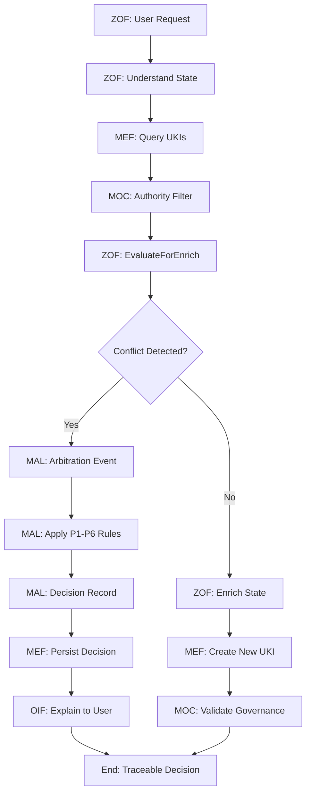

# CLAUDE.md

This file provides guidance to Claude Code (claude.ai/code) when working with code in this repository.

## Project Overview

This repository contains the **Matrix Protocol v1.0.0** specification - a comprehensive framework for human-AI collaboration through three interdependent layers:

- **🔮 Oracle Layer**: Strategic governance & knowledge base management (MEF)
- **⚡ Zion Layer**: Conceptual workflow framework for AI-oriented teams (ZOF)  
- **🧠 Operator Layer**: Practical execution and implementation by development teams (OIF)

The protocol includes the **Matrix Ontology Catalog (MOC)** - the foundational component that allows separation of universal core concepts from organization-specific taxonomies, enabling local flexibility with global coherence.

The framework is guided by the **Matrix Epistemic Principle (MEP)** - an epistemological manifesto that establishes how knowledge is treated, evaluated, and promoted within the Matrix ecosystem.

## Repository Structure

This repository contains comprehensive Matrix Protocol documentation and examples:

### 🏛️ Core Specifications
- `MATRIX_PROTOCOL.md` - Complete Matrix Protocol specification (bilingual)
- `MOC_MATRIX_ONTOLOGY_CATALOG.md` - Matrix Ontology Catalog specification
- `MEP_MATRIX_EPISTEMIC_PRINCIPLE.md` - Epistemological manifesto

### 🔧 Framework Specifications
- `MEF_MATRIX_EMBEDDING_FRAMEWORK.md` - Knowledge structuring via UKIs
- `ZOF_ZION_ORCHESTRATION_FRAMEWORK.md` - AI-oriented workflow framework
- `OIF_OPERATOR_INTELLIGENCE_FRAMEWORK.md` - AI archetype framework
- `MAL_MATRIX_ARBITER_LAYER.md` - Conflict arbitration framework

### 💡 Practical Examples
- `examples/knowledge-comparison/` - Complete comparison between unstructured and MEF-structured knowledge
  - Real organizational MOC example (`MOC_SQUAD_PAYMENTS.yaml`)
  - 17 compliant UKI examples across business rules, technical patterns, and procedures
  - Demonstrates knowledge evolution from chaotic to structured
  
All documentation is bilingual (Portuguese/English) with separate files for each language.

## Protocol Complexity and Sophistication

> **⚠️ IMPORTANT**: The Matrix Protocol is a sophisticated epistemological framework for human-AI collaboration, not just a documentation system. All taxonomies are **organization-specific** via MOC.

### Universal Architecture (6 Interdependent Layers)

The Matrix Protocol integrates **6 major components** with deep cross-framework dependencies:

1. **MOC (Matrix Ontology Catalog)**: Organizational taxonomy foundation
2. **MEP (Matrix Epistemic Principle)**: Epistemological philosophy governing all decisions
3. **MEF (Matrix Embedding Framework)**: Knowledge structuring with audit trails
4. **ZOF (Zion Orchestration Framework)**: AI-oriented workflow orchestration
5. **MAL (Matrix Arbiter Layer)**: Deterministic conflict arbitration
6. **OIF (Operator Intelligence Framework)**: Hierarchically-aware AI archetypes

### MEP (Matrix Epistemic Principle) - Philosophical Foundation

**5 Fundamental Epistemological Principles:**

#### 1. 🔄 **Semantic Elasticity**
Knowledge adapts to organizational contexts without global rigidity. No fixed taxonomies.

#### 2. 📊 **Stratified Epistemology** 
All knowledge carries maturity levels (draft → validated → approved). Hierarchy is epistemological.

#### 3. ⬆️ **Responsible Promotion**
Knowledge evolution requires explicit epistemological justification. No neutral promotions.

#### 4. 👥 **Derived Authority**
No absolute truths. All authority derives from organizational context via MOC.

#### 5. 💡 **Necessary Explainability**
Every decision generates auditable epistemological narrative. Explainability is mandatory.

### MOC (Matrix Ontology Catalog) - Governance Foundation
- **Authority Validation Service**: Determines who can perform operations
- **Arbitration Policy Configuration**: Defines precedence rules for MAL
- **Lifecycle Management**: Governs knowledge temporal evolution
- **Taxonomic Evolution Feedback**: Self-improving hierarchies based on usage patterns

### MAL (Matrix Arbiter Layer) - Conflict Arbitration Engine

**Deterministic arbitration** when local governance fails, handling 3 conflict types:

#### **H1 (Horizontal Conflicts)**: Equivalent UKIs that conflict semantically
#### **H2 (Concurrent Enrichment)**: Simultaneous modification attempts  
#### **H3 (Promotion Contention)**: Competing promotion proposals

**6 Precedence Rules (P1-P6):**
- **P1**: Authority Weight (higher MOC authority wins)
- **P2**: Scope Specificity (context-dependent precedence)
- **P3**: Maturity Level (validated > endorsed > draft)
- **P4**: Temporal Recency (more recent wins, respecting lifecycle)
- **P5**: Evidence Density (more MEF references wins)
- **P6**: Deterministic Fallback (lexicographic UKI identifier)

**Output**: Immutable Decision Records with complete audit trail

### OIF (Operator Intelligence Framework) - AI Archetype System

**3 Archetype Levels:**
- **Canonical**: Protocol-mandated, immutable core behavior
- **Specialized**: Organization-customized, MOC-governed extensions  
- **Ephemeral**: Session-level, experimental archetypes

**Mandatory Canonical Archetypes:**
- **Knowledge Agent**: MEF-specialized with MOC access control
- **Workflow Agent**: ZOF-specialized with EvaluateForEnrich execution

**Key Capabilities:**
- **Hierarchical Explainability**: Cite specific MOC nodes in responses
- **Authority Validation**: Respect user permissions via MOC
- **Derived Authority**: Never make absolute statements
- **Arbitration Explanation**: Communicate MAL decisions via templates

### ZOF (Zion Orchestration Framework) - Orchestration Engine
- **Canonical States**: Universal workflow sequence with **mandatory checkpoints**
- **EvaluateForEnrich**: Uses MOC criteria + MEP principles for enrichment decisions
- **MAL Integration**: Invokes arbitration when local conflict resolution fails
- **Oracle Consultation**: Always queries MEF knowledge before decisions

## Working with This Repository

### Content Guidelines
- All specifications are bilingual (Portuguese/English) with separate files
- Examples are **illustrative only** - each organization defines their own MOC
- Maintain MOC compliance when creating new knowledge units  
- Use Mermaid diagrams for integration flow visualizations
- Include warning about taxonomic examples being organizational-dependent

### Documentation Standards
- Reference existing MEF v1.0.0 specification for UKI structure
- Include practical examples from `examples/knowledge-comparison/`
- Maintain semantic versioning for specification changes
- Document MOC references and governance rules

## MEF Implementation

> **Based on MEF v1.0.0 Specification**

### Current UKI Structure (Mandatory Fields)
```yaml
# --- Mandatory Header ---
schema: "1.0"
ontology_reference: "[moc-reference]"  # Points to organizational MOC
version: "[MAJOR.MINOR.PATCH]"

# --- Identity and Scope ---
id: uki:[scope_ref]:[type_ref]:[slug-id]  # MOC-compliant format
title: "[Descriptive title]"
scope_ref: [moc-node]      # Reference to MOC scope hierarchy
scope_mode: "restricted"   # or "propagated" 
domain_ref: [moc-node]     # Reference to MOC domain hierarchy
type_ref: [moc-node]       # Reference to MOC type hierarchy  
maturity_ref: [moc-node]   # Reference to MOC maturity hierarchy

# --- Lifecycle ---
created_date: [YYYY-MM-DD]
last_modified: [YYYY-MM-DD]
change_summary: "[Summary of changes]"  # For versions > 1.0.0
change_impact: [major|minor|patch]
status: [active|deprecated|archived]

# --- Content ---
content: |
  [Structured knowledge content]

# --- Examples (Mandatory) ---
examples:
  - input: "[Real scenario description]"
    output: "[Expected result/behavior]"

# --- Relationships (Standard Types) ---
relationships:
  - type: [depends_on|overrides|conflicts_with|complements|amends|precedes|equivalent_to]
    target: uki:[scope_ref]:[type_ref]:[target-id]
    description: "[Specific relationship description]"

# --- Governance ---
domain_of_influence: "[organizational-reference]"
```

### MOC-Based Knowledge Organization
- All `*_ref` fields MUST reference valid nodes in organizational MOC
- Use format `uki:[scope_ref]:[type_ref]:[slug-id]` (scope comes first, not domain)
- Implement semantic versioning (MAJOR.MINOR.PATCH) for controlled evolution
- Use standard relationship types: depends_on, overrides, conflicts_with, complements, amends, precedes, equivalent_to
- Validate MOC references before UKI creation
- Maintain immutable audit trail through versioning

### Real Example from Repository
```yaml
# From examples/knowledge-comparison/structured/business-rules/uki-pay-discount-logic-001.yaml
schema: "1.0"
ontology_reference: "moc:squad-payments:v1.0"
version: "2.1.0"

id: uki:squad-payments:business_rule:discount-logic-001
title: "Regras de Desconto por Volume e Cupons"
scope_ref: squad-payments
scope_mode: "restricted"
domain_ref: business
type_ref: business_rule
maturity_ref: validated

relationships:
  - type: implements
    target: uki:squad-payments:business_rule:fee-calculation-005
    description: "Cálculo de taxas considera descontos aplicados"
```

### Actual MOC File Structure (Official Specification)
```yaml
# Real MOC structure following MOC v1.0.0 specification
moc_version: "1.0"
organization: "Example E-commerce Company"
created_date: "2024-03-25"
last_modified: "2024-03-25"
version: "1.0.0"

hierarchies:
  scope:
    metadata:
      concept: "Knowledge reach and visibility"
      governance_rules: "Rules for scope-based knowledge access"
    nodes:
      - id: "squad-payments"
        label: "Squad Payments"
        parent: "tribe-commerce"
        level: 1
        governance:
          visibility: ["squad_members", "tribe_leads"]
          propagation: "restricted"
          authority_required: "tech_lead"
      - id: "tribe-commerce"
        label: "Commerce Tribe"
        parent: null
        level: 0
        governance:
          visibility: ["all_tribe_members"]
          propagation: "automatic"
          authority_required: "tribe_lead"

  domain:
    metadata:
      concept: "Knowledge area and specialization"
    nodes:
      - id: "business"
        label: "Business Rules"
        parent: null
        level: 0
        governance:
          owners: ["product_managers"]
          reviewers: ["stakeholders"]
      - id: "technical"
        label: "Technical Patterns"
        parent: null
        level: 0
        governance:
          owners: ["engineering_team"]
          reviewers: ["tech_leads", "architects"]

  maturity:
    metadata:
      concept: "Validation and reliability level"
    nodes:
      - id: "draft"
        label: "Draft"
        parent: null
        level: 0
        governance:
          auto_promotion: false
          validation_required: false
      - id: "validated"
        label: "Validated"
        parent: "draft"
        level: 1
        governance:
          auto_promotion: false
          validation_required: true
          authority_required: "domain_expert"

  evaluation_criteria:
    metadata:
      concept: "Criteria for EvaluateForEnrich checkpoint"
    nodes:
      - id: "business_impact"
        label: "Business Impact"
        parent: null
        level: 0
        governance:
          threshold: "medium"
          evaluators: ["product_managers"]

governance:
  version_control:
    change_approval_required: true
    change_authority: "architecture_committee"
    impact_analysis_required: true
  audit_trail:
    track_changes: true
    change_notifications: ["affected_teams"]
    validation_frequency_days: 90
```

**Note**: The MOC defines the hierarchical nodes that UKIs reference via `*_ref` fields. Each `scope_ref`, `domain_ref`, `type_ref`, `maturity_ref` in UKIs points to a specific `id` in the MOC hierarchies.

## Working with Examples

The `examples/knowledge-comparison/` directory contains the primary demonstration of Matrix Protocol principles:

### Knowledge Transformation Example
- **Problem**: Chaotic, contradictory knowledge across 12 unstructured documents
- **Solution**: 17 compliant MEF UKIs with semantic relationships
- **Foundation**: `MOC_SQUAD_PAYMENTS.yaml` - organizational ontology catalog
- **Result**: From dispersed information to governed, traceable knowledge

### Structure Overview
```
examples/knowledge-comparison/
├── MOC_SQUAD_PAYMENTS.yaml              # Organizational taxonomy (FOUNDATIONAL)
├── unstructured/                        # 12 problematic documents
│   ├── team-meeting-jan-2024.md        # Contradictory decisions
│   ├── slack-refunds-thread.txt        # Fragmented conversations
│   └── ...                             # Various formats with issues
└── structured/                         # 17 compliant UKI examples
    ├── business-rules/                  # 6 UKIs: discount, refund, fraud rules
    ├── technical-patterns/              # 6 UKIs: gateway, security, retry patterns  
    └── procedures/                      # 5 UKIs: PCI, deployment, monitoring procedures
```

### Using These Examples
- **MOC First**: Always start with the MOC to understand organizational taxonomy
- **UKI Compliance**: Use existing UKIs as templates for proper structure
- **Relationship Patterns**: Study how UKIs reference each other semantically
- **Versioning Examples**: See how knowledge evolves with semantic versioning
- **Governance Demonstration**: Understand scope_mode and authority implications

## Complete Integration Flow

The Matrix Protocol operates through sophisticated **cross-framework integration**:

### Typical Workflow Integration Sequence



### Cross-Framework Dependencies

#### **ZOF → MAL → OIF Integration**
1. **ZOF detects conflict** during EvaluateForEnrich checkpoint
2. **ZOF creates Arbitration Event** with normalized conflict data
3. **MAL applies precedence rules** configured in MOC arbitration policies
4. **MAL generates Decision Record** with winner/loser designation
5. **OIF explains MAL decision** to user using explanation templates
6. **MEF persists Decision Record** as immutable audit trail

#### **MEP Principles Governing Integration**
- **Semantic Elasticity**: MOC provides flexible taxonomies, not rigid hierarchies
- **Stratified Epistemology**: MAL respects maturity levels in P3 precedence
- **Derived Authority**: OIF never makes absolute statements, cites MOC nodes
- **Necessary Explainability**: Every MAL decision includes epistemic rationale
- **Responsible Promotion**: MEF requires promotion_rationale for UKI evolution

## ZOF Implementation

> **Based on ZOF v1.0.0 Specification - Technology-Independent Conceptual Framework**

### Mandatory Canonical States
All ZOF workflows MUST follow this exact sequence:
1. **Intake**: Context and requirements capture
2. **Understand**: **Mandatory** Oracle consultation (query existing UKIs)
3. **Decide**: Decision based on existing knowledge + new context
4. **Act**: Execute planned action
5. **EvaluateForEnrich**: **Mandatory** checkpoint using MOC criteria
6. **Review**: Optional result validation
7. **Enrich**: Conditional Oracle enrichment (create new UKIs)

### Explainability Signals (Mandatory)
Each state transition MUST record:
```yaml
signals:
  context: "[What entered this state]"
  decision: "[Why it transitioned to next state]"
  result: "[What exited this state]"
```

### EvaluateForEnrich Checkpoint
- Uses `can_enrich?()` function with MOC-defined criteria
- Evaluates semantic novelty, practical value, authority
- Invokes MAL for conflict resolution when needed
- Respects `scope_mode` for multi-scope scenarios

### ZOF Flow Example (Conceptual)
```yaml
# Technology-independent workflow description
flow_id: "zof-payment-gateway-selection"
canonical_states:
  - state: "intake"
    signals:
      context: "Need to choose payment gateway for new market"
      decision: "Sufficient requirements gathered"
      result: "Clear requirements for gateway selection"
      
  - state: "understand"
    oracle_consultation:
      - uki:squad-payments:business_rule:fee-calculation-005
      - uki:squad-payments:technical_pattern:gateway-integration-007
    signals:
      context: "Existing knowledge about gateways and fees"
      decision: "Have baseline knowledge, ready to decide"
      result: "Informed decision context"
      
  - state: "evaluate_for_enrich"
    moc_criteria: ["relevance", "reusability", "authority"]
    can_enrich: true
    signals:
      context: "New market requirements vs existing patterns"
      decision: "Worth teaching Oracle - new market specifics"
      result: "Approved for knowledge enrichment"
      
  - state: "enrich"
    new_ukis:
      - uki:squad-payments:business_rule:market-specific-gateway-rules-019
```

### Key ZOF Principles
- **Technology-Independent**: Describes "how to think", not "how to implement"
- **Oracle-Centric**: Always consult existing knowledge before deciding
- **Governance-Aware**: Uses MOC for authority and enrichment criteria
- **Explainable**: Every transition has clear context, decision, result
- **MAL Integration**: Invoke arbitration for unresolvable conflicts

## MAL (Matrix Arbiter Layer) Examples

> **Real arbitration scenarios demonstrating deterministic conflict resolution**

### H1 (Horizontal Conflict) - Competing UKIs

```yaml
# Arbitration Event
arbitration_event:
  event_id: "mal-evt-20250826-001"
  event_type: "H1"
  conflict_description: "Two data retention rules conflict"
  
  candidates:
    - uki: "uki:squad-x:rule:data-retention-30d"
      maturity_ref: "validated"
      authority_ref: "tech-lead"
      evidence_density: 8  # Links to GDPR policy, audit logs
      
    - uki: "uki:squad-x:rule:data-retention-7d"
      maturity_ref: "endorsed"
      authority_ref: "developer"
      evidence_density: 3  # Basic implementation notes

# MAL Decision Record (Immutable)
decision_record:
  decision_id: "mal-dec-20250826-h1-001"
  outcome: "winner"
  winner: "uki:squad-x:rule:data-retention-30d"
  
  precedence_applied:
    - "P3_maturity": "validated > endorsed (decisive factor)"
    - "P5_evidence": "GDPR compliance > data minimization"
    
  epistemic_rationale:
    summary: "Validated maturity and stronger regulatory evidence"
    moc_nodes_cited: ["moc:maturity:validated", "moc:domain:security"]
    
  actions:
    - "deprecate:uki:squad-x:rule:data-retention-7d"
    - "mark_conflict_resolved"
```

### H2 (Concurrent Enrichment) - Simultaneous Modifications

```yaml
# Concurrent enrichment detected within 30-second window
arbitration_event:
  event_type: "H2"
  candidates:
    - flow_id: "zof-auth-update-001"
      user_authority: "developer"
      proposed_changes: "Add OAuth2 details"
      timestamp: "2025-08-26T16:20:00Z"
      
    - flow_id: "zof-auth-update-002" 
      user_authority: "tech_lead"
      proposed_changes: "Update security requirements"
      timestamp: "2025-08-26T16:20:15Z"  # 15 seconds later

# MAL applies P1 (Authority Weight) as decisive
decision_record:
  outcome: "winner"
  winner: "zof-auth-update-002"
  precedence_applied:
    - "P1_authority": "tech_lead > developer (decisive)"
  actions:
    - "allow_enrich:zof-auth-update-002"
    - "defer_enrich:zof-auth-update-001"
```

## OIF (Operator Intelligence Framework) Examples

> **AI archetypes with hierarchical explainability and MOC integration**

### Knowledge Agent (Canonical Archetype)

```yaml
# Knowledge Agent behavior demonstrating derived authority
user_query: "What's the correct way to implement JWT authentication?"

knowledge_agent_response:
  authority_context: "Based on your squad-backend scope_ref"
  moc_filtering: "Showing UKIs accessible to your authority level"
  
  response: |
    According to uki:squad-payments:technical_pattern:gateway-integration-007 
    (validated maturity), your squad uses JWT with 15-minute expiration.
    
    However, this is contextual to your organizational MOC. Other squads 
    may have different requirements based on their domain_ref.
    
  moc_nodes_cited:
    - "moc:scope:squad-backend"
    - "moc:maturity:validated"
    - "moc:domain:technical"
    
  derived_authority_principle: |
    This recommendation derives from your organizational context, not 
    absolute technical truth. Consult security team for cross-squad policies.
```

### OIF Arbitration Explanation Template

```yaml
# OIF explaining MAL decision to user
arbitration_explanation:
  decision_id: "mal-dec-20250826-h1-001"
  event_type: "H1"
  summary: "Conflict resolved: 30-day retention rule chosen over 7-day rule"
  
  outcome_explanation: |
    The Matrix Arbiter Layer resolved a conflict between two data retention 
    rules in your squad. The 30-day retention rule was selected based on:
    
  precedence_explanation:
    - rule: "P3_maturity_level"
      description: "validated maturity supersedes endorsed maturity"
      impact: "30-day rule had stronger validation evidence"
      
    - rule: "P5_evidence_density"  
      description: "More MEF references indicate better foundation"
      impact: "30-day rule links to GDPR compliance requirements"
      
  moc_references:
    - node_id: "moc:maturity:validated"
      relevance: "Determines epistemological precedence"
    - node_id: "moc:domain:security"
      relevance: "Security domain prioritizes regulatory compliance"
      
  next_steps: |
    The 7-day rule has been deprecated. Your squad should review any 
    systems still using the old retention period.
    
  escalation_path: "Contact security team if you need to contest this decision"
```

## MEP (Matrix Epistemic Principle) Applications

> **How epistemological principles guide real protocol operations**

### Framework Complementarity in Action

| Scenario | MEP Philosophy | Framework Implementation |
|----------|---------------|-------------------------|
| **UKI Conflict** | "Why authority is derived" | MAL applies P1 rule citing MOC authority nodes |
| **Knowledge Promotion** | "Why justification is mandatory" | MEF requires promotion_rationale field |
| **AI Response** | "Why no absolute truths" | OIF cites MOC context, avoids definitive claims |
| **Workflow Decision** | "Why explainability is necessary" | ZOF records context/decision/result signals |
| **Taxonomy Change** | "Why semantic elasticity matters" | MOC allows local configuration vs protocol rigidity |

### MEP Conformance Example

```yaml
# How MEP principles are validated in practice
mep_conformance_check:
  principle_1_semantic_elasticity:
    criterion: "Framework uses MOC references, not hardcoded values"
    evidence: "All *_ref fields validated against organizational MOC"
    validation: "PASS - No fixed taxonomies found in UKI structure"
    
  principle_4_derived_authority:
    criterion: "Authority claims cite MOC sources, avoid absolutes"
    evidence: "OIF responses reference moc_nodes_cited"
    validation: "PASS - All authority contextual and cited"
    
  principle_5_necessary_explainability:
    criterion: "All decisions have epistemic_rationale"
    evidence: "MAL Decision Records include reasoning and MOC references"
    validation: "PASS - Complete audit trail maintained"
```

This demonstrates that MEP is not abstract philosophy but **concrete guidance** that shapes every framework operation, ensuring epistemological consistency across the entire protocol.

## Protocol Sophistication Summary

### Why Matrix Protocol is Complex

The Matrix Protocol represents a **paradigm shift** from ad-hoc knowledge management to **epistemologically-grounded AI collaboration**:

#### **Traditional Approach vs. Matrix Protocol**

| Aspect | Traditional | Matrix Protocol |
|--------|-------------|----------------|
| **Knowledge Conflicts** | Manual resolution, inconsistency | Deterministic MAL arbitration with P1-P6 rules |
| **AI Authority** | Absolute statements, black box | Derived authority, MOC-cited explanations |
| **Knowledge Evolution** | Untracked changes | Semantic versioning + promotion_rationale |
| **Organizational Adaptation** | Rigid structures | MOC-configurable taxonomies |
| **Decision Auditability** | Lost context | Immutable Decision Records + epistemic rationale |
| **Workflow Orchestration** | Tool-specific | Technology-independent ZOF canonical states |

#### **Architectural Sophistication**

1. **Epistemological Foundation**: MEP principles govern all operations
2. **Deterministic Arbitration**: MAL ensures consistent conflict resolution  
3. **Hierarchical AI**: OIF archetypes respect organizational authority
4. **Semantic Flexibility**: MOC enables local adaptation without global rigidity
5. **Complete Auditability**: Every decision traceable through immutable records
6. **Cross-Framework Integration**: 6 components working as unified system

#### **Real-World Impact**

- **Scalability**: Organizations can adapt taxonomies without protocol changes
- **Governance**: Clear authority models prevent knowledge chaos
- **AI Reliability**: Contextual, cited responses instead of hallucinations
- **Compliance**: Complete audit trails for regulatory requirements
- **Evolution**: Knowledge can grow systematically with proper justification
- **Collaboration**: Humans and AI operate within shared epistemological framework

### Implementation Complexity Indicators

When working with this repository, recognize that the Matrix Protocol is **not just documentation** but a complete **epistemological framework** requiring:

- Understanding of **6 interdependent specifications**
- **MOC-first approach** to all taxonomic decisions  
- **MEP principle compliance** in all framework operations
- **MAL arbitration awareness** for conflict scenarios
- **OIF archetype design** for AI integration
- **Cross-framework dependency** management

The examples in `examples/knowledge-comparison/` demonstrate this complexity by showing how **12 chaotic documents** transform into **17 governed UKIs** with **complete semantic relationships** and **audit trails** - a microcosm of the protocol's organizational impact.

---

**Matrix Protocol v1.0.0**: *Where epistemology meets engineering for human-AI collaboration.*