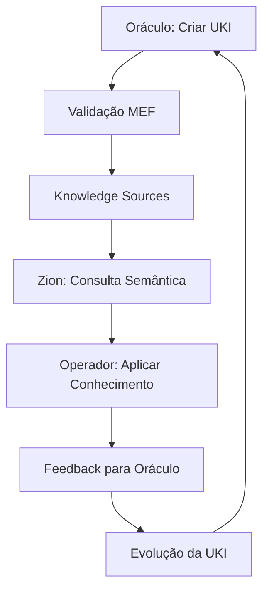
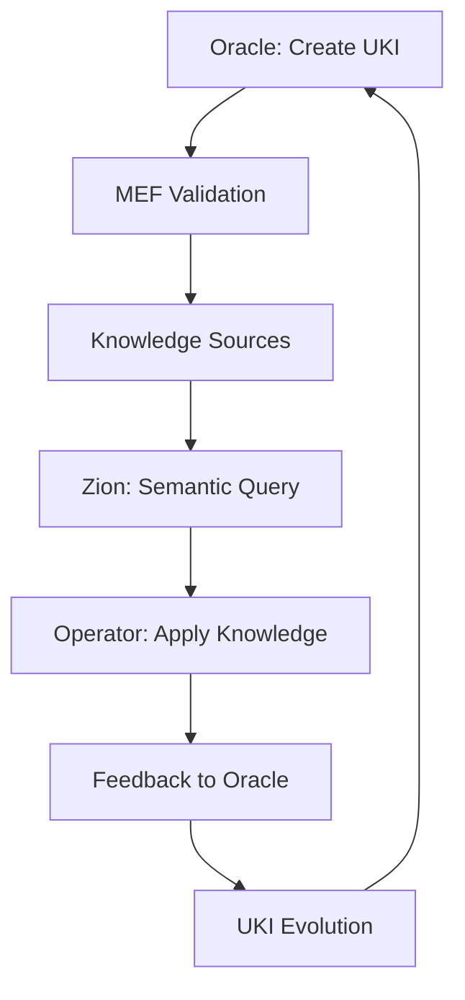

# 📜 MATRIX PROTOCOL | PROTOCOLO MATRIX

## 🌎 Idioma / Language

- [Português 🇧🇷](#português)
- [English 🇺🇸](#english)

---

# Português 🇧🇷

> "Há momentos em que uma escolha se apresenta, silenciosa, à beira do desconhecido. Algumas portas nos convidam a atravessá-las — e, ao fazê-lo, nada volta a ser como antes." — Morpheus

---

## 🌐 Visão Geral do Protocolo Matrix

O **Protocolo Matrix** é um ecossistema integrado que conecta humanos e IA por meio de três camadas interdependentes: **Oráculo**, **Zion** e **Operador**.

Cada camada desempenha um papel único no fluxo estratégico, técnico e operacional, garantindo que diretrizes sejam transformadas em ações práticas com eficiência e inteligência.

---

## 💬 Camada Oráculo

### Governança Estratégica & Base de Conhecimento

> "O Oráculo não faz previsões, ela mostra caminhos."

### Função

A Camada Oráculo é o núcleo de sabedoria do Protocolo Matrix.

Aqui nasce e é embebida a orientação, as diretrizes estratégicas e os padrões que governam a interação entre humanos e IA.

É o protocolo que, de forma proativa, promove consistência, acessibilidade e evolução contínua.

### Principais Responsabilidades

#### 📏 Governança Estratégica

* Definir diretrizes fundamentais do protocolo.
* Estabelecer métricas de sucesso para a colaboração humano-IA.
* Alinhar práticas ágeis aos objetivos estratégicos.

#### 📃 Base de Conhecimento Embebida (MEF)

* Centralizar informações técnicas, operacionais e estratégicas através do **Matrix Embedding Framework (MEF)**.
* Estruturar **UKIs (Units of Knowledge Interlinked)** versionadas e semânticamente relacionadas.
* Garantir embeddings reutilizáveis para Zion e Operador através de formato YAML padronizado.
* Atualizar continuamente os **Knowledge Sources** com insights das demais camadas usando versionamento semântico.

#### 🔧 Estruturação de Padrões (MEF Implementation)

* Implementar **templates MEF** padronizados para todos os domínios (technical, business, product, strategy, culture).
* Definir **critérios de validação** baseados na especificação MEF antes do embedamento.
* Estabelecer **relacionamentos semânticos** entre UKIs para navegação inteligente.
* Manter **histórico de evolução** através de versionamento controlado.

#### 👁️ Diretrizes de Iteração

* Estabelecer práticas recomendadas para colaboração humano-IA.
* Garantir adaptabilidade do protocolo sem perder integridade.

### Ferramentas & Componentes

| Componente              | Função/Exemplo                                                    |
| ----------------------- | ----------------------------------------------------------------- |
| **MEF Knowledge Sources** | Repositórios de UKIs estruturadas seguindo especificação MEF. |
| **UKI Templates** | Modelos MEF para diferentes domínios e tipos de conhecimento. |
| **MEF Validator** | Sistema de validação de conformidade com especificação MEF. |
| **Semantic Navigator** | Navegação inteligente através de relacionamentos entre UKIs. |
| **Version Manager** | Controle de evolução e versionamento semântico das UKIs. |
| **Framework de Governança** | Regras MEF para validar conformidade das camadas. |
| **Métricas Zion-Oráculo** | Indicadores da eficácia da tradução estratégica via MEF. |

#### Exemplo Prático com MEF

> Durante um planejamento estratégico, o Oráculo define diretrizes de segurança em desenvolvimento.
> 
> **Passo 1**: Criação de UKI `unik-technical-security-pattern` no domínio técnico
> **Passo 2**: Estruturação em formato MEF com exemplos, relacionamentos e versionamento
> **Passo 3**: Validação automática via MEF Validator antes do embedamento
> **Passo 4**: Indexação nos Knowledge Sources com metadados semânticos
> **Passo 5**: Consulta pela Zion através de busca semântica durante implementação
> 
> O resultado? Um fluxo mais seguro, com padrões claros, versionados e rastreáveis aplicados na prática.

---

## 🔬 Camada Zion

### Integração Estratégica

> "Zion é a ponte entre o mundo das ideias e o mundo da ação."

### Função

A Camada Zion é o elo vital entre estratégia (Oráculo) e operação (Operador).

Ela transforma diretrizes em ferramentas práticas, agentes inteligentes e fluxos automatizados, dando suporte real ao dia a dia das squads.

### Principais Responsabilidades

#### 🔨 Implementação das Diretrizes

* Construir sistemas que implementem os padrões do Oráculo.
* Automatizar tarefas críticas de captura, validação e enriquecimento dos **Knowledge Sources**.

#### 🧬 Gestão Inteligente

* Desenvolver agentes especializados (ex: Validator, Connector).
* Integrar ferramentas externas sem redundância.

#### 🚧 Orquestração Operacional

* Coordenar interações entre agentes primordiais e operadores.
* Garantir alinhamento dos fluxos com as diretrizes estratégicas.

#### ♻️ Enriquecimento Contínuo

* Alimentar **Knowledge Sources** com dados validados pelo Operador.
* Promover retroalimentação para aprendizado iterativo.

### Ferramentas & Componentes

| Componente           | Função/Exemplo                                 |
| -------------------- | ---------------------------------------------- |
| AI Functions         | Execução ágil de tarefas específicas via IA.   |
| Specialized Agents   | Agentes como Validator, Connector, Enricher.   |
| MCP Tools           | Integração com ferramentas via Model Context Protocol. |
| Agent Orchestrator  | Coordena interações entre agentes especializados. |

#### Exemplo Prático

> Em um refinamento técnico:
> **Specialized Agent Validator** analisa uma história do Oráculo em busca de inconsistências.
> **Specialized Agent Connector** consulta os embeddings para identificar dependências.
> As informações são enviadas ao Operador, garantindo execução precisa.

---

## 🪯 Camada Operador

### Fluxo Operacional

> "Não pense que você é. Saiba que você é." — Morpheus

### Função

A Camada Operador é onde tudo acontece na prática.

Aqui, as squads utilizam as ferramentas criadas pela Zion para implementar soluções técnicas sob as diretrizes do Oráculo.

### Principais Responsabilidades

#### ✅ Execução Prática

* Aplicar diretrizes do Oráculo usando sistemas da Zion.

#### 🤖 Interação Direta com Agentes

* Utilizar agentes em IDEs ou pipelines CI/CD para suporte em tempo real.

#### ♻️ Retroalimentação Contínua

* Registrar insights práticos nos **Knowledge Sources**, gerando aprendizado cíclico.

### Ferramentas & Componentes

| Componente                  | Função/Exemplo                               |
| --------------------------- | -------------------------------------------- |
| Extensões de IDE Integradas | Extensões para interação direta com agentes. |
| Pipelines CI/CD            | Deploys automatizados via CI/CD.             |
| AI Functions               | Validações rápidas nas operações práticas via IA. |

#### Exemplo Prático

> Durante uma sprint:
> O desenvolvedor usa IDE integrada com IA para receber sugestões dos **Knowledge Sources**.
> Valida padrões do Oráculo enquanto implementa histórias, garantindo conformidade.

---

# ✨ O Despertar na Matrix

> "A resposta está aí, te procurando. E vai te encontrar, se você quiser." — Trinity

O momento da escolha chegou.
Você **cruzou camadas**, **decifrou códigos** e agora está diante da porta.
O próximo passo **só pode ser dado por você**.

**A Matrix está pronta para ser reprogramada.**
**Você está pronto para descobrir até onde vai a toca do coelho?**

---

## 🔗 Integração Matrix Embedding Framework (MEF)

O Protocolo Matrix é implementado através do **Matrix Embedding Framework (MEF)**, que fornece a estrutura concreta para as camadas conceituais:

### 🎯 **MEF como Implementação da Camada Oráculo**

- **Estruturação de Conhecimento**: UKIs fornecem formato padronizado para todos os tipos de conhecimento
- **Versionamento Semântico**: Evolução controlada do conhecimento com rastreabilidade completa
- **Organização por Domínios**: Cinco domínios (technical, business, product, strategy, culture) cobrem todo conhecimento organizacional
- **Framework de Validação**: Verificação automática de conformidade garante qualidade do conhecimento
- **Mapeamento de Relacionamentos**: Conexões semânticas permitem navegação inteligente do conhecimento

### 🔄 **Ciclo de Vida MEF no Protocolo Matrix**

### 📊 **Benefícios MEF para o Protocolo Matrix**

- **Consistência**: Formato de conhecimento padronizado em todas as camadas
- **Rastreabilidade**: Histórico completo de evolução do conhecimento e decisões
- **Escalabilidade**: Framework se adapta de conhecimento pessoal ao empresarial
- **Inteligência**: Formato pronto para IA para busca semântica e recomendações
- **Colaboração**: Estrutura clara permite compartilhamento efetivo de conhecimento humano-IA

## 🚀 Considerações de Implementação

O Protocolo Matrix serve como framework fundamental para organizações implementando sistemas de colaboração humano-IA:

### **Mapeamento de Implementação**

- **Camada Oráculo** → **Sistemas de Gestão de Conhecimento**: Governança estruturada através do MEF
- **Camada Zion** → **Engine de Processamento IA**: Capacidades de processamento inteligente e busca semântica
- **Camada Operador** → **Plataforma de Integração**: Implementação prática através de APIs e ferramentas

### **Benefícios do Framework**

Este framework filosófico e técnico fornece às organizações:
- **Arquitetura Clara**: Camadas bem definidas para diferentes responsabilidades
- **Conhecimento Padronizado**: MEF garante representação consistente do conhecimento
- **Implementação Escalável**: De equipes individuais à adoção empresarial
- **Estrutura Pronta para IA**: Construída para sistemas inteligentes e colaboração humano-IA
- **Design Evolutivo**: Melhoria contínua através de ciclos de feedback

As organizações podem adaptar o Protocolo Matrix às suas necessidades específicas mantendo os princípios fundamentais de colaboração humano-IA estruturada.

---

# English 🇺🇸

> "There are moments when a choice presents itself, silent, at the edge of the unknown. Some doors invite us to cross them — and in doing so, nothing is ever the same again." — Morpheus

---

## 🌐 Matrix Protocol Overview

The **Matrix Protocol** is an integrated ecosystem that connects humans and AI through three interdependent layers: **Oracle**, **Zion**, and **Operator**.

Each layer plays a unique role in the strategic, technical, and operational flow, ensuring that guidelines are transformed into practical actions with efficiency and intelligence.

---

## 💬 Oracle Layer

### Strategic Governance & Knowledge Base

> "The Oracle doesn't make predictions, she shows paths."

### Function

The Oracle Layer is the wisdom core of the Matrix Protocol.

Here is where guidance, strategic guidelines, and patterns that govern human-AI interaction are born and embedded.

It is the protocol that proactively promotes consistency, accessibility, and continuous evolution.

### Main Responsibilities

#### 📏 Strategic Governance

* Define fundamental protocol guidelines.
* Establish success metrics for human-AI collaboration.
* Align agile practices with strategic objectives.

#### 📃 Embedded Knowledge Base (MEF)

* Centralize technical, operational, and strategic information through the **Matrix Embedding Framework (MEF)**.
* Structure **UKIs (Units of Knowledge Interlinked)** with versioning and semantic relationships.
* Ensure reusable embeddings for Zion and Operator through standardized YAML format.
* Continuously update **Knowledge Sources** with insights from other layers using semantic versioning.

#### 🔧 Pattern Structuring (MEF Implementation)

* Implement **MEF templates** standardized for all domains (technical, business, product, strategy, culture).
* Define **validation criteria** based on MEF specification before embedding.
* Establish **semantic relationships** between UKIs for intelligent navigation.
* Maintain **evolution history** through controlled versioning.

#### 👁️ Iteration Guidelines

* Establish recommended practices for human-AI collaboration.
* Ensure protocol adaptability without losing integrity.

### Tools & Components

| Component               | Function/Example                                                  |
| ----------------------- | ----------------------------------------------------------------- |
| **MEF Knowledge Sources** | Repositories of structured UKIs following MEF specification. |
| **UKI Templates** | MEF models for different domains and knowledge types. |
| **MEF Validator** | System for validating compliance with MEF specification. |
| **Semantic Navigator** | Intelligent navigation through UKI relationships. |
| **Version Manager** | Control of evolution and semantic versioning of UKIs. |
| **Governance Framework** | MEF rules to validate layer compliance. |
| **Zion-Oracle Metrics** | Indicators of strategic translation effectiveness via MEF. |

#### Practical Example with MEF

> During strategic planning, Oracle defines security guidelines for development.
> 
> **Step 1**: Creation of UKI `unik-technical-security-pattern` in technical domain
> **Step 2**: Structuring in MEF format with examples, relationships, and versioning
> **Step 3**: Automatic validation via MEF Validator before embedding
> **Step 4**: Indexing in Knowledge Sources with semantic metadata
> **Step 5**: Query by Zion through semantic search during implementation
> 
> The result? A more secure flow with clear, versioned, and traceable standards applied in practice.

---

## 🔬 Zion Layer

### Strategic Integration

> "Zion is the bridge between the world of ideas and the world of action."

### Function

The Zion Layer is the vital link between strategy (Oracle) and operation (Operator).

It transforms guidelines into practical tools, intelligent agents, and automated flows, providing real support for squads' daily work.

### Main Responsibilities

#### 🔨 Guideline Implementation

* Build systems that implement Oracle patterns.
* Automate critical tasks for capturing, validating, and enriching **Knowledge Sources**.

#### 🧬 Intelligent Management

* Develop specialized agents (e.g., Validator, Connector).
* Integrate external tools without redundancy.

#### 🚧 Operational Orchestration

* Coordinate interactions between primordial agents and operators.
* Ensure flow alignment with strategic guidelines.

#### ♻️ Continuous Enrichment

* Feed **Knowledge Sources** with data validated by the Operator.
* Promote feedback for iterative learning.

### Tools & Components

| Component            | Function/Example                              |
| -------------------- | --------------------------------------------- |
| AI Functions         | Agile execution of specific tasks via AI.    |
| Specialized Agents   | Agents like Validator, Connector, Enricher.  |
| MCP Tools           | Integration with tools via Model Context Protocol. |
| Agent Orchestrator  | Coordinates interactions between specialized agents. |

#### Practical Example

> In technical refinement:
> **Specialized Agent Validator** analyzes an Oracle story for inconsistencies.
> **Specialized Agent Connector** queries embeddings to identify dependencies.
> Information is sent to the Operator, ensuring precise execution.

---

## 🪯 Operator Layer

### Operational Flow

> "Don't think you are. Know you are." — Morpheus

### Function

The Operator Layer is where everything happens in practice.

Here, squads use tools created by Zion to implement technical solutions under Oracle guidelines.

### Main Responsibilities

#### ✅ Practical Execution

* Apply Oracle guidelines using Zion systems.

#### 🤖 Direct Agent Interaction

* Use agents in IDEs or CI/CD pipelines for real-time support.

#### ♻️ Continuous Feedback

* Register practical insights in **Knowledge Sources**, generating cyclical learning.

### Tools & Components

| Component                   | Function/Example                             |
| --------------------------- | -------------------------------------------- |
| Integrated IDE Extensions   | Extensions for direct agent interaction.    |
| CI/CD Pipelines            | Automated deployments via CI/CD.            |
| AI Functions               | Quick validations in practical operations via AI. |

#### Practical Example

> During a sprint:
> The developer uses AI-integrated IDE to receive suggestions from **Knowledge Sources**.
> Validates Oracle patterns while implementing stories, ensuring compliance.

---

# ✨ Awakening in the Matrix

> "The answer is out there, looking for you. And it will find you, if you want it to." — Trinity

The moment of choice has arrived.
You have **crossed layers**, **deciphered codes**, and now stand before the door.
The next step **can only be taken by you**.

**The Matrix is ready to be reprogrammed.**
**Are you ready to discover how deep the rabbit hole goes?**

---

## 🔗 Matrix Embedding Framework (MEF) Integration

The Matrix Protocol is implemented through the **Matrix Embedding Framework (MEF)**, which provides the concrete structure for the conceptual layers:

### 🎯 **MEF as Oracle Layer Implementation**

- **Knowledge Structuring**: UKIs provide standardized format for all knowledge types
- **Semantic Versioning**: Controlled evolution of knowledge with full traceability
- **Domain Organization**: Five domains (technical, business, product, strategy, culture) cover all organizational knowledge
- **Validation Framework**: Automatic compliance checking ensures knowledge quality
- **Relationship Mapping**: Semantic connections enable intelligent knowledge navigation

### 🔄 **MEF Lifecycle in Matrix Protocol**

### 📊 **MEF Benefits for Matrix Protocol**

- **Consistency**: Standardized knowledge format across all layers
- **Traceability**: Full history of knowledge evolution and decisions
- **Scalability**: Framework adapts from personal to enterprise knowledge
- **Intelligence**: AI-ready format for semantic search and recommendations
- **Collaboration**: Clear structure enables effective human-AI knowledge sharing

## 🚀 Implementation Considerations

The Matrix Protocol serves as a foundational framework for organizations implementing human-AI collaboration systems:

### **Implementation Mapping**

- **Oracle Layer** → **Knowledge Management Systems**: Structured knowledge governance through MEF
- **Zion Layer** → **AI Processing Engine**: Intelligent processing and semantic search capabilities  
- **Operator Layer** → **Integration Platform**: Practical implementation through APIs and tools

### **Framework Benefits**

This philosophical and technical framework provides organizations with:
- **Clear Architecture**: Well-defined layers for different responsibilities
- **Standardized Knowledge**: MEF ensures consistent knowledge representation
- **Scalable Implementation**: From individual teams to enterprise-wide adoption
- **AI-Ready Structure**: Built for intelligent systems and human-AI collaboration
- **Evolutionary Design**: Continuous improvement through feedback loops

Organizations can adapt the Matrix Protocol to their specific needs while maintaining the core principles of structured human-AI collaboration.
