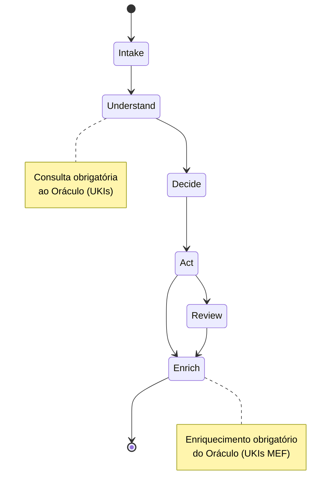
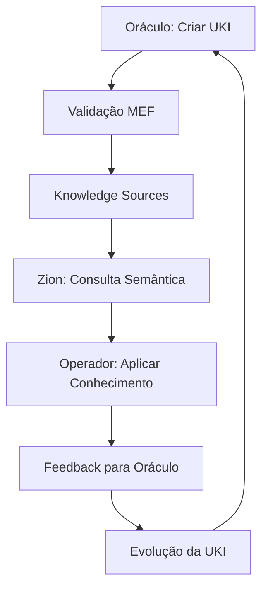
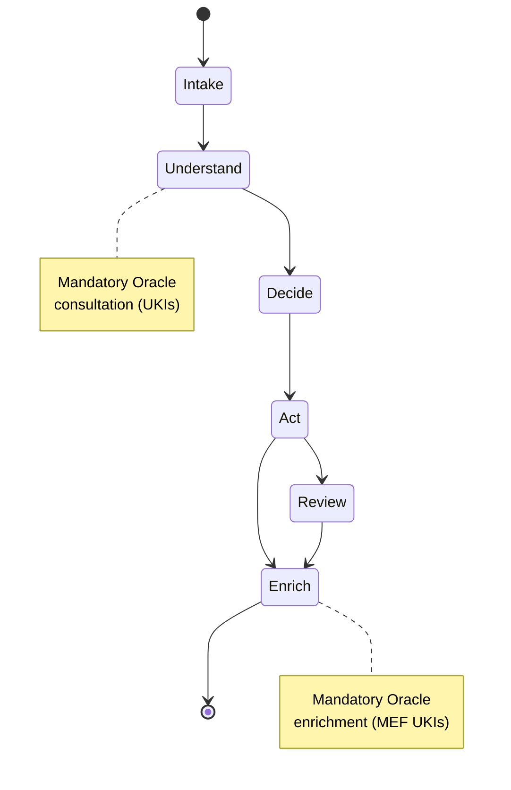
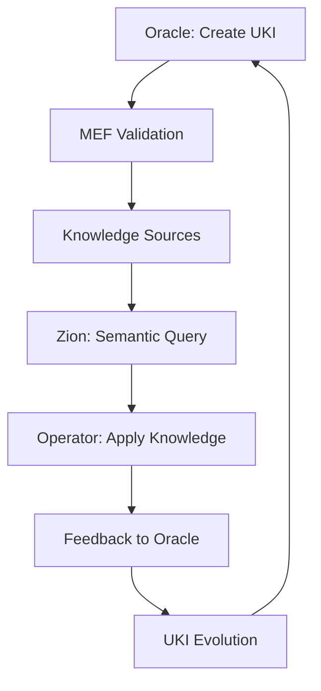

# 📜 MATRIX PROTOCOL | PROTOCOLO MATRIX

## 🌎 Idioma / Language

- [Português 🇧🇷](#português)
- [English 🇺🇸](#english)

---

# Português 🇧🇷

> "Há momentos em que uma escolha se apresenta, silenciosa, à beira do desconhecido. Algumas portas nos convidam a atravessá-las — e, ao fazê-lo, nada volta a ser como antes." — Morpheus

---

## 🌐 Visão Geral do Protocolo Matrix

O **Protocolo Matrix** é um ecossistema integrado que conecta humanos e IA por meio de três camadas interdependentes: **Oráculo**, **Zion** e **Operador**.

Cada camada desempenha um papel único no fluxo estratégico, técnico e operacional, garantindo que diretrizes sejam transformadas em ações práticas com eficiência e inteligência.

---

## 💬 Camada Oráculo

### Governança Estratégica & Base de Conhecimento

> "O Oráculo não faz previsões, ela mostra caminhos."

### Função

A Camada Oráculo é o núcleo de sabedoria do Protocolo Matrix.

Aqui nasce e é embebida a orientação, as diretrizes estratégicas e os padrões que governam a interação entre humanos e IA.

É o protocolo que, de forma proativa, promove consistência, acessibilidade e evolução contínua.

### Principais Responsabilidades

#### 📏 Governança Estratégica através do MEF

* Definir diretrizes fundamentais através de **UKIs do domínio strategy** versionadas e rastreáveis.
* Estabelecer métricas de sucesso para colaboração humano-IA como **UKIs de business_rule**.
* Criar **UKIs de decision** para registrar alinhamentos de práticas ágeis aos objetivos estratégicos.
* Garantir que toda decisão estratégica seja capturada, versionada e relacionada semanticamente no MEF.

#### 📃 Base de Conhecimento Embebida como Governança Ativa

* Implementar **governança através de UKIs**: cada diretriz, regra e padrão é uma UKI versionada e rastreável.
* Estruturar **Knowledge Sources governados** onde mudanças estratégicas propagam automaticamente.
* Garantir **rastreabilidade de decisões** através de relacionamentos semânticos entre UKIs estratégicas.
* Criar **ciclo de governança MEF**: Strategy UKIs → Technical UKIs → Business UKIs → Culture UKIs.

#### 🔧 Estruturação de Padrões com Governança Integrada

* Aplicar **governance templates MEF** onde cada padrão técnico está ligado a decisões estratégicas.
* Implementar **validation chains**: Technical UKIs devem referenciar Strategy UKIs que as justificam.
* Estabelecer **semantic governance**: mudanças em Strategy UKIs invalidam Technical UKIs relacionadas.
* Garantir **compliance via relacionamentos**: toda UKI técnica rastreia sua origem estratégica.

#### 👁️ Diretrizes de Iteração Governadas

* Implementar **governance workflows** através de UKIs de culture domain para práticas de colaboração.
* Criar **adaptation rules** como UKIs que definem como o protocolo evolui mantendo governança.
* Estabelecer **feedback loops** onde insights das camadas Zion/Operador atualizam UKIs estratégicas.

### Ferramentas & Componentes

| Componente              | Função/Exemplo                                                    |
| ----------------------- | ----------------------------------------------------------------- |
| **Governed Knowledge Sources** | Repositórios MEF com governança estratégica integrada via relacionamentos. |
| **Governance Templates** | Templates MEF que incluem obrigatoriedade de linkagem estratégica. |
| **Compliance Validator** | Validação de conformidade MEF + verificação de rastreabilidade estratégica. |
| **Governance Navigator** | Navegação semântica que mostra cadeias de decisão Strategy → Technical. |
| **Strategic Version Manager** | Versionamento que propaga mudanças estratégicas para UKIs dependentes. |
| **Decision Traceability** | Rastreamento completo de decisões estratégicas até implementação técnica. |
| **Governance Metrics** | Métricas de cobertura, conformidade e evolução da governança via MEF. |

#### Exemplo Prático com Governança MEF Integrada

> Durante um planejamento estratégico, o Oráculo redefine diretrizes de segurança em desenvolvimento.
> 
> **Passo 1**: Criação/atualização de UKI estratégica `unik-strategy-security-policy` (v2.0.0)
> **Passo 2**: Sistema identifica automaticamente UKIs técnicas relacionadas que precisam atualização
> **Passo 3**: UKI `unik-technical-security-pattern` é marcada como "outdated" pela mudança estratégica
> **Passo 4**: Governance Validator exige atualização de UKIs técnicas para conformidade
> **Passo 5**: UKIs atualizadas mantêm rastreabilidade via `related_to` para decisão estratégica
> **Passo 6**: Zion consulta UKIs governadas com garantia de alinhamento estratégico
> 
> O resultado? Governança ativa onde mudanças estratégicas propagam automaticamente, mantendo todas as camadas alinhadas e rastreáveis.

---

## 🔬 Camada Zion

### Framework Conceitual de Workflows Orientados a IA (ZWF)

> "Zion é a ponte entre o mundo das ideias e o mundo da ação."

### Função

A Camada Zion é o elo vital entre estratégia (Oráculo) e operação (Operador).

Ela transforma diretrizes em workflows conceituais através do **ZWF (Zion Workflow Framework)** - um modelo de máquinas de estado independentes de tecnologia que orienta **como pensar** os fluxos de trabalho orientados a IA, sem prescrever **como implementar**.

### Principais Responsabilidades

#### 🔨 Estruturação Conceitual via ZWF

* **Definir padrões de fluxo** seguindo estados canônicos: `Intake → Understand → Decide → Act → Review → Enrich`
* **Catalogar eventos canônicos** que iniciam workflows: `knowledge.added`, `work.proposed`, `work.refine.requested`, `assistance.requested`, `test.authored`, `feedback.submitted`
* **Garantir ciclo fechado**: sempre consultar Oráculo → agir → enriquecer Oráculo

#### 🧬 Explicabilidade e Rastreabilidade

* **Sinais de explicabilidade** em cada estado: contexto (o que entrou) → decisão (por que transicionou) → resultado (o que saiu)
* **Fundamentação em UKIs** do Oráculo para todas as decisões críticas
* **Relacionamentos semânticos** entre UKIs motivadoras e UKIs geradas

#### 🚧 Orquestração Conceitual

* **Independência tecnológica**: ZWF define "como pensar" não "como implementar"
* **Flexibilidade de ferramentas**: cada equipe implementa com suas tecnologias preferidas
* **Padronização de raciocínio**: mesmo padrão conceitual independente da implementação

#### ♻️ Enriquecimento Obrigatório do Oráculo

* **Toda execução ZWF** deve gerar/atualizar UKIs MEF relacionadas às UKIs motivadoras
* **Aprendizados estruturados** capturados como conhecimento reutilizável
* **Evolução contínua** da base de conhecimento através dos workflows

### Padrões de Workflow ZWF

| Padrão ZWF | Evento Gatilho | Exemplo de Aplicação |
|------------|----------------|---------------------|
| **Request Flow** | `work.proposed` | Implementação de nova funcionalidade seguindo estados canônicos |
| **Refinement Flow** | `work.refine.requested` | Otimização de processo existente com abordagem incremental |  
| **Ingestion Flow** | `knowledge.added` | Processamento de documentação externa em UKIs estruturadas |
| **Assistance Flow** | `assistance.requested` | Suporte técnico ou pair programming estruturado |
| **Testing Flow** | `test.authored` | Criação de cenários de teste baseados em conhecimento |
| **Feedback Flow** | `feedback.submitted` | Processamento de correções e aprendizados |

### Estados Canônicos ZWF

#### Exemplo Prático: Implementação de Autenticação via ZWF

> **Evento:** `work.proposed` - Nova necessidade de autenticação JWT  
> **Intake:** Captura história e contexto, organiza requisitos  
> **Understand:** Consulta `unik-technical-jwt-authentication-pattern`, `unik-business-security-requirements`  
> **Decide:** Escolhe biblioteca baseada em `unik-business-vendor-approval-policy`  
> **Act:** Implementa solução usando ferramentas da equipe  
> **Review:** Validação opcional seguindo `unik-culture-code-review-process`  
> **Enrich:** Cria `unik-technical-auth-implementation-example` e `unik-technical-token-refresh-pattern`
>
> **Resultado:** Solução implementada + conhecimento estruturado devolvido ao Oráculo para reuso futuro

---

## 🪯 Camada Operador

### Framework de Inteligência Operador (OIF)

> "Não pense que você é. Saiba que você é." — Morpheus

### Função

A Camada Operador é onde a **inteligência artificial se materializa** como colaboradora do humano.

Ela é implementada através do **OIF (Operator Intelligence Framework)** - um framework conceitual que define **arquétipos de inteligência** necessários para que o conhecimento do Oráculo e os fluxos de Zion ganhem vida através de agentes que pensam, decidem e agem junto aos humanos, mantendo a essência do protocolo independente de como cada organização escolhe materializar essas inteligências.

### Principais Responsabilidades

#### 🧠 Definição de Arquétipos via OIF

* **Knowledge Agent (Oracle Intelligence)** - arquétipo especializado em compreensão, organização e relacionamento de conhecimento estruturado MEF.
* **Workflow Agent (Zion Intelligence)** - arquétipo especializado em orquestração de fluxos conceituais ZWF e materialização de intenções em ações.
* **Arquétipos Especializados** - metodologia para criação de inteligências customizadas para domínios específicos.

#### 🔧 Especificações Conceituais via OIF

* **Capacidades Mínimas** - cada arquétipo possui capacidades essenciais definidas independente de tecnologia.
* **Templates de Comunicação** - padrões de prompt e interação para cada tipo de inteligência.
* **Fluxos de Colaboração** - como diferentes arquétipos interagem semanticamente para realizar trabalho conjunto.

#### 🎯 Implementação Agnóstica via OIF

* **Independência Tecnológica** - especificações conceituais implementáveis em qualquer stack tecnológico.
* **Adaptabilidade Cultural** - metodologia para adaptar arquétipos ao contexto organizacional específico.
* **Evolução Orgânica** - processo de expansão e refinamento contínuo dos arquétipos conforme necessidades emergem.

### Ferramentas & Componentes

| Componente                 | Função/Exemplo                                                    |
| -------------------------- | ----------------------------------------------------------------- |
| **OIF Framework Specification** | Especificação completa dos arquétipos de inteligência e suas capacidades mínimas. |
| **Agent Archetype Templates** | Templates conceituais para Knowledge Agent e Workflow Agent com padrões de comunicação. |
| **Collaboration Patterns** | Padrões de interação semântica entre diferentes tipos de arquétipos. |
| **Specialization Methodology** | Metodologia para criação de arquétipos especializados para domínios específicos. |
| **Cultural Adaptation Framework** | Framework para adaptar arquétipos ao contexto e cultura organizacional. |
| **Evolution Governance** | Processo de expansão orgânica e refinamento contínuo dos arquétipos. |

#### Exemplo Prático: Implementação JWT via OIF

> **Workflow Agent** (seguindo especificação OIF) inicia orquestração de `work.proposed` para JWT
> 
> **Estado Understand:** Workflow Agent aciona capacidade `search()` do Knowledge Agent via padrão de colaboração OIF
> 
> **Knowledge Agent** (seguindo template OIF) retorna UKIs relevantes usando capacidade `search()` semântica
> 
> **Estado Decide:** Workflow Agent usa capacidade `contextualize()` para processar UKIs e decidir abordagem
> 
> **Estado Enrich:** Workflow Agent coordena via `enrich()` para que Knowledge Agent execute `synthesize()` + `relate()`
> 
> **Resultado:** Implementação concluída + Oracle enriquecido seguindo padrões de colaboração OIF

---

## 🔗 Integração Matrix Embedding Framework (MEF)

O Protocolo Matrix é implementado através do **Matrix Embedding Framework (MEF)**, que fornece a estrutura concreta para as camadas conceituais:

### 🎯 **MEF como Implementação da Camada Oráculo**

- **Estruturação de Conhecimento**: UKIs fornecem formato padronizado para todos os tipos de conhecimento
- **Versionamento Semântico**: Evolução controlada do conhecimento com rastreabilidade completa
- **Organização por Domínios**: Cinco domínios (technical, business, product, strategy, culture) cobrem todo conhecimento organizacional
- **Framework de Validação**: Verificação automática de conformidade garante qualidade do conhecimento
- **Mapeamento de Relacionamentos**: Conexões semânticas permitem navegação inteligente do conhecimento

### 🔄 **Ciclo de Vida MEF no Protocolo Matrix**

### 📊 **Benefícios MEF para o Protocolo Matrix**

- **Consistência**: Formato de conhecimento padronizado em todas as camadas
- **Rastreabilidade**: Histórico completo de evolução do conhecimento e decisões
- **Escalabilidade**: Framework se adapta de conhecimento pessoal ao empresarial
- **Inteligência**: Formato pronto para IA para busca semântica e recomendações
- **Colaboração**: Estrutura clara permite compartilhamento efetivo de conhecimento humano-IA

## 🚀 Considerações de Implementação

O Protocolo Matrix serve como framework fundamental para organizações implementando sistemas de colaboração humano-IA:

### **Mapeamento de Implementação**

- **Camada Oráculo** → **Sistemas de Gestão de Conhecimento**: Governança estruturada através do MEF (UKIs versionadas)
- **Camada Zion** → **Framework Conceitual de Workflows**: Padrões ZWF independentes de tecnologia para fluxos orientados a IA
- **Camada Operador** → **Framework de Inteligência de Agentes**: Especificações OIF de arquétipos com capacidades mínimas e padrões de colaboração

### **Benefícios do Framework**

Este framework filosófico e técnico fornece às organizações:
- **Arquitetura Clara**: Camadas bem definidas para diferentes responsabilidades
- **Conhecimento Padronizado**: MEF garante representação consistente do conhecimento
- **Workflows Conceituais**: ZWF orienta "como pensar" fluxos orientados a IA
- **Especificações de Agentes**: OIF define arquétipos de inteligência mínimos necessários sem prescrever tecnologias específicas
- **Independência Tecnológica**: Todas as camadas permitem flexibilidade de ferramentas mantendo consistência conceitual
- **Rastreabilidade Completa**: Relacionamentos semânticos entre conhecimento e decisões
- **Implementação Escalável**: De equipes individuais à adoção empresarial
- **Estrutura Pronta para IA**: Construída para sistemas inteligentes e colaboração humano-IA
- **Design Evolutivo**: Melhoria contínua através de ciclos de feedback e enriquecimento obrigatório

As organizações podem adaptar o Protocolo Matrix às suas necessidades específicas mantendo os princípios fundamentais de colaboração humano-IA estruturada.

---

# ✨ O Despertar na Matrix

> "A resposta está aí, te procurando. E vai te encontrar, se você quiser." — Trinity

O momento da escolha chegou.
Você **cruzou camadas**, **decifrou códigos** e agora está diante da porta.
O próximo passo **só pode ser dado por você**.

**A Matrix está pronta para ser reprogramada.**
**Você está pronto para descobrir até onde vai a toca do coelho?**

---

# English 🇺🇸

> "There are moments when a choice presents itself, silent, at the edge of the unknown. Some doors invite us to cross them — and in doing so, nothing is ever the same again." — Morpheus

---

## 🌐 Matrix Protocol Overview

The **Matrix Protocol** is an integrated ecosystem that connects humans and AI through three interdependent layers: **Oracle**, **Zion**, and **Operator**.

Each layer plays a unique role in the strategic, technical, and operational flow, ensuring that guidelines are transformed into practical actions with efficiency and intelligence.

---

## 💬 Oracle Layer

### Strategic Governance & Knowledge Base

> "The Oracle doesn't make predictions, she shows paths."

### Function

The Oracle Layer is the wisdom core of the Matrix Protocol.

Here is where guidance, strategic guidelines, and patterns that govern human-AI interaction are born and embedded.

It is the protocol that proactively promotes consistency, accessibility, and continuous evolution.

### Main Responsibilities

#### 📏 Strategic Governance through MEF

* Define fundamental guidelines through **versioned and traceable Strategy domain UKIs**.
* Establish human-AI collaboration success metrics as **business_rule UKIs**.
* Create **decision UKIs** to record strategic alignments between agile practices and objectives.
* Ensure every strategic decision is captured, versioned, and semantically related in MEF.

#### 📃 Embedded Knowledge Base as Active Governance

* Implement **governance through UKIs**: every guideline, rule, and pattern is a versioned and traceable UKI.
* Structure **governed Knowledge Sources** where strategic changes propagate automatically.
* Ensure **decision traceability** through semantic relationships between strategic UKIs.
* Create **MEF governance cycle**: Strategy UKIs → Technical UKIs → Business UKIs → Culture UKIs.

#### 🔧 Pattern Structuring with Integrated Governance

* Apply **governance templates MEF** where every technical pattern links to strategic decisions.
* Implement **validation chains**: Technical UKIs must reference Strategy UKIs that justify them.
* Establish **semantic governance**: changes in Strategy UKIs invalidate related Technical UKIs.
* Ensure **compliance via relationships**: every technical UKI traces its strategic origin.

#### 👁️ Governed Iteration Guidelines

* Implement **governance workflows** through culture domain UKIs for collaboration practices.
* Create **adaptation rules** as UKIs that define how the protocol evolves while maintaining governance.
* Establish **feedback loops** where Zion/Operator insights update strategic UKIs.

### Tools & Components

| Component               | Function/Example                                                  |
| ----------------------- | ----------------------------------------------------------------- |
| **Governed Knowledge Sources** | MEF repositories with integrated strategic governance via relationships. |
| **Governance Templates** | MEF templates requiring mandatory strategic linkage. |
| **Compliance Validator** | MEF compliance validation + strategic traceability verification. |
| **Governance Navigator** | Semantic navigation showing Strategy → Technical decision chains. |
| **Strategic Version Manager** | Versioning that propagates strategic changes to dependent UKIs. |
| **Decision Traceability** | Complete tracking from strategic decisions to technical implementation. |
| **Governance Metrics** | Metrics for coverage, compliance, and governance evolution via MEF. |

#### Practical Example with Integrated MEF Governance

> During strategic planning, Oracle redefines security guidelines for development.
> 
> **Step 1**: Creation/update of strategic UKI `unik-strategy-security-policy` (v2.0.0)
> **Step 2**: System automatically identifies related technical UKIs requiring updates
> **Step 3**: UKI `unik-technical-security-pattern` is marked as "outdated" by strategic change
> **Step 4**: Governance Validator requires technical UKI updates for compliance
> **Step 5**: Updated UKIs maintain traceability via `related_to` to strategic decision
> **Step 6**: Zion queries governed UKIs with guaranteed strategic alignment
> 
> The result? Active governance where strategic changes propagate automatically, keeping all layers aligned and traceable.

---

## 🔬 Zion Layer

### AI-Oriented Workflow Conceptual Framework (ZWF)

> "Zion is the bridge between the world of ideas and the world of action."

### Function

The Zion Layer is the vital link between strategy (Oracle) and operation (Operator).

It transforms guidelines into conceptual workflows through the **ZWF (Zion Workflow Framework)** - a technology-independent state machine model that guides **how to think** about AI-oriented workflows, without prescribing **how to implement**.

### Main Responsibilities

#### 🔨 Conceptual Structuring via ZWF

* **Define flow patterns** following canonical states: `Intake → Understand → Decide → Act → Review → Enrich`
* **Catalog canonical events** that initiate workflows: `knowledge.added`, `work.proposed`, `work.refine.requested`, `assistance.requested`, `test.authored`, `feedback.submitted`
* **Ensure closed loop**: always consult Oracle → act → enrich Oracle

#### 🧬 Explainability and Traceability

* **Explainability signals** in each state: context (what came in) → decision (why it transitioned) → result (what came out)
* **UKI-based reasoning** from Oracle for all critical decisions
* **Semantic relationships** between motivating UKIs and generated UKIs

#### 🚧 Conceptual Orchestration

* **Technology independence**: ZWF defines "how to think" not "how to implement"
* **Tool flexibility**: each team implements with their preferred technologies
* **Reasoning standardization**: same conceptual pattern regardless of implementation

#### ♻️ Mandatory Oracle Enrichment

* **Every ZWF execution** must generate/update MEF UKIs related to motivating UKIs
* **Structured learnings** captured as reusable knowledge
* **Continuous evolution** of knowledge base through workflows

### ZWF Workflow Patterns

| ZWF Pattern | Trigger Event | Application Example |
|-------------|---------------|---------------------|
| **Request Flow** | `work.proposed` | New functionality implementation following canonical states |
| **Refinement Flow** | `work.refine.requested` | Existing process optimization with incremental approach |  
| **Ingestion Flow** | `knowledge.added` | External documentation processing into structured UKIs |
| **Assistance Flow** | `assistance.requested` | Structured technical support or pair programming |
| **Testing Flow** | `test.authored` | Test scenario creation based on knowledge |
| **Feedback Flow** | `feedback.submitted` | Processing corrections and learnings |

### ZWF Canonical States

#### Practical Example: JWT Authentication Implementation via ZWF

> **Event:** `work.proposed` - New JWT authentication requirement  
> **Intake:** Captures story and context, organizes requirements  
> **Understand:** Consults `unik-technical-jwt-authentication-pattern`, `unik-business-security-requirements`  
> **Decide:** Chooses library based on `unik-business-vendor-approval-policy`  
> **Act:** Implements solution using team tools  
> **Review:** Optional validation following `unik-culture-code-review-process`  
> **Enrich:** Creates `unik-technical-auth-implementation-example` and `unik-technical-token-refresh-pattern`
>
> **Result:** Solution implemented + structured knowledge returned to Oracle for future reuse

---

## 🪯 Operator Layer

### Operator Intelligence Framework (OIF)

> "Don't think you are. Know you are." — Morpheus

### Function

The Operator Layer is where **artificial intelligence materializes** as a human collaborator.

It is implemented through the **OIF (Operator Intelligence Framework)** - a conceptual framework that defines **intelligence archetypes** necessary for Oracle knowledge and Zion workflows to come alive through agents that think, decide, and act alongside humans, maintaining the protocol's essence independent of how each organization chooses to materialize these intelligences.

### Main Responsibilities

#### 🧠 Archetype Definition via OIF

* **Knowledge Agent (Oracle Intelligence)** - archetype specialized in comprehension, organization, and relationship of structured MEF knowledge.
* **Workflow Agent (Zion Intelligence)** - archetype specialized in orchestration of conceptual ZWF flows and materialization of intentions into actions.
* **Specialized Archetypes** - methodology for creating customized intelligences for specific domains.

#### 🔧 Conceptual Specifications via OIF

* **Minimum Capabilities** - each archetype possesses essential capabilities defined independent of technology.
* **Communication Templates** - prompt and interaction patterns for each intelligence type.
* **Collaboration Flows** - how different archetypes interact semantically to perform joint work.

#### 🎯 Agnostic Implementation via OIF

* **Technology Independence** - conceptual specifications implementable in any technology stack.
* **Cultural Adaptability** - methodology for adapting archetypes to specific organizational context.
* **Organic Evolution** - process of continuous expansion and refinement of archetypes as needs emerge.

### Tools & Components

| Component                    | Function/Example                                                  |
| ---------------------------- | ----------------------------------------------------------------- |
| **OIF Framework Specification** | Complete specification of intelligence archetypes and their minimum capabilities. |
| **Agent Archetype Templates** | Conceptual templates for Knowledge Agent and Workflow Agent with communication patterns. |
| **Collaboration Patterns** | Semantic interaction patterns between different archetype types. |
| **Specialization Methodology** | Methodology for creating specialized archetypes for specific domains. |
| **Cultural Adaptation Framework** | Framework for adapting archetypes to organizational context and culture. |
| **Evolution Governance** | Process for organic expansion and continuous archetype refinement. |

#### Practical Example: JWT Implementation via OIF

> **Workflow Agent** (following OIF specification) initiates orchestration of `work.proposed` for JWT
> 
> **Understand State:** Workflow Agent triggers Knowledge Agent's `search()` capability via OIF collaboration pattern
> 
> **Knowledge Agent** (following OIF template) returns relevant UKIs using semantic `search()` capability
> 
> **Decide State:** Workflow Agent uses `contextualize()` capability to process UKIs and decide approach
> 
> **Enrich State:** Workflow Agent coordinates via `enrich()` for Knowledge Agent to execute `synthesize()` + `relate()`
> 
> **Result:** Implementation completed + Oracle enriched following OIF collaboration patterns

---

## 🔗 Matrix Embedding Framework (MEF) Integration

The Matrix Protocol is implemented through the **Matrix Embedding Framework (MEF)**, which provides the concrete structure for the conceptual layers:

### 🎯 **MEF as Oracle Layer Implementation**

- **Knowledge Structuring**: UKIs provide standardized format for all knowledge types
- **Semantic Versioning**: Controlled evolution of knowledge with full traceability
- **Domain Organization**: Five domains (technical, business, product, strategy, culture) cover all organizational knowledge
- **Validation Framework**: Automatic compliance checking ensures knowledge quality
- **Relationship Mapping**: Semantic connections enable intelligent knowledge navigation

### 🔄 **MEF Lifecycle in Matrix Protocol**

### 📊 **MEF Benefits for Matrix Protocol**

- **Consistency**: Standardized knowledge format across all layers
- **Traceability**: Full history of knowledge evolution and decisions
- **Scalability**: Framework adapts from personal to enterprise knowledge
- **Intelligence**: AI-ready format for semantic search and recommendations
- **Collaboration**: Clear structure enables effective human-AI knowledge sharing

## 🚀 Implementation Considerations

The Matrix Protocol serves as a foundational framework for organizations implementing human-AI collaboration systems:

### **Implementation Mapping**

- **Oracle Layer** → **Knowledge Management Systems**: Structured governance through MEF (versioned and traceable UKIs)
- **Zion Layer** → **Conceptual Workflow Framework**: ZWF patterns for technology-independent AI-oriented workflows
- **Operator Layer** → **Agent Intelligence Framework**: OIF archetype specifications with minimum capabilities and collaboration patterns

### **Framework Benefits**

This philosophical and technical framework provides organizations with:
- **Clear Architecture**: Well-defined layers for different responsibilities
- **Standardized Knowledge**: MEF ensures consistent knowledge representation
- **Conceptual Workflows**: ZWF guides "how to think" about AI-oriented flows without prescribing "how to implement"
- **Agent Specifications**: OIF defines minimum intelligence archetypes needed without prescribing specific technologies
- **Technology Independence**: All layers allow tool flexibility while maintaining conceptual consistency
- **Complete Traceability**: Semantic relationships between knowledge and decisions
- **Scalable Implementation**: From individual teams to enterprise-wide adoption
- **AI-Ready Structure**: Built for intelligent systems and human-AI collaboration
- **Evolutionary Design**: Continuous improvement through feedback loops and mandatory Oracle enrichment

Organizations can adapt the Matrix Protocol to their specific needs while maintaining the core principles of structured human-AI collaboration.

---

# ✨ Awakening in the Matrix

> "The answer is out there, looking for you. And it will find you, if you want it to." — Trinity

The moment of choice has arrived.
You have **crossed layers**, **deciphered codes**, and now stand before the door.
The next step **can only be taken by you**.

**The Matrix is ready to be reprogrammed.**
**Are you ready to discover how deep the rabbit hole goes?**

---