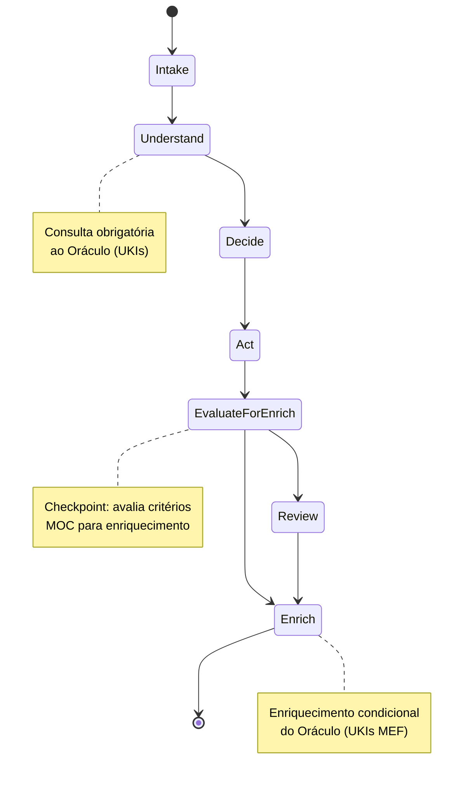
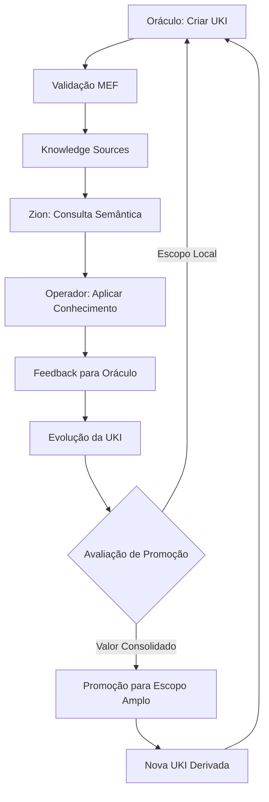
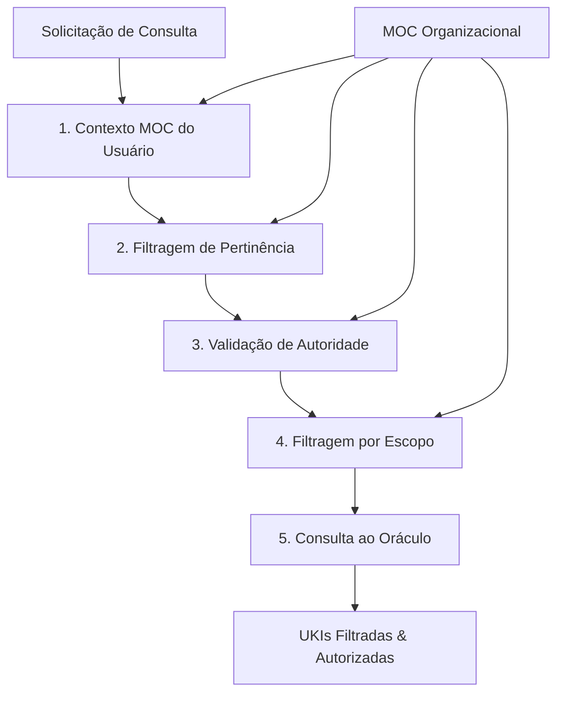
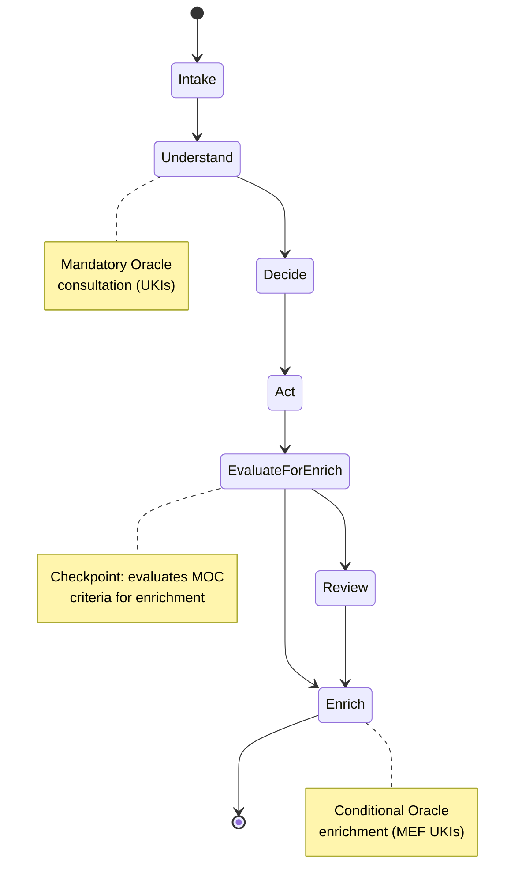
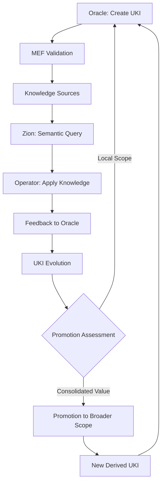
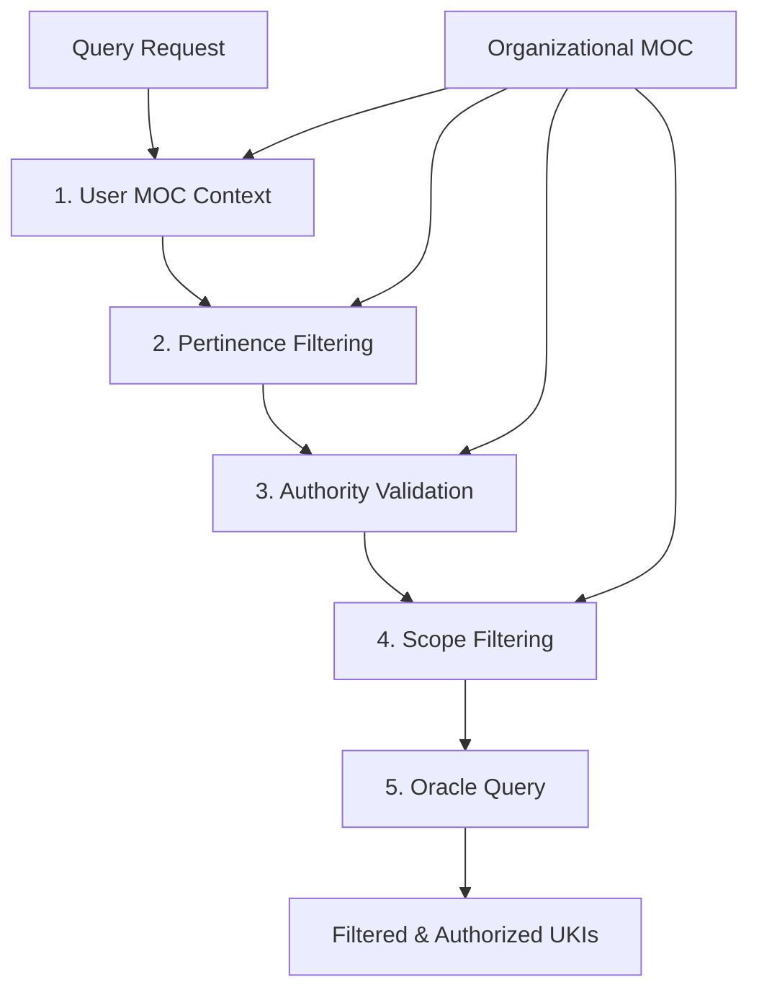

# 📜 MATRIX PROTOCOL | PROTOCOLO MATRIX

> 🚨 **IMPORTANTE**: Este documento contém exemplos ilustrativos que **NÃO são taxonomias obrigatórias**. Todas as taxonomias são configuráveis via MOC organizacional.

> 🚨 **IMPORTANT**: This document contains illustrative examples that are **NOT mandatory taxonomies**. All taxonomies are configurable via organizational MOC.

## 🌎 Idioma / Language

- [Português 🇧🇷](#português)
- [English 🇺🇸](#english)

---

# Português 🇧🇷

> "Há momentos em que uma escolha se apresenta, silenciosa, à beira do desconhecido. Algumas portas nos convidam a atravessá-las — e, ao fazê-lo, nada volta a ser como antes." — Morpheus

---

## 🌐 Visão Geral do Protocolo Matrix

O **Protocolo Matrix** é um ecossistema integrado que conecta humanos e IA por meio de três camadas interdependentes: **Oráculo**, **Zion** e **Operador**.

Cada camada desempenha um papel único no fluxo estratégico, técnico e operacional, garantindo que diretrizes sejam transformadas em ações práticas com eficiência e inteligência.

### 🔧 Flexibilidade Local com Coerência Global

O Protocolo Matrix separa **conceitos centrais universais** de **taxonomias organizacionais específicas** seguindo o **MEP (Matrix Elasticity Principle)**:

#### 🏆 Conceitos Universais (Fixos)
- **Estados Canonônicos**: Intake → Understand → Decide → Act → EvaluateForEnrich → Review → Enrich
- **Checkpoints Obrigatórios**: EvaluateForEnrich como ponto de avaliação condicional
- **Campos Estruturais**: scope_ref, domain_ref, type_ref, maturity_ref (referências, não valores)
- **Relacionamentos Semânticos**: Tipos de relação entre UKIs (implements, depends_on, extends, etc.)

#### 🏛️ Hierarquias Locais (Configuráveis via MOC)
- **Catálogo Semântico**: Cada organização define sua estrutura hierárquica no **MOC (Matrix Ontology Catalog)**
- **Taxonomias Organizacionais**: Domínios, tipos, escopos e níveis de maturidade específicos
- **Regras de Governança**: Autoridades, visibilidade e propagação definidas por contexto
- **Critérios de Enriquecimento**: Parâmetros do EvaluateForEnrich adaptáveis ao contexto organizacional

#### 🤝 Interoperabilidade Semântica
- **Conceitos Compartilháveis**: Conhecimento pode ser exportado entre organizações mantendo estrutura universal
- **Tradutibilidade**: MOCs diferentes podem mapear conceitos equivalentes
- **Coerência Global**: Mesmos princípios fundamentais independente da configuração local

> 💡 **Princípio MEP**: *"Conceitos universais garantem interoperabilidade; hierarquias configuráveis garantem adaptábil idade. O MOC é a fonte única de verdade para taxonomias organizacionais."*

---

## 💬 Camada Oráculo

### Governança Estratégica & Base de Conhecimento

> "O Oráculo não faz previsões, ela mostra caminhos."

### Função

A Camada Oráculo é o núcleo de sabedoria do Protocolo Matrix.

Aqui nasce e é embebida a orientação, as diretrizes estratégicas e os padrões que governam a interação entre humanos e IA.

É o protocolo que, de forma proativa, promove consistência, acessibilidade e evolução contínua.

### Principais Responsabilidades

#### 📏 Governança Estratégica através do MEF

* Definir diretrizes fundamentais através de **UKIs de domínios estratégicos** (configuráveis via MOC) versionadas e rastreáveis.
* Estabelecer métricas de sucesso para colaboração humano-IA como **UKIs de tipos apropriados** definidos no MOC organizacional.
* Criar **UKIs de decision** para registrar alinhamentos de práticas ágeis aos objetivos estratégicos.
* Garantir que toda decisão estratégica seja capturada, versionada e relacionada semanticamente no MEF.

#### 📃 Base de Conhecimento Embebida como Governança Ativa

* Implementar **governança através de UKIs**: cada diretriz, regra e padrão é uma UKI versionada e rastreável.
* Estruturar **Knowledge Sources governados** onde mudanças estratégicas propagam automaticamente.
* Garantir **rastreabilidade de decisões** através de relacionamentos semânticos entre UKIs estratégicas.
* Criar **ciclos de governança MEF** baseados nas hierarquias definidas no MOC organizacional (exemplo: UKIs estratégicas → UKIs técnicas → UKIs operacionais).

#### 🔧 Estruturação de Padrões com Governança Integrada

* Aplicar **governance templates MEF** onde cada padrão técnico está ligado a decisões estratégicas.
* Implementar **validation chains**: UKIs de níveis hierárquicos inferiores devem referenciar UKIs que as justificam conforme MOC.
* Estabelecer **semantic governance**: mudanças em UKIs de maior autoridade invalidam UKIs relacionadas de níveis inferiores.
* Garantir **compliance via relacionamentos**: toda UKI técnica rastreia sua origem estratégica.

#### 👁️ Diretrizes de Iteração Governadas

* Implementar **governance workflows** através de UKIs de domínios culturais/organizacionais conforme definido no MOC.
* Criar **adaptation rules** como UKIs que definem como o protocolo evolui mantendo governança.
* Estabelecer **feedback loops** onde insights das camadas Zion/Operador atualizam UKIs estratégicas.

### Ferramentas & Componentes

| Componente              | Função/Exemplo                                                    |
| ----------------------- | ----------------------------------------------------------------- |
| **Governed Knowledge Sources** | Repositórios MEF com governança estratégica integrada via relacionamentos. |
| **Governance Templates** | Templates MEF configuráveis que seguem regras de linkagem definidas no MOC organizacional. |
| **Compliance Validator** | Validação de conformidade MEF + verificação de rastreabilidade estratégica. |
| **Governance Navigator** | Navegação semântica que mostra cadeias de decisão Strategy → Technical. |
| **Strategic Version Manager** | Versionamento que propaga mudanças estratégicas para UKIs dependentes. |
| **Decision Traceability** | Rastreamento completo de decisões estratégicas até implementação técnica. |
| **Governance Metrics** | Métricas de cobertura, conformidade e evolução da governança via MEF. |

#### Exemplo Prático com Governança MEF Integrada

> 🚨 **EXEMPLO ILUSTRATIVO** - Os valores `strategy`, `security-policy`, etc. são apenas demonstrativos. Organizações definem suas próprias taxonomias via MOC.

> Durante um planejamento estratégico, o Oráculo redefine diretrizes de segurança em desenvolvimento.
> 
> **Passo 1**: Criação/atualização de UKI estratégica `uki:strategy:decision:security-policy` 
> **Passo 2**: Sistema identifica automaticamente UKIs técnicas relacionadas que precisam atualização
> **Passo 3**: UKI `uki:technical:pattern:security-implementation` é marcada como "outdated" pela mudança estratégica
> **Passo 4**: Governance Validator exige atualização de UKIs técnicas para conformidade
> **Passo 5**: UKIs atualizadas mantêm rastreabilidade via `related_to` para decisão estratégica
> **Passo 6**: Zion consulta UKIs governadas com garantia de alinhamento estratégico
> 
> O resultado? Governança ativa onde mudanças estratégicas propagam automaticamente, mantendo todas as camadas alinhadas e rastreáveis.

---

## 🔬 Camada Zion

### Framework Conceitual de Workflows Orientados a IA (ZOF)

> "Zion é a ponte entre o mundo das ideias e o mundo da ação."

### Função

A Camada Zion é o elo vital entre estratégia (Oráculo) e operação (Operador).

Ela transforma diretrizes em workflows conceituais através do **ZOF (Zion Orchestration Framework)** - um modelo de máquinas de estado independentes de tecnologia que orienta **como pensar** os fluxos de trabalho orientados a IA, sem prescrever **como implementar**.

### Principais Responsabilidades

#### 🔨 Estruturação Conceitual via ZOF

* **Definir padrões de fluxo** seguindo estados canônicos: `Intake → Understand → Decide → Act → EvaluateForEnrich → Review → Enrich`
* **Catalogar eventos canônicos** que iniciam workflows: `knowledge.added`, `work.proposed`, `work.refine.requested`, `assistance.requested`, `test.authored`, `feedback.submitted`
* **Checkpoint condicional**: `EvaluateForEnrich` aplica critérios definidos no MOC organizacional para decidir se conhecimento deve enriquecer Oracle
* **Garantir ciclo fechado**: sempre consultar Oráculo → agir → avaliar para enriquecimento → enriquecer Oráculo

#### 🧬 Explicabilidade e Rastreabilidade

* **Sinais de explicabilidade** em cada estado: contexto (o que entrou) → decisão (por que transicionou) → resultado (o que saiu)
* **Fundamentação em UKIs** do Oráculo para todas as decisões críticas
* **Relacionamentos semânticos** entre UKIs motivadoras e UKIs geradas

#### 🚧 Orquestração Conceitual

* **Independência tecnológica**: ZOF define "como pensar" não "como implementar"
* **Flexibilidade de ferramentas**: cada equipe implementa com suas tecnologias preferidas
* **Padronização de raciocínio**: mesmo padrão conceitual independente da implementação

#### ♻️ Enriquecimento Condicional do Oráculo

* **Execuções ZOF** que passam no `EvaluateForEnrich` geram/atualizam UKIs MEF relacionadas às UKIs motivadoras
* **Aprendizados estruturados** capturados como conhecimento reutilizável quando justificáveis via critérios MOC
* **Evolução contínua** da base de conhecimento através de enriquecimento criterioso e validado

### Padrões de Workflow ZOF

| Padrão ZOF | Evento Gatilho | Exemplo de Aplicação |
|------------|----------------|---------------------|
| **Request Flow** | `work.proposed` | Implementação de nova funcionalidade seguindo estados canônicos |
| **Refinement Flow** | `work.refine.requested` | Otimização de processo existente com abordagem incremental |  
| **Ingestion Flow** | `knowledge.added` | Processamento de documentação externa em UKIs estruturadas |
| **Assistance Flow** | `assistance.requested` | Suporte técnico ou pair programming estruturado |
| **Testing Flow** | `test.authored` | Criação de cenários de teste baseados em conhecimento |
| **Feedback Flow** | `feedback.submitted` | Processamento de correções e aprendizados |

### Estados Canônicos ZOF

#### Exemplo Prático: Implementação de Autenticação via ZOF

> 🚨 **EXEMPLO ILUSTRATIVO** - UKIs como `jwt-authentication`, `security-requirements` são demonstrativas. Organizações configuram taxonomias via MOC.

> **Evento:** `work.proposed` - Nova necessidade de autenticação JWT  
> **Intake:** Captura história e contexto, organiza requisitos  
> **Understand:** Consulta `uki:technical:pattern:jwt-authentication`, `uki:business:rule:security-requirements`  
> **Decide:** Escolhe biblioteca baseada em `uki:business:policy:vendor-approval`  
> **Act:** Implementa solução usando ferramentas da equipe  
> **EvaluateForEnrich:** Avalia critérios MOC (relevância=alta, reusabilidade=média, impacto=alto) → aprovado para enriquecimento com escopo "team"
> **Review:** Validação opcional seguindo `uki:culture:guideline:code-review-process`  
> **Enrich:** Cria `uki:technical:example:auth-implementation` e `uki:technical:pattern:token-refresh`
>
> **Resultado:** Solução implementada + conhecimento estruturado devolvido ao Oráculo para reuso futuro

---

## 🪯 Camada Operador

### Framework de Inteligência Operador (OIF)

> "Não pense que você é. Saiba que você é." — Morpheus

### Função

A Camada Operador é onde a **inteligência artificial se materializa** como colaboradora do humano.

Ela é implementada através do **OIF (Operator Intelligence Framework)** - um framework conceitual que define **arquétipos de inteligência** necessários para que o conhecimento do Oráculo e os fluxos de Zion ganhem vida através de agentes que pensam, decidem e agem junto aos humanos, mantendo a essência do protocolo independente de como cada organização escolhe materializar essas inteligências.

### Principais Responsabilidades

#### 🧠 Definição de Arquétipos via OIF

* **Knowledge Agent (Oracle Intelligence)** - arquétipo especializado em compreensão, organização e relacionamento de conhecimento estruturado MEF com controle de acesso baseado no MOC.
* **Workflow Agent (Zion Intelligence)** - arquétipo especializado em orquestração de fluxos conceituais ZOF incluindo execução do checkpoint EvaluateForEnrich.
* **Arquétipos Especializados** - metodologia para criação de inteligências customizadas para domínios específicos com níveis de autoridade definidos pelo MOC.

#### 🔧 Capacidades Integradas ao MOC via OIF

* **Resolução de Pertinência** - filtrar e apresentar UKIs baseado nas permissões de escopo e domínio do usuário definidas no MOC
* **Validação de Autoridade** - verificar se o usuário possui autoridade necessária para operações baseado nas regras de governança do MOC
* **Explicabilidade da Governança** - fornecer explicações transparentes para decisões de acesso referenciando nós específicos do MOC
* **Caminhos de Escalonamento** - rotear automaticamente solicitações que requerem autoridade superior conforme configuração do MOC

#### 🎯 Implementação Ciente de Governança via OIF

* **Controle de Acesso Baseado no MOC** - todas as operações de agentes respeitam hierarquia organizacional e regras de governança
* **Assistência Ciente de Contexto** - agentes compreendem e operam dentro do escopo e domínio autorizado do usuário
* **Tomada de Decisão Auditável** - todas as ações dos agentes são rastrearáveis às regras do MOC e permissões do usuário
* **Adaptação Dinâmica de Autoridade** - agentes adaptam suas capacidades baseadas no papel atual e contexto do usuário

### Ferramentas & Componentes

| Componente                 | Função/Exemplo                                                    |
| -------------------------- | ----------------------------------------------------------------- |
| **OIF Framework Specification** | Especificação completa dos arquétipos de inteligência com capacidades de integração ao MOC. |
| **Templates de Agentes Cientes do MOC** | Templates para Knowledge e Workflow Agents com padrões cientes de governança. |
| **Motor de Resolução de Pertinência** | Sistema para filtrar UKIs baseado no acesso de escopo e domínio definido pelo MOC do usuário. |
| **Camada de Validação de Autoridade** | Componente que verifica permissões do usuário contra regras de governança do MOC. |
| **Sistema de Explicação de Governança** | Fornece explicações transparentes referenciando nós e regras específicos do MOC. |
| **Adaptação Dinâmica de Autoridade** | Framework para adaptar capacidades de agentes baseado no contexto atual do usuário no MOC. |

#### Exemplo Prático: Implementação JWT via OIF

> 🚨 **EXEMPLO ILUSTRATIVO** - Escopo `team`, domínio `technical`, arquétipo `Knowledge Agent` são demonstrativos. MOC define taxonomias organizacionais.

> **Contexto do Usuário:** Desenvolvedor com MOC scope="team", domain_access=["technical"], authority="developer"
>
> **Workflow Agent** inicia orquestração `work.proposed`, valida autoridade do usuário via MOC
> 
> **Estado Understand:** Workflow Agent solicita busca ao Knowledge Agent com filtros MOC (scope≤"team", domain="technical")
> 
> **Knowledge Agent** retorna UKIs acessíveis ao usuário: `uki:technical:pattern:jwt-standard` (scope="team"), filtrando padrões de nível organizacional
> 
> **Estado EvaluateForEnrich:** Workflow Agent aplica critérios de avaliação do MOC e determina enrichment scope="team" baseado na autoridade do usuário
>
> **Estado Enrich:** Knowledge Agent cria novas UKIs com scope_ref="team", respeitando permissões MOC do usuário
> 
> **Resultado:** Implementação concluída + Oracle enriquecido dentro do escopo autorizado do usuário, governança MOC completa aplicada

---

## 🔗 Integração Matrix Embedding Framework (MEF)

O Protocolo Matrix é implementado através do **Matrix Embedding Framework (MEF)**, que fornece a estrutura concreta para as camadas conceituais:

### 🎯 **MEF como Implementação da Camada Oráculo**

- **Estruturação de Conhecimento**: UKIs fornecem formato padronizado para todos os tipos de conhecimento
- **Versionamento Semântico**: Evolução controlada do conhecimento com rastreabilidade completa
- **Organização por Domínios**: Domínios organizacionais (exemplos: technical, business, product - definidos no MOC organizacional) estruturam todo conhecimento
- **Framework de Validação**: Verificação automática de conformidade garante qualidade do conhecimento
- **Mapeamento de Relacionamentos**: Conexões semânticas permitem navegação inteligente do conhecimento
- **Promoção de Conhecimento**: Transição formal de UKIs de escopo limitado para amplo através de reconhecimento de valor consolidado

### 🔄 **Ciclo de Vida MEF no Protocolo Matrix**

### 📊 **Benefícios MEF para o Protocolo Matrix**

- **Consistência**: Formato de conhecimento padronizado em todas as camadas
- **Rastreabilidade**: Histórico completo de evolução do conhecimento e decisões
- **Escalabilidade**: Framework se adapta de conhecimento pessoal ao empresarial
- **Inteligência**: Formato pronto para IA para busca semântica e recomendações
- **Colaboração**: Estrutura clara permite compartilhamento efetivo de conhecimento humano-IA
- **Maturação Orgânica**: Processo de promoção permite evolução natural do conhecimento de local para organizacional

### ⚡ **Ordem Operacional Padrão para Consultas Oracle**

Para garantir consistência entre implementações, o protocolo estabelece a seguinte ordem operacional obrigatória:

**Sequência Operacional:**
1. **Contexto MOC**: Identificar hierarquia, autoridades e escopo do usuário via MOC
2. **Filtragem de Pertinência**: Aplicar regras de visibilidade baseadas no contexto hierárquico
3. **Validação de Autoridade**: Verificar se o usuário tem autoridade para acessar domínios/tipos solicitados
4. **Filtragem por Escopo**: Aplicar restrições de escopo (restricted vs propagated) conforme MOC
5. **Consulta ao Oráculo**: Executar busca semântica apenas no subconjunto autorizado de UKIs

**🛑 Importante**: A filtragem **sempre precede** a consulta, nunca o contrário, para garantir segurança e eficiência.

---

## 🏛️ MOC - Matrix Ontology Catalog

O **Matrix Ontology Catalog (MOC)** é a **fonte única de verdade** para taxonomias e governança organizacional no Protocolo Matrix:

### 🎯 **Função do MOC**
- **Taxonomias Configuráveis**: Define domínios, tipos, escopos e níveis de maturidade específicos da organização
- **Governança Hierárquica**: Estabelece regras de autoridade, visibilidade e propagação por contexto
- **Critérios de Enriquecimento**: Define parâmetros para o checkpoint EvaluateForEnrich
- **Interoperabilidade**: Permite mapeamento entre diferentes estruturas organizacionais

### 🔗 **Integração com Camadas Matrix**
- **Oraculo + MOC**: UKIs MEF usam *_ref fields que referenciam nós do MOC em vez de valores fixos
- **Zion + MOC**: ZOF consulta MOC para validação de autoridade durante EvaluateForEnrich
- **Operador + MOC**: OIF usa MOC para filtrar conhecimento e validar explicações baseadas em hierarquias

### 📋 **Documento de Referência**
Ver especificação completa: `MOC_CATALOGO_SEMANTICO_HIERARQUIAS.md`

---

## 🚀 Considerações de Implementação

O Protocolo Matrix serve como framework fundamental para organizações implementando sistemas de colaboração humano-IA:

### **Mapeamento de Implementação**

- **Camada Oráculo** → **Sistemas de Gestão de Conhecimento**: Governança estruturada através do MEF (UKIs versionadas com capacidades de promoção)
- **Camada Zion** → **Framework Conceitual de Workflows**: Padrões ZOF independentes de tecnologia para fluxos orientados a IA
- **Camada Operador** → **Framework de Inteligência de Agentes**: Especificações OIF de arquétipos com capacidades mínimas e padrões de colaboração

### **Benefícios do Framework**

Este framework filosófico e técnico fornece às organizações:
- **Arquitetura Clara**: Camadas bem definidas para diferentes responsabilidades
- **Conhecimento Padronizado**: MEF garante representação consistente do conhecimento com flexibilidade hierárquica via MOC
- **Workflows Conceituais**: ZOF orienta "como pensar" fluxos orientados a IA com checkpoint EvaluateForEnrich
- **Especificações de Agentes**: OIF define arquétipos de inteligência cientes de governança com integração ao MOC
- **Flexibilidade Local**: MOC permite adaptação completa às estruturas organizacionais preservando conceitos globais
- **Independência Tecnológica**: Todas as camadas permitem flexibilidade de ferramentas mantendo consistência conceitual
- **Rastreabilidade Completa**: Relacionamentos semânticos entre conhecimento e decisões com transparência de governança
- **Governança Adaptável**: Regras de autoridade, visibilidade e propagação configuradas por contexto organizacional
- **Implementação Escalável**: De equipes individuais à adoção empresarial
- **Estrutura Pronta para IA**: Construída para sistemas inteligentes e colaboração humano-IA
- **Design Evolutivo**: Melhoria contínua através de ciclos de feedback e enriquecimento criterioso via EvaluateForEnrich

As organizações podem adaptar o Protocolo Matrix às suas necessidades específicas mantendo os princípios fundamentais de colaboração humano-IA estruturada.

---

# ✨ O Despertar na Matrix

> "A resposta está aí, te procurando. E vai te encontrar, se você quiser." — Trinity

O momento da escolha chegou.
Você **cruzou camadas**, **decifrou códigos** e agora está diante da porta.
O próximo passo **só pode ser dado por você**.

**A Matrix está pronta para ser reprogramada.**
**Você está pronto para descobrir até onde vai a toca do coelho?**

---

# English 🇺🇸

> "There are moments when a choice presents itself, silent, at the edge of the unknown. Some doors invite us to cross them — and in doing so, nothing is ever the same again." — Morpheus

---

## 🌐 Matrix Protocol Overview

The **Matrix Protocol** is an integrated ecosystem that connects humans and AI through three interdependent layers: **Oracle**, **Zion**, and **Operator**.

Each layer plays a unique role in the strategic, technical, and operational flow, ensuring that guidelines are transformed into practical actions with efficiency and intelligence.

### 🔧 Local Flexibility with Global Coherence

The Matrix Protocol separates **universal core concepts** from **organization-specific taxonomies** following the **MOCP (Matrix Elasticity Principle)**:

#### 🏆 Universal Concepts (Fixed)
- **Canonical States**: Intake → Understand → Decide → Act → EvaluateForEnrich → Review → Enrich
- **Mandatory Checkpoints**: EvaluateForEnrich as conditional evaluation point
- **Structural Fields**: scope_ref, domain_ref, type_ref, maturity_ref (references, not values)
- **Semantic Relationships**: Relationship types between UKIs (implements, depends_on, extends, etc.)

#### 🏛️ Local Hierarchies (Configurable via MOC)
- **Semantic Catalog**: Each organization defines its hierarchical structure in **MOC (Matrix Ontology Catalog)**
- **Organizational Taxonomies**: Domains, types, scopes, and maturity levels specific to context
- **Governance Rules**: Authorities, visibility, and propagation defined by context
- **Enrichment Criteria**: EvaluateForEnrich parameters adaptable to organizational context

#### 🤝 Semantic Interoperability
- **Shareable Concepts**: Knowledge can be exported between organizations maintaining universal structure
- **Translatability**: Different MOCs can map equivalent concepts
- **Global Coherence**: Same fundamental principles regardless of local configuration

> 💡 **MOCP Principle**: *"Universal concepts ensure interoperability; configurable hierarchies ensure adaptability. MOC is the single source of truth for organizational taxonomies."*

---

## 💬 Oracle Layer

### Strategic Governance & Knowledge Base

> "The Oracle doesn't make predictions, she shows paths."

### Function

The Oracle Layer is the wisdom core of the Matrix Protocol.

Here is where guidance, strategic guidelines, and patterns that govern human-AI interaction are born and embedded.

It is the protocol that proactively promotes consistency, accessibility, and continuous evolution.

### Main Responsibilities

#### 📏 Strategic Governance through MEF

* Define fundamental guidelines through **versioned and traceable Strategy domain UKIs**.
* Establish human-AI collaboration success metrics as **business_rule UKIs**.
* Create **decision UKIs** to record strategic alignments between agile practices and objectives.
* Ensure every strategic decision is captured, versioned, and semantically related in MEF.

#### 📃 Embedded Knowledge Base as Active Governance

* Implement **governance through UKIs**: every guideline, rule, and pattern is a versioned and traceable UKI.
* Structure **governed Knowledge Sources** where strategic changes propagate automatically.
* Ensure **decision traceability** through semantic relationships between strategic UKIs.
* Create **MEF governance cycles** based on hierarchies defined in organizational MOC (example: strategic UKIs → technical UKIs → operational UKIs).

#### 🔧 Pattern Structuring with Integrated Governance

* Apply **governance templates MEF** where every technical pattern links to strategic decisions.
* Implement **validation chains**: UKIs from lower hierarchical levels must reference justifying UKIs according to MOC.
* Establish **semantic governance**: changes in higher-authority UKIs invalidate related UKIs from lower levels.
* Ensure **compliance via relationships**: every technical UKI traces its strategic origin.

#### 👁️ Governed Iteration Guidelines

* Implement **governance workflows** through culture domain UKIs for collaboration practices.
* Create **adaptation rules** as UKIs that define how the protocol evolves while maintaining governance.
* Establish **feedback loops** where Zion/Operator insights update strategic UKIs.

### Tools & Components

| Component               | Function/Example                                                  |
| ----------------------- | ----------------------------------------------------------------- |
| **Governed Knowledge Sources** | MEF repositories with integrated strategic governance via relationships. |
| **Governance Templates** | Configurable MEF templates following linkage rules defined in organizational MOC. |
| **Compliance Validator** | MEF compliance validation + strategic traceability verification. |
| **Governance Navigator** | Semantic navigation showing Strategy → Technical decision chains. |
| **Strategic Version Manager** | Versioning that propagates strategic changes to dependent UKIs. |
| **Decision Traceability** | Complete tracking from strategic decisions to technical implementation. |
| **Governance Metrics** | Metrics for coverage, compliance, and governance evolution via MEF. |

#### Practical Example with Integrated MEF Governance

> 🚨 **ILLUSTRATIVE EXAMPLE** - Values like `strategy`, `security-policy`, etc. are demonstrative. Organizations define their taxonomies via MOC.

> During strategic planning, Oracle redefines security guidelines for development.
> 
> **Step 1**: Creation/update of strategic UKI `uki:strategy:decision:security-policy` 
> **Step 2**: System automatically identifies related technical UKIs requiring updates
> **Step 3**: UKI `uki:technical:pattern:security-implementation` is marked as "outdated" by strategic change
> **Step 4**: Governance Validator requires technical UKI updates for compliance
> **Step 5**: Updated UKIs maintain traceability via `related_to` to strategic decision
> **Step 6**: Zion queries governed UKIs with guaranteed strategic alignment
> 
> The result? Active governance where strategic changes propagate automatically, keeping all layers aligned and traceable.

---

## 🔬 Zion Layer

### AI-Oriented Workflow Conceptual Framework (ZOF)

> "Zion is the bridge between the world of ideas and the world of action."

### Function

The Zion Layer is the vital link between strategy (Oracle) and operation (Operator).

It transforms guidelines into conceptual workflows through the **ZOF (Zion Orchestration Framework)** - a technology-independent state machine model that guides **how to think** about AI-oriented workflows, without prescribing **how to implement**.

### Main Responsibilities

#### 🔨 Conceptual Structuring via ZOF

* **Define flow patterns** following canonical states: `Intake → Understand → Decide → Act → EvaluateForEnrich → Review → Enrich`
* **Catalog canonical events** that initiate workflows: `knowledge.added`, `work.proposed`, `work.refine.requested`, `assistance.requested`, `test.authored`, `feedback.submitted`
* **Mandatory checkpoint**: `EvaluateForEnrich` applies MOC-defined organizational criteria to decide if knowledge should enrich Oracle
* **Ensure closed loop**: always consult Oracle → act → evaluate for enrichment → enrich Oracle

#### 🧬 Explainability and Traceability

* **Explainability signals** in each state: context (what came in) → decision (why it transitioned) → result (what came out)
* **UKI-based reasoning** from Oracle for all critical decisions
* **Semantic relationships** between motivating UKIs and generated UKIs

#### 🚧 Conceptual Orchestration

* **Technology independence**: ZOF defines "how to think" not "how to implement"
* **Tool flexibility**: each team implements with their preferred technologies
* **Reasoning standardization**: same conceptual pattern regardless of implementation

#### ♻️ Conditional Oracle Enrichment

* **ZOF executions** that pass `EvaluateForEnrich` generate/update MEF UKIs related to motivating UKIs
* **Structured learnings** captured as reusable knowledge when justifiable via MOC criteria
* **Continuous evolution** of knowledge base through criterious and validated enrichment

### ZOF Workflow Patterns

| ZOF Pattern | Trigger Event | Application Example |
|-------------|---------------|---------------------|
| **Request Flow** | `work.proposed` | New functionality implementation following canonical states |
| **Refinement Flow** | `work.refine.requested` | Existing process optimization with incremental approach |  
| **Ingestion Flow** | `knowledge.added` | External documentation processing into structured UKIs |
| **Assistance Flow** | `assistance.requested` | Structured technical support or pair programming |
| **Testing Flow** | `test.authored` | Test scenario creation based on knowledge |
| **Feedback Flow** | `feedback.submitted` | Processing corrections and learnings |

### ZOF Canonical States

#### Practical Example: JWT Authentication Implementation via ZOF

> 🚨 **ILLUSTRATIVE EXAMPLE** - UKIs like `jwt-authentication`, `security-requirements` are demonstrative. Organizations configure taxonomies via MOC.

> **Event:** `work.proposed` - New JWT authentication requirement  
> **Intake:** Captures story and context, organizes requirements  
> **Understand:** Consults `uki:technical:pattern:jwt-authentication`, `uki:business:rule:security-requirements`  
> **Decide:** Chooses library based on `uki:business:policy:vendor-approval`  
> **Act:** Implements solution using team tools  
> **EvaluateForEnrich:** Evaluates MOC criteria (relevance=high, reusability=medium, impact=high) → approved for enrichment with "team" scope
> **Review:** Optional validation following `uki:culture:guideline:code-review-process`  
> **Enrich:** Creates `uki:technical:example:auth-implementation` and `uki:technical:pattern:token-refresh`
>
> **Result:** Solution implemented + structured knowledge returned to Oracle for future reuse

---

## 🪯 Operator Layer

### Operator Intelligence Framework (OIF)

> "Don't think you are. Know you are." — Morpheus

### Function

The Operator Layer is where **artificial intelligence materializes** as a human collaborator.

It is implemented through the **OIF (Operator Intelligence Framework)** - a conceptual framework that defines **intelligence archetypes** necessary for Oracle knowledge and Zion workflows to come alive through agents that think, decide, and act alongside humans, maintaining the protocol's essence independent of how each organization chooses to materialize these intelligences.

### Main Responsibilities

#### 🧠 Archetype Definition via OIF

* **Knowledge Agent (Oracle Intelligence)** - archetype specialized in comprehension, organization, and relationship of structured MEF knowledge with MOC-based access control.
* **Workflow Agent (Zion Intelligence)** - archetype specialized in orchestration of conceptual ZOF flows including EvaluateForEnrich checkpoint execution.
* **Specialized Archetypes** - methodology for creating customized intelligences for specific domains with MOC-defined authority levels.

#### 🔧 MOC-Integrated Capabilities via OIF

* **Pertinence Resolution** - filter and present UKIs based on user's scope and domain permissions from MOC
* **Authority Validation** - verify user has required authority for operations based on MOC governance rules
* **Explaining Governance** - provide transparent explanations for access decisions referencing specific MOC nodes
* **Escalation Pathways** - automatically route requests requiring higher authority per MOC configuration

#### 🎯 Governance-Aware Implementation via OIF

* **MOC-Based Access Control** - all agent operations respect organizational hierarchy and governance rules
* **Context-Aware Assistance** - agents understand and operate within user's authorized scope and domain
* **Auditable Decision Making** - all agent actions are traceable to MOC rules and user permissions
* **Dynamic Authority Adaptation** - agents adapt their capabilities based on user's current role and context

### Tools & Components

| Component                    | Function/Example                                                  |
| ---------------------------- | ----------------------------------------------------------------- |
| **OIF Framework Specification** | Complete specification of intelligence archetypes with MOC integration capabilities. |
| **MOC-Aware Agent Templates** | Templates for Knowledge and Workflow Agents with governance-aware patterns. |
| **Pertinence Resolution Engine** | System for filtering UKIs based on user's MOC-defined scope and domain access. |
| **Authority Validation Layer** | Component that verifies user permissions against MOC governance rules. |
| **Governance Explanation System** | Provides transparent explanations referencing specific MOC nodes and rules. |
| **Dynamic Authority Adaptation** | Framework for adapting agent capabilities based on user's current MOC context. |

#### Practical Example: JWT Implementation via OIF

> 🚨 **ILLUSTRATIVE EXAMPLE** - Scope `team`, domain `technical`, archetype `Knowledge Agent` are demonstrative. MOC defines organizational taxonomies.

> **User Context:** Developer with MOC scope="team", domain_access=["technical"], authority="developer"
>
> **Workflow Agent** initiates `work.proposed` orchestration, validates user authority via MOC
> 
> **Understand State:** Workflow Agent requests Knowledge Agent search with MOC filters (scope≤"team", domain="technical")
> 
> **Knowledge Agent** returns UKIs accessible to user: `uki:technical:pattern:jwt-standard` (scope="team"), filtering out organization-level patterns
> 
> **EvaluateForEnrich State:** Workflow Agent applies MOC evaluation criteria and determines enrichment scope="team" based on user authority
>
> **Enrich State:** Knowledge Agent creates new UKIs with scope_ref="team", respecting user's MOC permissions
> 
> **Result:** Implementation completed + Oracle enriched within user's authorized scope, full MOC governance applied

---

## 🔗 Matrix Embedding Framework (MEF) Integration

The Matrix Protocol is implemented through the **Matrix Embedding Framework (MEF)**, which provides the concrete structure for the conceptual layers:

### 🎯 **MEF as Oracle Layer Implementation**

- **Knowledge Structuring**: UKIs provide standardized format for all knowledge types
- **Semantic Versioning**: Controlled evolution of knowledge with full traceability
- **Domain Organization**: Five domains (technical, business, product, strategy, culture) cover all organizational knowledge
- **Validation Framework**: Automatic compliance checking ensures knowledge quality
- **Relationship Mapping**: Semantic connections enable intelligent knowledge navigation

### 🔄 **MEF Lifecycle in Matrix Protocol**

### 📊 **MEF Benefits for Matrix Protocol**

- **Consistency**: Standardized knowledge format across all layers
- **Traceability**: Full history of knowledge evolution and decisions
- **Scalability**: Framework adapts from personal to enterprise knowledge
- **Intelligence**: AI-ready format for semantic search and recommendations
- **Collaboration**: Clear structure enables effective human-AI knowledge sharing
- **Organic Maturation**: Promotion process enables natural evolution of knowledge from local to organizational scope

### ⚡ **Standard Operational Order for Oracle Queries**

To ensure consistency between implementations, the protocol establishes the following mandatory operational order:

**Operational Sequence:**
1. **MOC Context**: Identify user hierarchy, authorities and scope via MOC
2. **Pertinence Filtering**: Apply visibility rules based on hierarchical context
3. **Authority Validation**: Verify user has authority to access requested domains/types
4. **Scope Filtering**: Apply scope restrictions (restricted vs propagated) per MOC
5. **Oracle Query**: Execute semantic search only on authorized UKI subset

**🛑 Important**: Filtering **always precedes** the query, never the reverse, to ensure security and efficiency.

---

## 🏛️ MOC - Matrix Ontology Catalog

The **Matrix Ontology Catalog (MOC)** is the **single source of truth** for taxonomies and organizational governance in the Matrix Protocol:

### 🎯 **MOC Function**
- **Configurable Taxonomies**: Defines domains, types, scopes, and maturity levels specific to the organization
- **Hierarchical Governance**: Establishes authority, visibility, and propagation rules by context
- **Enrichment Criteria**: Defines parameters for the EvaluateForEnrich checkpoint
- **Interoperability**: Enables mapping between different organizational structures

### 🔗 **Integration with Matrix Layers**
- **Oracle + MOC**: MEF UKIs use *_ref fields that reference MOC nodes instead of fixed values
- **Zion + MOC**: ZOF consults MOC for authority validation during EvaluateForEnrich
- **Operator + MOC**: OIF uses MOC to filter knowledge and validate explanations based on hierarchies

### 📋 **Reference Document**
See complete specification: `MOC_CATALOGO_SEMANTICO_HIERARQUIAS.md`

---

## 🚀 Implementation Considerations

The Matrix Protocol serves as a foundational framework for organizations implementing human-AI collaboration systems:

### **Implementation Mapping**

- **Oracle Layer** → **Knowledge Management Systems**: Structured governance through MEF (versioned and traceable UKIs with promotion capabilities)
- **Zion Layer** → **Conceptual Workflow Framework**: ZOF patterns for technology-independent AI-oriented workflows
- **Operator Layer** → **Agent Intelligence Framework**: OIF archetype specifications with minimum capabilities and collaboration patterns

### **Framework Benefits**

This philosophical and technical framework provides organizations with:
- **Clear Architecture**: Well-defined layers for different responsibilities
- **Standardized Knowledge**: MEF ensures consistent knowledge representation with MOC-based hierarchical flexibility
- **Conceptual Workflows**: ZOF guides "how to think" about AI-oriented flows with EvaluateForEnrich checkpoint
- **Agent Specifications**: OIF defines governance-aware intelligence archetypes with MOC integration
- **Local Flexibility**: MOC allows complete adaptation to organizational structures while preserving global concepts
- **Technology Independence**: All layers allow tool flexibility while maintaining conceptual consistency
- **Complete Traceability**: Semantic relationships between knowledge and decisions with governance transparency
- **Adaptive Governance**: Authority, visibility, and propagation rules configured per organizational context
- **Scalable Implementation**: From individual teams to enterprise-wide adoption
- **AI-Ready Structure**: Built for intelligent systems and human-AI collaboration
- **Evolutionary Design**: Continuous improvement through feedback loops and criterious enrichment via EvaluateForEnrich

Organizations can adapt the Matrix Protocol to their specific needs while maintaining the core principles of structured human-AI collaboration.

---

# ✨ Awakening in the Matrix

> "The answer is out there, looking for you. And it will find you, if you want it to." — Trinity

The moment of choice has arrived.
You have **crossed layers**, **deciphered codes**, and now stand before the door.
The next step **can only be taken by you**.

**The Matrix is ready to be reprogrammed.**
**Are you ready to discover how deep the rabbit hole goes?**

---