# Matrix Protocol — Integration Diagram
**Acronym:** Integration Diagram  
**Status:** Stable  
**Version:** 1.0.0  
**Date:** 2025-01-25  

> 🔄 "The whole is greater than the sum of its parts — and the Matrix Protocol demonstrates this through seamless framework integration."

---

## 1. Introduction

The **Matrix Protocol Integration Diagram** provides the meta-architectural view of how all frameworks (MEF, ZOF, OIF, MOC, MEP) work together in practice.

This document visualizes the end-to-end flows that cross framework boundaries, showing concrete integration patterns that implementers encounter when building Matrix Protocol-compliant systems.

Unlike individual framework documentation that focuses on specific capabilities, this diagram shows the **complete journey** from user interaction to knowledge enrichment across all layers.

---

## 2. Core Integration Patterns

### Pattern 1: Knowledge-Driven Workflow
**Flow**: `User Request → OIF Intelligence → ZOF Workflow → Oracle Consultation → MEF UKI Creation`
- OIF receives user request and determines workflow type
- ZOF orchestrates canonical states with mandatory Oracle consultation
- MEF provides structured knowledge via UKIs during Understand state
- MOC validates all hierarchical references and authority levels
- MEP guides epistemological decisions throughout the process

### Pattern 2: Authority-Aware Operations
**Flow**: `Operation Request → MOC Authority Check → Framework-Specific Execution → MEP Compliance`
- All operations validate authority through MOC before execution
- Each framework respects user's hierarchical context
- MEP principles ensure derived authority, never absolute truth
- Escalation paths route requests requiring superior authority

### Pattern 3: Enrichment Evaluation Cycle
**Flow**: `ZOF EvaluateForEnrich → MOC Criteria → MEP Epistemology → MEF UKI Creation → OIF Explanation`
- ZOF executes mandatory enrichment evaluation
- MOC provides organizational criteria for evaluation
- MEP guides epistemological justification requirements
- MEF structures the resulting UKI with proper metadata
- OIF provides explainable feedback to users

---

## 3. End-to-End Flow Diagram

```mermaid
graph TB
    %% User Layer
    User[👤 User Request<br/>Authentication Implementation]
    
    %% OIF Layer - Intelligence Archetypes
    OIF_KA[🤖 Knowledge Agent<br/>OIF]
    OIF_WA[🔄 Workflow Agent<br/>OIF]
    OIF_EXP[💡 Explainability Interface<br/>OIF]
    
    %% ZOF Layer - Workflow Orchestration  
    ZOF_INT[📥 Intake State<br/>ZOF]
    ZOF_UND[🔍 Understand State<br/>ZOF]
    ZOF_DEC[⚖️ Decide State<br/>ZOF]
    ZOF_ACT[⚡ Act State<br/>ZOF]
    ZOF_EVL[🎯 EvaluateForEnrich<br/>ZOF]
    ZOF_ENR[📚 Enrich State<br/>ZOF]
    
    %% MEF Layer - Knowledge Structure
    MEF_UKI[📄 UKI Repository<br/>MEF]
    MEF_VER[🔄 Versioning System<br/>MEF]
    MEF_REL[🔗 Relationships<br/>MEF]
    
    %% MOC Layer - Organizational Taxonomy
    MOC_AUTH[🔐 Authority Validation<br/>MOC]
    MOC_HIER[🏗️ Hierarchies<br/>MOC]
    MOC_CRIT[📊 Evaluation Criteria<br/>MOC]
    
    %% MEP Layer - Epistemological Foundation
    MEP_PRINC[📜 Five Principles<br/>MEP]
    MEP_AUTH[👥 Derived Authority<br/>MEP]
    MEP_EXPL[💡 Mandatory Explainability<br/>MEP]
    
    %% MAL Layer - Arbitration
    MAL_ARB[⚖️ Conflict Arbitrator<br/>MAL]
    MAL_DEC[📋 Decision Records<br/>MAL]
    MAL_POL[📊 Precedence Policies<br/>MAL]
    
    %% Integration Flow
    User --> OIF_WA
    OIF_WA --> ZOF_INT
    
    ZOF_INT --> ZOF_UND
    ZOF_UND --> OIF_KA
    OIF_KA --> MEF_UKI
    MEF_UKI --> MOC_AUTH
    MOC_AUTH --> OIF_KA
    OIF_KA --> ZOF_UND
    
    ZOF_UND --> ZOF_DEC
    ZOF_DEC --> ZOF_ACT
    ZOF_ACT --> ZOF_EVL
    
    %% MAL Arbitration Flow
    ZOF_EVL -->|"Conflict Detection<br/>(H1/H2/H3)"| MAL_ARB
    MAL_POL --> MAL_ARB
    MOC_HIER --> MAL_ARB
    MEP_PRINC --> MAL_ARB
    MAL_ARB --> MAL_DEC
    MAL_DEC --> MEF_REL
    MAL_DEC --> OIF_EXP
    
    %% Normal Flow Continuation
    ZOF_EVL -->|"No Conflicts"| MOC_CRIT
    MOC_CRIT --> MEP_PRINC
    MEP_PRINC --> ZOF_EVL
    MAL_ARB -->|"Arbitration Complete"| ZOF_EVL
    
    ZOF_EVL --> ZOF_ENR
    ZOF_ENR --> MEF_VER
    MEF_VER --> MEF_REL
    MEF_REL --> MEF_UKI
    
    ZOF_ENR --> OIF_EXP
    OIF_EXP --> MEP_EXPL
    MEP_EXPL --> User
    
    %% Cross-cutting Concerns
    MOC_HIER -.-> OIF_KA
    MOC_HIER -.-> ZOF_EVL
    MOC_HIER -.-> MEF_UKI
    
    MEP_AUTH -.-> MOC_AUTH
    MEP_AUTH -.-> OIF_WA
    MEP_AUTH -.-> ZOF_EVL
    MEP_AUTH -.-> MAL_ARB
    
    %% Styling
    classDef user fill:#e1f5fe
    classDef oif fill:#f3e5f5
    classDef zof fill:#e8f5e8
    classDef mef fill:#fff3e0
    classDef moc fill:#fce4ec
    classDef mep fill:#f1f8e9
    classDef mal fill:#ffebee
    
    class User user
    class OIF_KA,OIF_WA,OIF_EXP oif
    class ZOF_INT,ZOF_UND,ZOF_DEC,ZOF_ACT,ZOF_EVL,ZOF_ENR zof
    class MEF_UKI,MEF_VER,MEF_REL mef
    class MOC_AUTH,MOC_HIER,MOC_CRIT moc
    class MEP_PRINC,MEP_AUTH,MEP_EXPL mep
    class MAL_ARB,MAL_DEC,MAL_POL mal
```



---

## 4. Integration Points Matrix

| **From Framework** | **To Framework** | **Integration Point** | **Purpose** |
|-------------------|------------------|----------------------|-------------|
| **OIF → ZOF** | Workflow Agent | Canonical States Orchestration | Execute ZOF flows via intelligence archetypes |
| **ZOF → OIF** | Oracle Consultation | Knowledge Agent Query | Consult existing knowledge during Understand state |
| **ZOF → MEF** | Enrichment | UKI Creation | Create structured knowledge during Enrich state |
| **ZOF → MOC** | EvaluateForEnrich | Criteria Consultation | Apply organizational evaluation criteria |
| **OIF → MOC** | Authority Check | Hierarchical Validation | Validate user authority for operations |
| **MEF → MOC** | Field Validation | *_ref References | Validate all hierarchical field references |
| **OIF → MEP** | Explainability | Derived Authority | Ensure contextual, non-absolute responses |
| **ZOF → MEP** | Enrichment Decision | Epistemological Justification | Apply MEP principles in enrichment evaluation |
| **MEF → MEP** | Knowledge Promotion | Responsible Promotion | Document epistemological justification for UKI evolution |
| **ZOF → MAL** | Conflict Detection | Arbitration Invocation | Invoke MAL when EvaluateForEnrich detects H1/H2/H3 conflicts |
| **MAL → MEF** | Decision Persistence | Decision Record Storage | Persist arbitration decisions as immutable audit records |
| **MAL → OIF** | Outcome Communication | Arbitration Explanation | Explain arbitration outcomes using structured templates |
| **MOC → MAL** | Policy Configuration | Precedence Rule Supply | Provide arbitration policies and authority hierarchies |
| **MEP → MAL** | Epistemic Foundation | Rationale Generation | Guide epistemological justification in arbitration decisions |

---

## 5. Practical Examples

### **Example 1: JWT Authentication Implementation**

```yaml
# Complete Integration Flow
user_story: "As a developer, I need to implement JWT authentication"

# 1. OIF Intelligence Reception
oif_workflow_agent:
  request_analysis: "Authentication implementation need"
  workflow_determination: "Technical implementation workflow"
  canonical_event: "work.proposed"

# 2. ZOF Canonical States Execution
zof_workflow_execution:
  intake:
    signals:
      context: "JWT authentication story received"
      decision: "Clear requirements, proceed to understanding"
      result: "Context captured and organized"
  
  understand:
    oracle_consultation: 
      knowledge_agent_query: "existing authentication patterns"
      moc_authority_filter: "user scope: team, domain: technical"
      retrieved_ukis:
        - "uki:technical:pattern:jwt-authentication"
        - "uki:business:policy:security-requirements"
    signals:
      context: "Oracle returned existing authentication knowledge"
      decision: "Use proven JWT pattern with team-specific adaptations"
      result: "Implementation strategy defined"
  
  decide:
    moc_validation:
      authority_check: "user can implement in team scope"
      vendor_policy: "approved library selection"
    signals:
      context: "Strategy validated against organizational policies"
      decision: "Proceed with implementation using approved approach"
      result: "Technical plan approved"
  
  act:
    conceptual_execution: "Implement JWT solution following Oracle patterns"
    signals:
      context: "Implementation following proven patterns"
      decision: "Solution completed with team-specific enhancements"
      result: "Working authentication system deployed"
  
  evaluate_for_enrich:
    moc_criteria_consultation:
      relevance: {threshold: "medium", result: "PASS", score: 0.8}
      reusability: {threshold: "high", result: "PASS", score: 0.9}
      impact: {threshold: "medium", result: "PASS", score: 0.7}
    mep_epistemological_check:
      novelty_validation: "Team-specific implementation patterns identified"
      authority_derivation: "Authorized for team scope enrichment"
    signals:
      context: "Implementation contains reusable knowledge"
      decision: "Approve enrichment with team scope"
      result: "Qualified for Oracle enrichment"
  
  enrich:
    mef_uki_creation:
      - id: "uki:technical:example:team-jwt-implementation"
        scope_ref: "team"
        domain_ref: "technical"
        type_ref: "example"
        maturity_ref: "validated"
        relationships:
          - type: "derives_from"
            target: "uki:technical:pattern:jwt-authentication"
    signals:
      context: "New UKI created documenting team implementation"
      decision: "Knowledge stored with proper semantic relationships"
      result: "Oracle enriched for future reuse"

# 3. OIF Explainability Response
oif_explanation:
  mep_compliance: "Response contextualizes authority within team scope"
  explanation_to_user: |
    "Implementation completed successfully based on organizational patterns.
    
    ✅ Used: uki:technical:pattern:jwt-authentication (Oracle guidance)
    ✅ Validated: Against team authority and domain access
    ✅ Created: uki:technical:example:team-jwt-implementation
    
    This knowledge is now available for other team members working on
    similar authentication requirements."
```

### **Example 2: MAL Arbitration Scenario**

```yaml
# Concurrent JWT Implementation Conflict
user_story: "Two teams implementing JWT authentication simultaneously"

# 1. ZOF Conflict Detection during EvaluateForEnrich
zof_conflict_detection:
  conflict_type: "H2_concurrent_enrichment"
  candidates:
    - flow_id: "team-frontend-jwt-001"
      uki_target: "uki:technical:pattern:jwt-authentication"
      user: {scope: "team-frontend", authority: "developer"}
    - flow_id: "team-backend-jwt-002"
      uki_target: "uki:technical:pattern:jwt-authentication"
      user: {scope: "team-backend", authority: "tech_lead"}
  
  mal_invocation: "Local resolution failed, invoking MAL"

# 2. MAL Arbitration Process
mal_arbitration_event:
  event_id: "mal-evt-concurrent-jwt-001"
  event_type: "H2"
  policy_ref: "moc:arbitration:concurrent_enrichment"
  
  arbitration_decision:
    outcome: "winner"
    winner: "team-backend-jwt-002"
    loser: "team-frontend-jwt-001"
    precedence_applied:
      - "P1_authority": "tech_lead > developer"
    actions:
      - "allow_enrich:team-backend-jwt-002"
      - "defer_enrich:team-frontend-jwt-001"
    
    epistemic_rationale:
      summary: "Higher authority precedence in concurrent scenario"
      moc_nodes_cited: ["moc:authority:tech_lead", "moc:domain:technical"]

# 3. OIF Arbitration Explanation
oif_arbitration_template:
  decision_id: "mal-evt-concurrent-jwt-001"
  outcome: "winner"
  winner: "team-backend JWT implementation"
  losers: ["team-frontend JWT implementation"]
  precedence_applied: "Authority precedence: tech_lead > developer"
  
  user_explanation: |
    "Arbitration completed for concurrent JWT implementations.
    
    ✅ Winner: Backend team implementation (tech_lead authority)
    ⏸️ Deferred: Frontend team implementation 
    📋 Next Steps: Frontend team should coordinate with backend team
    🔗 Reference: MOC authority hierarchy for technical domain"

# 4. MEF Decision Record Persistence
mef_decision_record:
  decision_id: "mal-dec-concurrent-jwt-001"
  relationships_created:
    - type: "conflicts_with"
      source: "team-frontend-jwt-001"
      target: "team-backend-jwt-002"
      resolution: "authority_precedence"
  
  audit_trail: "Complete MAL arbitration recorded for future reference"
```

### **Example 3: Authority Escalation Scenario**

```yaml
# Organization-Level Policy Creation Attempt
user_request: "Create organization-wide security policy"
user_context: {scope: "team", authority: "developer", domain: "technical"}

# 1. MOC Authority Validation
moc_authority_check:
  required_scope: "organization" 
  user_max_scope: "team"
  validation_result: "ESCALATION_REQUIRED"
  escalation_path: "team_lead → architect → cto"

# 2. OIF Intelligent Response
oif_knowledge_agent:
  mep_derived_authority_application: |
    "Based on your 'developer' authority in 'team' scope (MOC: hierarchies.scope.team),
    you cannot create organization-level policies.
    
    Available actions:
    ✅ Create team-level security guidelines
    ✅ Request escalation via: team_lead → architect → cto
    🔒 Organization policy creation requires 'architect' authority or higher
    
    Reference: MOC hierarchies.scope.team.governance.policy_creation_restrictions"

# 3. ZOF Workflow Adaptation  
zof_workflow_modification:
  original_flow: "work.proposed → organization policy creation"
  adapted_flow: "assistance.requested → escalation routing"
  canonical_states:
    intake: "Policy creation request with scope mismatch"
    understand: "Consult MOC authority requirements"
    decide: "Route to escalation path per MOC configuration"
    act: "Generate escalation request with context"
    # EvaluateForEnrich skipped - no enrichment for escalation routing
```

---

## 6. Cross-References

- [MEF — Matrix Embedding Framework](MEF_MATRIX_EMBEDDING_FRAMEWORK.md)  
- [ZOF — Zion Orchestration Framework](ZOF_ZION_ORCHESTRATION_FRAMEWORK.md)  
- [OIF — Operator Intelligence Framework](OIF_OPERATOR_INTELLIGENCE_FRAMEWORK.md)  
- [MOC — Matrix Ontology Catalog](MOC_MATRIX_ONTOLOGY_CATALOG.md)  
- [MEP — Matrix Epistemic Principle](MEP_MATRIX_EPISTEMIC_PRINCIPLE.md)  
- [Matrix Protocol Glossary](MATRIX_PROTOCOL_GLOSSARY.md)
- [MAL — Matrix Arbiter Layer](MAL_MATRIX_ARBITER_LAYER.md)  
- [Matrix Protocol Integration Diagram — Portuguese](MATRIX_PROTOCOL_INTEGRATION_DIAGRAM_PT.md)  
- [Matrix Protocol Glossary — Portuguese](MATRIX_PROTOCOL_GLOSSARY_PT.md)