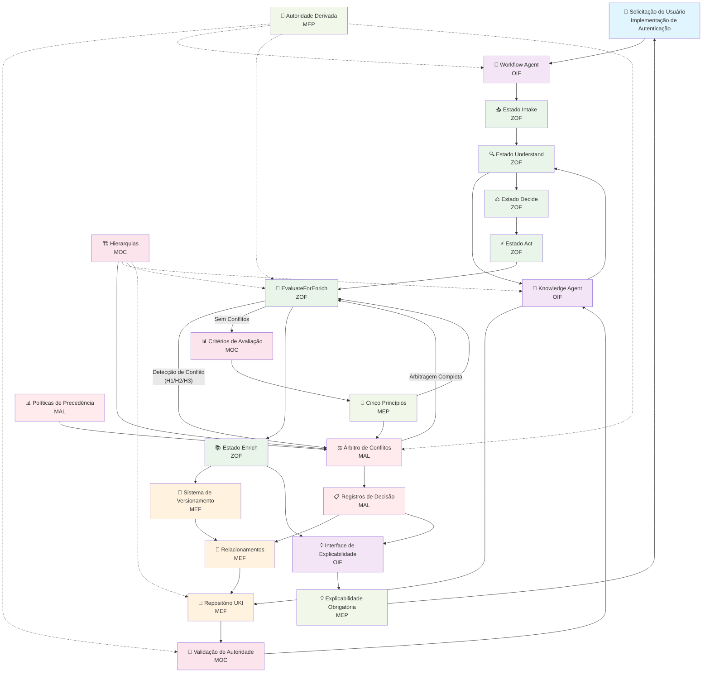

# Protocolo Matrix — Diagrama de Integração
**Acrônimo:** Diagrama de Integração  
**Status:** Ativo  
**Versão:** 1.0.0  
**Data:** 2025-01-25  

> ⚠️ **IMPORTANTE**: Este documento é uma tradução informativa. A versão autoritativa é [MATRIX_PROTOCOL_INTEGRATION_DIAGRAM.md](MATRIX_PROTOCOL_INTEGRATION_DIAGRAM.md).

> 🔄 "O todo é maior que a soma das partes — e o Protocolo Matrix demonstra isso através da integração perfeita entre frameworks."

---

## 1. Introdução

O **Diagrama de Integração do Protocolo Matrix** fornece a visão meta-arquitetural de como todos os frameworks (MEF, ZOF, OIF, MOC, MEP) trabalham juntos na prática.

Este documento visualiza os fluxos end-to-end que cruzam fronteiras entre frameworks, mostrando padrões concretos de integração que implementadores encontram ao construir sistemas compatíveis com o Protocolo Matrix.

Diferentemente da documentação individual de cada framework que foca em capacidades específicas, este diagrama mostra a **jornada completa** desde a interação do usuário até o enriquecimento do conhecimento através de todas as camadas.

---

## 2. Padrões Centrais de Integração

### Padrão 1: Workflow Orientado por Conhecimento
**Fluxo**: `Solicitação do Usuário → Inteligência OIF → Workflow ZOF → Consulta ao Oráculo → Criação UKI MEF`
- OIF recebe solicitação do usuário e determina tipo de workflow
- ZOF orquestra estados canônicos com consulta obrigatória ao Oráculo
- MEF fornece conhecimento estruturado via UKIs durante estado Understand
- MOC valida todas as referências hierárquicas e níveis de autoridade
- MEP orienta decisões epistemológicas durante todo o processo

### Padrão 2: Operações Cientes de Autoridade
**Fluxo**: `Solicitação de Operação → Verificação de Autoridade MOC → Execução Específica do Framework → Conformidade MEP`
- Todas as operações validam autoridade através do MOC antes da execução
- Cada framework respeita o contexto hierárquico do usuário
- Princípios MEP asseguram autoridade derivada, nunca verdade absoluta
- Caminhos de escalação roteiam solicitações que requerem autoridade superior

### Padrão 3: Ciclo de Avaliação de Enriquecimento
**Fluxo**: `ZOF EvaluateForEnrich → Critérios MOC → Epistemologia MEP → Criação UKI MEF → Explicação OIF`
- ZOF executa avaliação obrigatória de enriquecimento
- MOC fornece critérios organizacionais para avaliação
- MEP orienta requisitos de justificativa epistemológica
- MEF estrutura a UKI resultante com metadados apropriados
- OIF fornece feedback explicável aos usuários

---

## 3. Diagrama de Fluxo End-to-End



---

## 4. Matriz de Pontos de Integração

| **Do Framework** | **Para Framework** | **Ponto de Integração** | **Propósito** |
|-------------------|---------------------|-------------------------|---------------|
| **OIF → ZOF** | Workflow Agent | Orquestração de Estados Canônicos | Executar fluxos ZOF via arquétipos de inteligência |
| **ZOF → OIF** | Consulta ao Oráculo | Query do Knowledge Agent | Consultar conhecimento existente durante estado Understand |
| **ZOF → MEF** | Enriquecimento | Criação de UKI | Criar conhecimento estruturado durante estado Enrich |
| **ZOF → MOC** | EvaluateForEnrich | Consulta de Critérios | Aplicar critérios de avaliação organizacionais |
| **OIF → MOC** | Verificação de Autoridade | Validação Hierárquica | Validar autoridade do usuário para operações |
| **MEF → MOC** | Validação de Campo | Referências *_ref | Validar todas as referências de campo hierárquicas |
| **OIF → MEP** | Explicabilidade | Autoridade Derivada | Garantir respostas contextuais, não absolutas |
| **ZOF → MEP** | Decisão de Enriquecimento | Justificativa Epistemológica | Aplicar princípios MEP na avaliação de enriquecimento |
| **MEF → MEP** | Promoção de Conhecimento | Promoção Responsável | Documentar justificativa epistemológica para evolução de UKI |
| **ZOF → MAL** | Detecção de Conflito | Invocação de Arbitragem | Invocar MAL quando EvaluateForEnrich detecta conflitos H1/H2/H3 |
| **MAL → MEF** | Persistência de Decisão | Armazenamento de Registro de Decisão | Persistir decisões de arbitragem como registros de auditoria imutáveis |
| **MAL → OIF** | Comunicação de Resultado | Explicação de Arbitragem | Explicar resultados de arbitragem usando templates estruturados |
| **MOC → MAL** | Configuração de Política | Fornecimento de Regras de Precedência | Fornecer políticas de arbitragem e hierarquias de autoridade |
| **MEP → MAL** | Fundamento Epistêmico | Geração de Justificativa | Orientar justificação epistemológica em decisões de arbitragem |

---

## 5. Exemplos Práticos

### **Exemplo 1: Implementação de Autenticação JWT**

```yaml
# Fluxo Completo de Integração
user_story: "Como desenvolvedor, preciso implementar autenticação JWT"

# 1. Recepção de Inteligência OIF
oif_workflow_agent:
  request_analysis: "Necessidade de implementação de autenticação"
  workflow_determination: "Workflow de implementação técnica"
  canonical_event: "work.proposed"

# 2. Execução de Estados Canônicos ZOF
zof_workflow_execution:
  intake:
    signals:
      context: "Story de autenticação JWT recebida"
      decision: "Requisitos claros, proceder ao entendimento"
      result: "Contexto capturado e organizado"
  
  understand:
    oracle_consultation: 
      knowledge_agent_query: "padrões de autenticação existentes"
      moc_authority_filter: "escopo do usuário: team, domínio: technical"
      retrieved_ukis:
        - "uki:technical:pattern:jwt-authentication"
        - "uki:business:policy:security-requirements"
    signals:
      context: "Oráculo retornou conhecimento de autenticação existente"
      decision: "Usar padrão JWT comprovado com adaptações específicas do time"
      result: "Estratégia de implementação definida"
  
  decide:
    moc_validation:
      authority_check: "usuário pode implementar no escopo team"
      vendor_policy: "seleção de biblioteca aprovada"
    signals:
      context: "Estratégia validada contra políticas organizacionais"
      decision: "Proceder com implementação usando abordagem aprovada"
      result: "Plano técnico aprovado"
  
  act:
    conceptual_execution: "Implementar solução JWT seguindo padrões do Oráculo"
    signals:
      context: "Implementação seguindo padrões comprovados"
      decision: "Solução completada com melhorias específicas do time"
      result: "Sistema de autenticação funcionando implantado"
  
  evaluate_for_enrich:
    moc_criteria_consultation:
      relevance: {threshold: "medium", result: "PASS", score: 0.8}
      reusability: {threshold: "high", result: "PASS", score: 0.9}
      impact: {threshold: "medium", result: "PASS", score: 0.7}
    mep_epistemological_check:
      novelty_validation: "Padrões de implementação específicos do time identificados"
      authority_derivation: "Autorizado para enriquecimento no escopo team"
    signals:
      context: "Implementação contém conhecimento reutilizável"
      decision: "Aprovar enriquecimento com escopo team"
      result: "Qualificado para enriquecimento do Oráculo"
  
  enrich:
    mef_uki_creation:
      - id: "uki:technical:example:team-jwt-implementation"
        scope_ref: "team"
        domain_ref: "technical"
        type_ref: "example"
        maturity_ref: "validated"
        relationships:
          - type: "derives_from"
            target: "uki:technical:pattern:jwt-authentication"
    signals:
      context: "Nova UKI criada documentando implementação do time"
      decision: "Conhecimento armazenado com relacionamentos semânticos apropriados"
      result: "Oráculo enriquecido para reutilização futura"

# 3. Resposta de Explicabilidade OIF
oif_explanation:
  mep_compliance: "Resposta contextualiza autoridade dentro do escopo team"
  explanation_to_user: |
    "Implementação completada com sucesso baseada em padrões organizacionais.
    
    ✅ Usado: uki:technical:pattern:jwt-authentication (orientação do Oráculo)
    ✅ Validado: Contra autoridade do time e acesso ao domínio
    ✅ Criado: uki:technical:example:team-jwt-implementation
    
    Este conhecimento agora está disponível para outros membros do time trabalhando
    em requisitos similares de autenticação."
```

### **Exemplo 2: Cenário de Arbitragem MAL**

```yaml
# Conflito de Implementação JWT Concorrente
user_story: "Dois times implementando autenticação JWT simultaneamente"

# 1. Detecção de Conflito ZOF durante EvaluateForEnrich
zof_conflict_detection:
  conflict_type: "H2_concurrent_enrichment"
  candidates:
    - flow_id: "team-frontend-jwt-001"
      uki_target: "uki:technical:pattern:jwt-authentication"
      user: {scope: "team-frontend", authority: "developer"}
    - flow_id: "team-backend-jwt-002"
      uki_target: "uki:technical:pattern:jwt-authentication"
      user: {scope: "team-backend", authority: "tech_lead"}
  
  mal_invocation: "Resolução local falhou, invocando MAL"

# 2. Processo de Arbitragem MAL
mal_arbitration_event:
  event_id: "mal-evt-concurrent-jwt-001"
  event_type: "H2"
  policy_ref: "moc:arbitration:concurrent_enrichment"
  
  arbitration_decision:
    outcome: "winner"
    winner: "team-backend-jwt-002"
    loser: "team-frontend-jwt-001"
    precedence_applied:
      - "P1_authority": "tech_lead > developer"
    actions:
      - "allow_enrich:team-backend-jwt-002"
      - "defer_enrich:team-frontend-jwt-001"
    
    epistemic_rationale:
      summary: "Precedência de autoridade superior em cenário concorrente"
      moc_nodes_cited: ["moc:authority:tech_lead", "moc:domain:technical"]

# 3. Explicação de Arbitragem OIF
oif_arbitration_template:
  decision_id: "mal-evt-concurrent-jwt-001"
  outcome: "winner"
  winner: "implementação JWT do time backend"
  losers: ["implementação JWT do time frontend"]
  precedence_applied: "Precedência de autoridade: tech_lead > developer"
  
  user_explanation: |
    "Arbitragem completada para implementações JWT concorrentes.
    
    ✅ Vencedor: Implementação time backend (autoridade tech_lead)
    ⏸️ Adiado: Implementação time frontend 
    📋 Próximos Passos: Time frontend deve coordenar com time backend
    🔗 Referência: Hierarquia de autoridade MOC para domínio técnico"

# 4. Persistência de Registro de Decisão MEF
mef_decision_record:
  decision_id: "mal-dec-concurrent-jwt-001"
  relationships_created:
    - type: "conflicts_with"
      source: "team-frontend-jwt-001"
      target: "team-backend-jwt-002"
      resolution: "authority_precedence"
  
  audit_trail: "Arbitragem MAL completa registrada para referência futura"
```

### **Exemplo 3: Cenário de Escalação de Autoridade**

```yaml
# Tentativa de Criação de Política Organizacional
user_request: "Criar política de segurança organizacional"
user_context: {scope: "team", authority: "developer", domain: "technical"}

# 1. Validação de Autoridade MOC
moc_authority_check:
  required_scope: "organization" 
  user_max_scope: "team"
  validation_result: "ESCALATION_REQUIRED"
  escalation_path: "team_lead → architect → cto"

# 2. Resposta Inteligente OIF
oif_knowledge_agent:
  mep_derived_authority_application: |
    "Baseado na sua autoridade 'developer' no escopo 'team' (MOC: hierarchies.scope.team),
    você não pode criar políticas no nível organizacional.
    
    Ações disponíveis:
    ✅ Criar diretrizes de segurança no nível team
    ✅ Solicitar escalação via: team_lead → architect → cto
    🔒 Criação de política organizacional requer autoridade 'architect' ou superior
    
    Referência: MOC hierarchies.scope.team.governance.policy_creation_restrictions"

# 3. Adaptação de Workflow ZOF  
zof_workflow_modification:
  original_flow: "work.proposed → criação de política organizacional"
  adapted_flow: "assistance.requested → roteamento de escalação"
  canonical_states:
    intake: "Solicitação de criação de política com incompatibilidade de escopo"
    understand: "Consultar requisitos de autoridade MOC"
    decide: "Rotear para caminho de escalação conforme configuração MOC"
    act: "Gerar solicitação de escalação com contexto"
    # EvaluateForEnrich pulado - sem enriquecimento para roteamento de escalação
```

---

## 6. Referências Cruzadas

- [MEF — Matrix Embedding Framework](MEF_MATRIX_EMBEDDING_FRAMEWORK.md)  
- [ZOF — Zion Orchestration Framework](ZOF_ZION_ORCHESTRATION_FRAMEWORK.md)  
- [OIF — Operator Intelligence Framework](OIF_OPERATOR_INTELLIGENCE_FRAMEWORK.md)  
- [MOC — Matrix Ontology Catalog](MOC_MATRIX_ONTOLOGY_CATALOG.md)  
- [MEP — Matrix Epistemic Principle](MEP_MATRIX_EPISTEMIC_PRINCIPLE.md)  
- [Glossário do Protocolo Matrix](MATRIX_PROTOCOL_GLOSSARY_PT.md)
- [MAL — Matrix Arbiter Layer](MAL_MATRIX_ARBITER_LAYER.md)