# 📜 MATRIX ZWF PROTOCOL | PROTOCOLO MATRIX ZWF

## 🌎 Idioma / Language

- [Português 🇧🇷](#português)
- [English 🇺🇸](#english)

---

<a name="português"></a>
# Português 🇧🇷

> Zion Workflow Framework

**Versão:** 1.0
**Status:** Ativo
**Finalidade:** Especificar de forma conceitual e padronizada o framework de fluxos de trabalho para equipes orientadas a IA, definindo como descrever, executar e governar workflows como máquinas de estado independentes de tecnologia.

---

## 📟️ VISÃO GERAL

O Protocolo Matrix ZWF define um **modelo conceitual para fluxos de trabalho orientados a IA** que permite que equipes multidisciplinares descrevam workflows como máquinas de estado independentes de tecnologia. Todos os fluxos seguem o padrão: **Evento → Consulta Oráculo → Decisão → Ação → Enriquecimento do Oráculo**.

O ZWF não prescreve ferramentas, motores de orquestração ou implementações técnicas - apenas direciona **como pensar e registrar o caminho** de forma conceitual e rastreável.

---

## 🎭 ATORES E PAPÉIS

### 🔮 **Oráculo**
- **Função:** Repositório estratégico/semântico que mantém UKIs (MEF)
- **Entrada:** Consultas para diretrizes, regras, decisões, padrões e exemplos
- **Saída:** Conhecimento contextual para fundamentar decisões nos fluxos
- **Enriquecimento:** Recebe novos/atualizados UKIs ao final dos fluxos

### 👥 **Equipes**
- **Função:** Descrevem fluxos em linguagem conceitual ZWF
- **Responsabilidade:** Implementam os fluxos usando suas próprias ferramentas e tecnologias
- **Papéis:** Dev/Eng/Tech/PM/UX/Analistas

### ⚙️ **Operador**
- **Função:** Executa na prática (CI/CD, IDE, orquestradores, etc.)
- **Limitação:** ZWF não prescreve como implementar - apenas o que desenhar

---

## 📡 EVENTOS CANÔNICOS (GATILHOS)

O ZWF reconhece seis tipos de eventos que iniciam fluxos:

| Evento | Descrição | Contexto Típico |
|--------|-----------|-----------------|
| `knowledge.added` | Novo conteúdo disponível | Documentação, especificações, decisões |
| `work.proposed` | Nova proposta de trabalho | História, épico, feature, estratégia |
| `work.refine.requested` | Solicitação de refinamento | Melhorias, ajustes, otimizações |
| `assistance.requested` | Pedido de ajuda/colaboração | Pair programming, consultoria, suporte |
| `test.authored` | Cenários de teste criados | Testes unitários, integração, aceitação |
| `feedback.submitted` | Correção/aprendizado | Bug reports, melhorias, lições aprendidas |

---

## 🔄 ESTADOS CANÔNICOS (MÁQUINA DE ESTADO)

Todo fluxo ZWF segue esta sequência conceitual obrigatória:

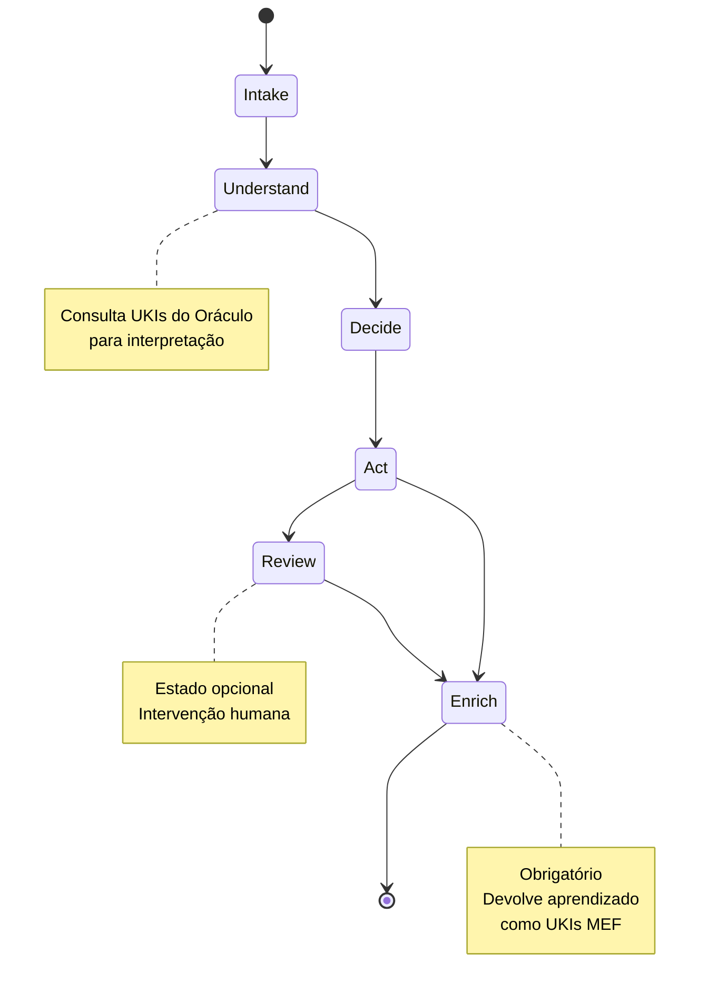

### 📨 **Intake**
- **Propósito:** Receber o evento e organizar o contexto
- **Ações:** Capturar dados do evento, validar formato, preparar contexto
- **Saída:** Contexto estruturado para consulta ao Oráculo

### 🧠 **Understand (via Oráculo)**
- **Propósito:** Consultar UKIs pertinentes para interpretar intenção/risco/contexto
- **Ações:** Busca semântica no Oráculo, análise de UKIs relacionados
- **Saída:** Conhecimento contextual para fundamentar decisões

### ⚖️ **Decide**
- **Propósito:** Escolher caminho baseado nas diretrizes do Oráculo
- **Ações:** Aplicar regras de negócio, avaliar riscos, definir ações
- **Saída:** Plano de ação fundamentado em UKIs

### 🎯 **Act**
- **Propósito:** Executar a ação com pessoas, agentes ou ferramentas
- **Ações:** Implementação prática usando recursos disponíveis da equipe
- **Saída:** Resultado da execução + contexto de aprendizado

### 👁️ **Review (Opcional)**
- **Propósito:** Intervenção humana quando necessário
- **Ações:** Validação humana, aprovação, ajustes
- **Saída:** Confirmação ou redirecionamento

### 🔄 **Enrich Oracle (Obrigatório)**
- **Propósito:** Devolver aprendizado como UKIs MEF válidos
- **Ações:** Criar/atualizar UKIs referenciais ao que motivou o fluxo
- **Saída:** Conhecimento estruturado adicionado ao Oráculo

---

## 🔗 VÍNCULO AO ORÁCULO

### 📋 **Declaração Inicial**
Todo fluxo deve declarar no início quais UKIs do Oráculo o motivam:

```yaml
# Exemplo de declaração de fluxo
flow_id: zion-workflow-jwt-implementation
triggered_by: work.proposed
oracle_context:
  motivating_ukis:
    - unik-technical-jwt-authentication-pattern
    - unik-business-security-requirements
    - unik-culture-code-review-process
```

### ⚖️ **Fundamentação de Decisões**
Durante as transições, o fluxo deve explicitar quais UKIs fundamentam cada decisão:

```yaml
# Exemplo de decisão fundamentada
decision_point: "choose_jwt_library"
reasoning_ukis:
  - unik-technical-jwt-security-standards
  - unik-business-vendor-approval-policy
decision_outcome: "use_jsonwebtoken_library"
```

### 🔄 **Enriquecimento Obrigatório**
As saídas devem referenciar UKIs motivadores através do campo `related_to`:

```yaml
# Exemplo de UKI gerada no enriquecimento
id: unik-technical-jwt-implementation-result
related_to:
  - unik-technical-jwt-authentication-pattern  # UKI motivador
  - unik-business-security-requirements        # UKI motivador
content: |
  Implementação bem-sucedida do padrão JWT seguindo as diretrizes de segurança.
  Baseado nas orientações dos UKIs relacionados, adaptado para nosso contexto específico.
```

---

## 📤 SAÍDAS OBRIGATÓRIAS

### 🎯 **Tipos de Saída MEF**
Todo fluxo deve retornar algo ao Oráculo escolhendo entre os tipos MEF:

| Tipo UKI | Quando Usar | Exemplo de Saída |
|----------|-------------|------------------|
| `business_rule` | Regra estabelecida | Nova política de autenticação |
| `guideline` | Diretriz consolidada | Processo de code review atualizado |
| `pattern` | Prática padronizada | Padrão de implementação de API |
| `decision` | Decisão registrada | Escolha de tecnologia documentada |
| `template` | Modelo reutilizável | Template de configuração |
| `function` | Implementação específica | Função de validação JWT |
| `example` | Caso de uso documentado | Exemplo de uso da API |

### 🔗 **Relacionamentos Obrigatórios**
Cada UKI gerada deve incluir:
- `related_to`: UKIs que motivaram/impactaram o fluxo
- Resumo claro da intenção da relação no campo `content`

---

## 📊 EXPLICABILIDADE MÍNIMA

Em cada estado do fluxo, registrar três sinais em linguagem natural:

### 📝 **Template de Registro**
```yaml
flow_step: [nome_do_estado]
signals:
  context: "O que entrou: [descrição da entrada]"
  decision: "Por que transicionou: [justificativa baseada em UKIs do Oráculo]" 
  result: "O que saiu: [descrição da saída]"
oracle_ukis_used:
  - unik-[id-do-uki-consultado]
timestamp: [YYYY-MM-DD HH:MM:SS]
```

### 💡 **Exemplo Prático**
```yaml
flow_step: "decide"
signals:
  context: "Recebida solicitação para implementar autenticação JWT na API"
  decision: "Escolhido padrão bearer token baseado no unik-technical-jwt-authentication-pattern que especifica melhores práticas de segurança"
  result: "Definido usar biblioteca jsonwebtoken com configuração de expiração de 15 minutos"
oracle_ukis_used:
  - unik-technical-jwt-authentication-pattern
  - unik-business-token-expiration-policy
timestamp: "2024-01-15 14:30:22"
```

---

## ⚖️ INVARIANTES DE ESTADO (FORMAL)

Para garantir a execução robusta e determinística, cada estado ZWF deve atender invariantes conceituais que podem ser implementados por engines duráveis:

### 📋 **Invariantes por Estado**

#### 📨 **Intake State**
```yaml
preconditions:
  - trigger_event: defined
  - event_type: valid_canonical_event
postconditions:
  - context_structured: true
  - trigger_validated: true
  - oracle_context_prepared: true
validation:
  required_fields: [flow_id, triggered_by, oracle_context]
  context_format: structured
```

#### 🧠 **Understand State**
```yaml
preconditions:
  - intake_completed: true
  - context_structured: true
postconditions:
  - oracle_consulted: true
  - ukis_identified: min_1
  - strategy_defined: true
validation:
  required_ukis: min_1
  oracle_response: structured
  understanding_documented: true
```

#### ⚖️ **Decide State**
```yaml
preconditions:
  - understanding_completed: true
  - oracle_knowledge_available: true
postconditions:
  - decision_made: true
  - reasoning_documented: true
  - action_plan_defined: true
validation:
  decision_rationale: required
  reasoning_ukis: min_1
  action_plan: structured
```

#### 🎯 **Act State**
```yaml
preconditions:
  - decision_made: true
  - action_plan_defined: true
postconditions:
  - action_executed: true
  - execution_result: documented
  - learning_context_captured: true
validation:
  execution_evidence: required
  result_documentation: structured
  error_handling: documented
```

#### 👁️ **Review State (Optional)**
```yaml
preconditions:
  - action_executed: true
  - review_required: true
postconditions:
  - validation_completed: true
  - approval_status: defined
  - feedback_documented: true
validation:
  review_criteria: defined
  reviewer_input: documented
  outcome_clear: true
```

#### 🔄 **Enrich State (Mandatory)**
```yaml
preconditions:
  - workflow_completed: true
  - learning_captured: true
postconditions:
  - uki_created: true
  - oracle_updated: true
  - relationships_established: true
validation:
  uki_format: mef_compliant
  related_to: motivating_ukis_referenced
  content_meaningful: true
```

### 🔄 **Invariantes de Transição**

#### **Estado para Estado**
```yaml
# Regras gerais de transição
transition_rules:
  intake_to_understand:
    condition: context_structured AND oracle_context_prepared
  understand_to_decide:
    condition: oracle_consulted AND strategy_defined
  decide_to_act:
    condition: decision_made AND action_plan_defined
  act_to_review:
    condition: action_executed AND review_required
  act_to_enrich:
    condition: action_executed AND NOT review_required
  review_to_enrich:
    condition: validation_completed
```

#### **Idempotência**
```yaml
# Garantias de execução segura
idempotency_rules:
  state_reentry: safe_if_postconditions_unmet
  oracle_consultation: cacheable_within_session
  enrichment: atomic_uki_creation
```

### 🚨 **Tratamento de Falhas**

#### **Comportamento em Erro**
```yaml
error_handling:
  oracle_unavailable:
    action: defer_until_available
    fallback: use_cached_ukis_if_recent
  invalid_state_transition:
    action: revert_to_last_valid_state
    log: violation_details
  enrichment_failure:
    action: mandatory_retry
    escalation: human_intervention
```

#### **Recuperação de Estado**
```yaml
recovery_patterns:
  partial_execution:
    action: resume_from_last_valid_checkpoint
  data_corruption:
    action: reconstruct_from_audit_trail
  timeout_exceeded:
    action: graceful_degradation_with_logging
```

### 📊 **Verificação de Consistência**

#### **Validações Automáticas**
```yaml
consistency_checks:
  oracle_binding:
    - motivating_ukis_exist
    - reasoning_ukis_accessible
    - enrichment_ukis_valid
  explainability:
    - signals_complete_per_state
    - decision_rationale_traceable
    - oracle_consultation_documented
  workflow_integrity:
    - all_mandatory_states_executed
    - enrichment_always_final
    - relationships_bidirectional
```

---

## 🎪 PADRÕES DE FLUXO (COBERTURA MÍNIMA)

### 📥 **Ingest (knowledge.added)**
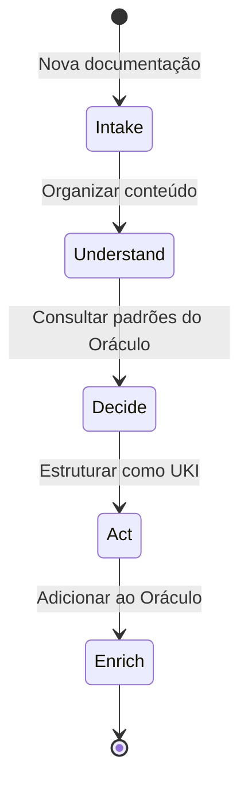

### 🎫 **Request (work.proposed)**
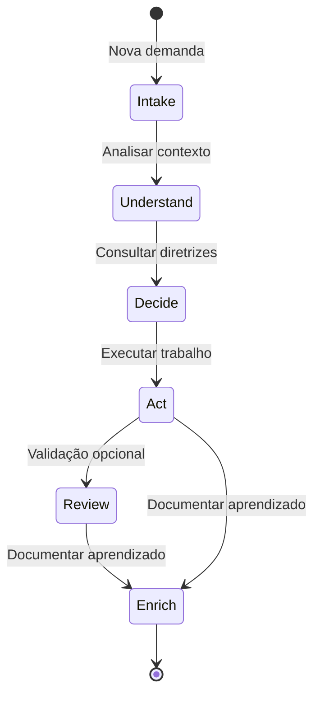

### 🎯 **Strategy (decisão estratégica)**
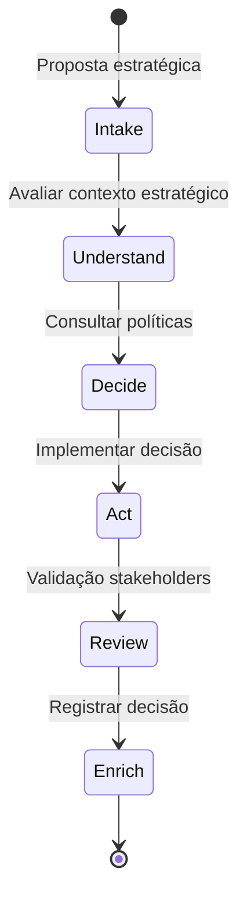

### 🔧 **Refinement (work.refine.requested)**
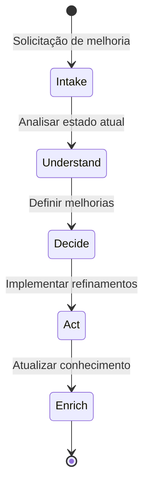

### 🤝 **Assistance (assistance.requested)**
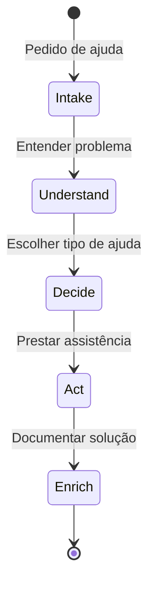

### 📝 **Feedback (feedback.submitted)**
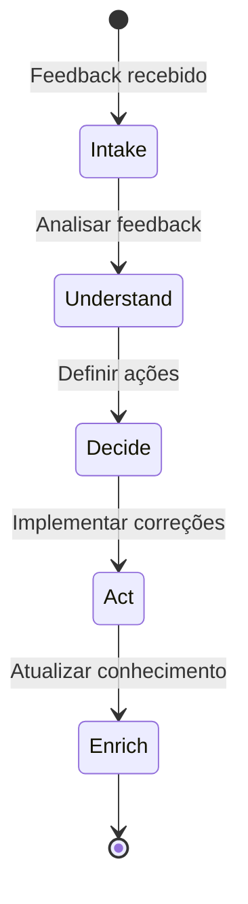

---

## 🚫 LIMITES DE ZION

### ❌ **O que ZWF NÃO especifica:**
- Ferramentas específicas de implementação
- Motores de orquestração ou workflow engines
- Prompts ou interfaces de agentes
- Custos, SLAs ou métricas numéricas
- Formatos técnicos de execução
- Tecnologias de implementação

### ❌ **O que ZWF NÃO adiciona ao MEF:**
- Novos campos na estrutura UKI
- Modificações no formato YAML
- Tipos de UKI adicionais
- Apenas usa `related_to` para relacionamentos

### ✅ **O que ZWF especifica:**
- Padrão conceitual de estados de fluxo
- Tipos de eventos que iniciam workflows
- Relacionamento obrigatório com o Oráculo
- Formato de explicabilidade e rastreamento
- Estrutura de enriquecimento do conhecimento

---

## 🎯 RESULTADO ESPERADO

Com o ZWF, qualquer equipe pode:

1. **Desenhar fluxos conceituais** seguindo os estados canônicos
2. **Consultar o Oráculo** para fundamentar decisões
3. **Executar ações** usando suas próprias ferramentas
4. **Enriquecer o Oráculo** com aprendizado em formato MEF
5. **Manter rastreabilidade** através dos sinais de explicabilidade
6. **Operar orientada a IA** do discovery à entrega

**Ciclo fechado:** Consultar Oráculo → Agir → Enriquecer Oráculo

---

## 🔄 INTEGRAÇÃO COM AS CAMADAS MATRIX

### 🔮 **Relação com Oracle (MEF)**
- **Entrada:** ZWF consulta UKIs do Oráculo para fundamentar decisões
- **Saída:** ZWF produz novos UKIs MEF para enriquecer o Oráculo
- **Formato:** Todos os relacionamentos usam `related_to` do MEF

### ⚙️ **Relação com Operator**
- **ZWF → Operator:** Fornece o desenho conceitual do fluxo
- **Operator:** Implementa usando tecnologias específicas da equipe
- **ZWF:** Não prescreve como implementar, apenas o que desenhar

---

<a name="english"></a>
# English 🇺🇸

> Zion Workflow Framework

**Version:** 1.0
**Status:** Active
**Purpose:** To specify in a conceptual and standardized way the workflow framework for AI-oriented teams, defining how to describe, execute and govern workflows as technology-independent state machines.

---

## 📟️ OVERVIEW

The Matrix ZWF Protocol defines a **conceptual model for AI-oriented workflows** that allows multidisciplinary teams to describe workflows as technology-independent state machines. All flows follow the pattern: **Event → Query Oracle → Decision → Action → Oracle Enrichment**.

ZWF does not prescribe tools, orchestration engines, or technical implementations - it only directs **how to think and record the path** in a conceptual and traceable way.

---

## 🎭 ACTORS AND ROLES

### 🔮 **Oracle**
- **Function:** Strategic/semantic repository that maintains UKIs (MEF)
- **Input:** Queries for guidelines, rules, decisions, patterns and examples
- **Output:** Contextual knowledge to support flow decisions
- **Enrichment:** Receives new/updated UKIs at the end of flows

### 👥 **Teams**
- **Function:** Describe flows in ZWF conceptual language
- **Responsibility:** Implement flows using their own tools and technologies
- **Roles:** Dev/Eng/Tech/PM/UX/Analysts

### ⚙️ **Operator**
- **Function:** Executes in practice (CI/CD, IDE, orchestrators, etc.)
- **Limitation:** ZWF does not prescribe how to implement - only what to design

---

## 📡 CANONICAL EVENTS (TRIGGERS)

ZWF recognizes six types of events that initiate flows:

| Event | Description | Typical Context |
|--------|-------------|-----------------|
| `knowledge.added` | New content available | Documentation, specifications, decisions |
| `work.proposed` | New work proposal | Story, epic, feature, strategy |
| `work.refine.requested` | Refinement request | Improvements, adjustments, optimizations |
| `assistance.requested` | Help/collaboration request | Pair programming, consulting, support |
| `test.authored` | Test scenarios created | Unit tests, integration, acceptance |
| `feedback.submitted` | Correction/learning | Bug reports, improvements, lessons learned |

---

## 🔄 CANONICAL STATES (STATE MACHINE)

Every ZWF flow follows this mandatory conceptual sequence:

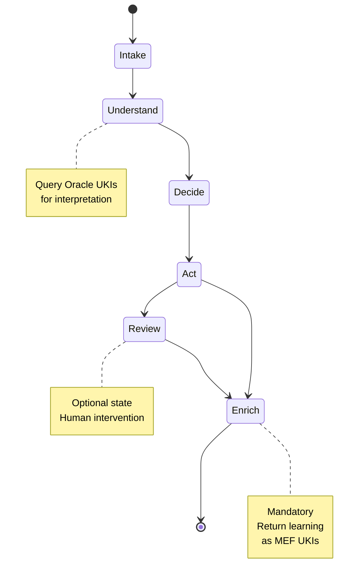

### 📨 **Intake**
- **Purpose:** Receive the event and organize the context
- **Actions:** Capture event data, validate format, prepare context
- **Output:** Structured context for Oracle consultation

### 🧠 **Understand (via Oracle)**
- **Purpose:** Query relevant UKIs to interpret intention/risk/context
- **Actions:** Semantic search in Oracle, analysis of related UKIs
- **Output:** Contextual knowledge to support decisions

### ⚖️ **Decide**
- **Purpose:** Choose path based on Oracle guidelines
- **Actions:** Apply business rules, assess risks, define actions
- **Output:** Action plan based on UKIs

### 🎯 **Act**
- **Purpose:** Execute action with people, agents or tools
- **Actions:** Practical implementation using team's available resources
- **Output:** Execution result + learning context

### 👁️ **Review (Optional)**
- **Purpose:** Human intervention when necessary
- **Actions:** Human validation, approval, adjustments
- **Output:** Confirmation or redirection

### 🔄 **Enrich Oracle (Mandatory)**
- **Purpose:** Return learning as valid MEF UKIs
- **Actions:** Create/update UKIs referential to what motivated the flow
- **Output:** Structured knowledge added to Oracle

---

## 🔗 ORACLE BINDING

### 📋 **Initial Declaration**
Every flow must declare at the beginning which Oracle UKIs motivate it:

```yaml
# Example of flow declaration
flow_id: zion-workflow-jwt-implementation
triggered_by: work.proposed
oracle_context:
  motivating_ukis:
    - unik-technical-jwt-authentication-pattern
    - unik-business-security-requirements
    - unik-culture-code-review-process
```

### ⚖️ **Decision Foundation**
During transitions, the flow must explicitly state which UKIs support each decision:

```yaml
# Example of founded decision
decision_point: "choose_jwt_library"
reasoning_ukis:
  - unik-technical-jwt-security-standards
  - unik-business-vendor-approval-policy
decision_outcome: "use_jsonwebtoken_library"
```

### 🔄 **Mandatory Enrichment**
Outputs must reference motivating UKIs through the `related_to` field:

```yaml
# Example of UKI generated in enrichment
id: unik-technical-jwt-implementation-result
related_to:
  - unik-technical-jwt-authentication-pattern  # Motivating UKI
  - unik-business-security-requirements        # Motivating UKI
content: |
  Successful JWT pattern implementation following security guidelines.
  Based on related UKIs guidance, adapted to our specific context.
```

---

## 📤 MANDATORY OUTPUTS

### 🎯 **MEF Output Types**
Every flow must return something to Oracle choosing among MEF types:

| UKI Type | When to Use | Example Output |
|----------|-------------|----------------|
| `business_rule` | Established rule | New authentication policy |
| `guideline` | Consolidated guideline | Updated code review process |
| `pattern` | Standardized practice | API implementation pattern |
| `decision` | Registered decision | Documented technology choice |
| `template` | Reusable template | Configuration template |
| `function` | Specific implementation | JWT validation function |
| `example` | Documented use case | API usage example |

### 🔗 **Mandatory Relationships**
Each generated UKI must include:
- `related_to`: UKIs that motivated/impacted the flow
- Clear summary of relationship intention in `content` field

---

## 📊 MINIMAL EXPLAINABILITY

In each flow state, record three signals in natural language:

### 📝 **Recording Template**
```yaml
flow_step: [state_name]
signals:
  context: "What came in: [input description]"
  decision: "Why it transitioned: [justification based on Oracle UKIs]"
  result: "What came out: [output description]"
oracle_ukis_used:
  - unik-[consulted-uki-id]
timestamp: [YYYY-MM-DD HH:MM:SS]
```

### 💡 **Practical Example**
```yaml
flow_step: "decide"
signals:
  context: "Received request to implement JWT authentication in API"
  decision: "Chosen bearer token pattern based on unik-technical-jwt-authentication-pattern specifying security best practices"
  result: "Defined to use jsonwebtoken library with 15-minute expiration configuration"
oracle_ukis_used:
  - unik-technical-jwt-authentication-pattern
  - unik-business-token-expiration-policy
timestamp: "2024-01-15 14:30:22"
```

---

## ⚖️ STATE INVARIANTS (FORMAL)

To ensure robust and deterministic execution, each ZWF state must meet conceptual invariants that can be implemented by durable engines:

### 📋 **Invariants per State**

#### 📨 **Intake State**
```yaml
preconditions:
  - trigger_event: defined
  - event_type: valid_canonical_event
postconditions:
  - context_structured: true
  - trigger_validated: true
  - oracle_context_prepared: true
validation:
  required_fields: [flow_id, triggered_by, oracle_context]
  context_format: structured
```

#### 🧠 **Understand State**
```yaml
preconditions:
  - intake_completed: true
  - context_structured: true
postconditions:
  - oracle_consulted: true
  - ukis_identified: min_1
  - strategy_defined: true
validation:
  required_ukis: min_1
  oracle_response: structured
  understanding_documented: true
```

#### ⚖️ **Decide State**
```yaml
preconditions:
  - understanding_completed: true
  - oracle_knowledge_available: true
postconditions:
  - decision_made: true
  - reasoning_documented: true
  - action_plan_defined: true
validation:
  decision_rationale: required
  reasoning_ukis: min_1
  action_plan: structured
```

#### 🎯 **Act State**
```yaml
preconditions:
  - decision_made: true
  - action_plan_defined: true
postconditions:
  - action_executed: true
  - execution_result: documented
  - learning_context_captured: true
validation:
  execution_evidence: required
  result_documentation: structured
  error_handling: documented
```

#### 👁️ **Review State (Optional)**
```yaml
preconditions:
  - action_executed: true
  - review_required: true
postconditions:
  - validation_completed: true
  - approval_status: defined
  - feedback_documented: true
validation:
  review_criteria: defined
  reviewer_input: documented
  outcome_clear: true
```

#### 🔄 **Enrich State (Mandatory)**
```yaml
preconditions:
  - workflow_completed: true
  - learning_captured: true
postconditions:
  - uki_created: true
  - oracle_updated: true
  - relationships_established: true
validation:
  uki_format: mef_compliant
  related_to: motivating_ukis_referenced
  content_meaningful: true
```

### 🔄 **Transition Invariants**

#### **State to State**
```yaml
# General transition rules
transition_rules:
  intake_to_understand:
    condition: context_structured AND oracle_context_prepared
  understand_to_decide:
    condition: oracle_consulted AND strategy_defined
  decide_to_act:
    condition: decision_made AND action_plan_defined
  act_to_review:
    condition: action_executed AND review_required
  act_to_enrich:
    condition: action_executed AND NOT review_required
  review_to_enrich:
    condition: validation_completed
```

#### **Idempotency**
```yaml
# Safe execution guarantees
idempotency_rules:
  state_reentry: safe_if_postconditions_unmet
  oracle_consultation: cacheable_within_session
  enrichment: atomic_uki_creation
```

### 🚨 **Failure Handling**

#### **Error Behavior**
```yaml
error_handling:
  oracle_unavailable:
    action: defer_until_available
    fallback: use_cached_ukis_if_recent
  invalid_state_transition:
    action: revert_to_last_valid_state
    log: violation_details
  enrichment_failure:
    action: mandatory_retry
    escalation: human_intervention
```

#### **State Recovery**
```yaml
recovery_patterns:
  partial_execution:
    action: resume_from_last_valid_checkpoint
  data_corruption:
    action: reconstruct_from_audit_trail
  timeout_exceeded:
    action: graceful_degradation_with_logging
```

### 📊 **Consistency Verification**

#### **Automatic Validations**
```yaml
consistency_checks:
  oracle_binding:
    - motivating_ukis_exist
    - reasoning_ukis_accessible
    - enrichment_ukis_valid
  explainability:
    - signals_complete_per_state
    - decision_rationale_traceable
    - oracle_consultation_documented
  workflow_integrity:
    - all_mandatory_states_executed
    - enrichment_always_final
    - relationships_bidirectional
```

---

## 🎪 FLOW PATTERNS (MINIMAL COVERAGE)

### 📥 **Ingest (knowledge.added)**
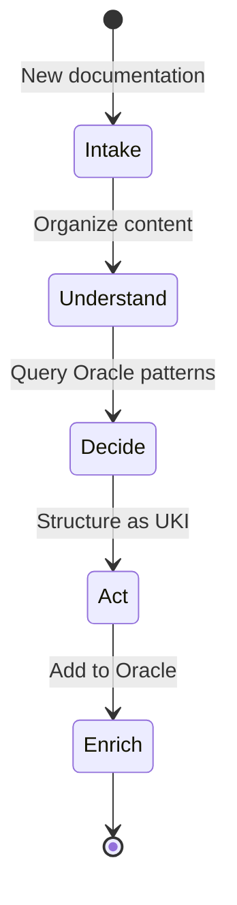

### 🎫 **Request (work.proposed)**
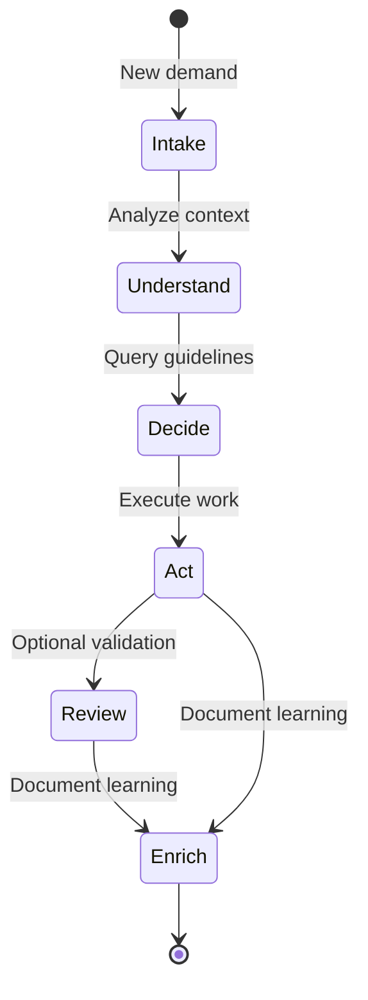

### 🎯 **Strategy (strategic decision)**
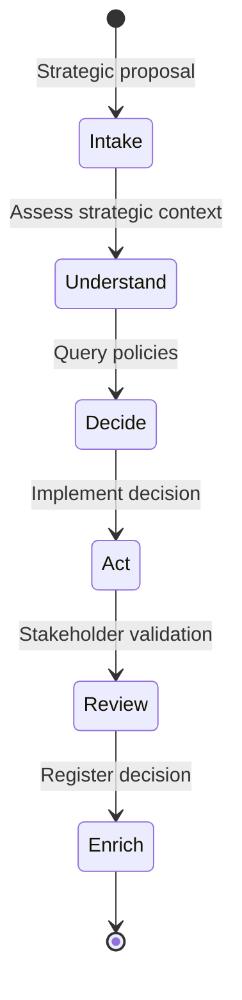

### 🔧 **Refinement (work.refine.requested)**
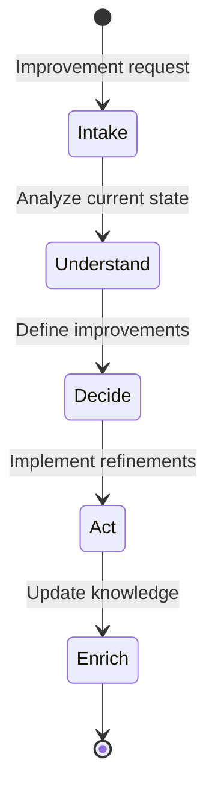

### 🤝 **Assistance (assistance.requested)**
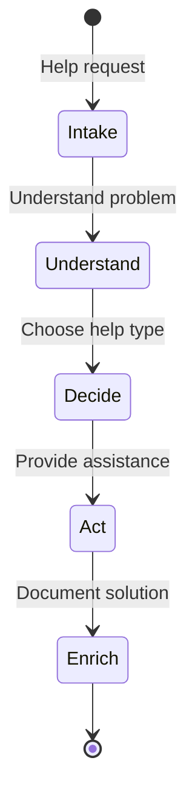

### 📝 **Feedback (feedback.submitted)**
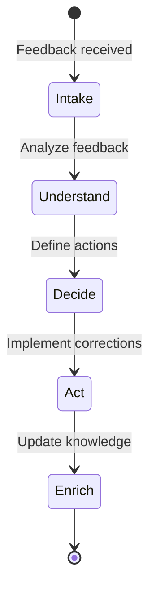

---

## 🚫 ZION BOUNDARIES

### ❌ **What ZWF does NOT specify:**
- Specific implementation tools
- Orchestration engines or workflow engines
- Agent prompts or interfaces
- Costs, SLAs or numerical metrics
- Technical execution formats
- Implementation technologies

### ❌ **What ZWF does NOT add to MEF:**
- New fields in UKI structure
- YAML format modifications
- Additional UKI types
- Only uses `related_to` for relationships

### ✅ **What ZWF specifies:**
- Conceptual pattern of flow states
- Types of events that initiate workflows
- Mandatory relationship with Oracle
- Explainability and tracking format
- Knowledge enrichment structure

---

## 🎯 EXPECTED RESULT

With ZWF, any team can:

1. **Design conceptual flows** following canonical states
2. **Query Oracle** to support decisions
3. **Execute actions** using their own tools
4. **Enrich Oracle** with learning in MEF format
5. **Maintain traceability** through explainability signals
6. **Operate AI-oriented** from discovery to delivery

**Closed loop:** Query Oracle → Act → Enrich Oracle

---

## 🔄 INTEGRATION WITH MATRIX LAYERS

### 🔮 **Relationship with Oracle (MEF)**
- **Input:** ZWF queries Oracle UKIs to support decisions
- **Output:** ZWF produces new MEF UKIs to enrich Oracle
- **Format:** All relationships use MEF's `related_to`

### ⚙️ **Relationship with Operator**
- **ZWF → Operator:** Provides conceptual flow design
- **Operator:** Implements using team-specific technologies
- **ZWF:** Does not prescribe how to implement, only what to design