# 📜 MATRIX ZWF PROTOCOL | PROTOCOLO MATRIX ZWF

> 🚨 **AVISO IMPORTANTE**: Este documento contém EXEMPLOS ILUSTRATIVOS (como `strategy`, `operations`, etc.) que NÃO são taxonomias obrigatórias. O **CSH (Catálogo Semântico de Hierarquias)** é a única fonte definitiva para taxonomias organizacionais. Exemplos servem apenas como referência conceitual.

## 🌎 Idioma / Language

- [Português 🇧🇷](#português)
- [English 🇺🇸](#english)

---

<a name="português"></a>
# Português 🇧🇷

> Zion Workflow Framework

**Versão:** 1.0
**Status:** Ativo
**Ontologia de Referência:** Ontology_MEF_Support v1.0
**Finalidade:** Especificar de forma conceitual e padronizada o framework de fluxos de trabalho para equipes orientadas a IA, definindo como descrever, executar e governar workflows como máquinas de estado independentes de tecnologia.

---

## 📟️ VISÃO GERAL

O Protocolo Matrix ZWF define um **modelo conceitual para fluxos de trabalho orientados a IA** que permite que equipes multidisciplinares descrevam workflows como máquinas de estado independentes de tecnologia. Todos os fluxos seguem o padrão: **Evento → Consulta Oráculo → Decisão → Ação → Avaliação → Enriquecimento Condicional do Oráculo**.

O ZWF integra nativamente com o **CSH (Catálogo Semântico de Hierarquias)** organizacional, respeitando estruturas de autoridade, escopos de conhecimento e critérios de governança específicos de cada implementação. Esta integração permite que o checkpoint **EvaluateForEnrich** aplique regras configuráveis ao invés de restrições fixas.

O ZWF não prescreve ferramentas, motores de orquestração ou implementações técnicas - apenas direciona **como pensar e registrar o caminho** de forma conceitual, rastreável e governada.

### 🏛️ **CSH - Fonte Única de Governança**

O ZWF utiliza o **Catálogo Semântico de Hierarquias (CSH)** para:
- **Critérios de Enriquecimento**: O checkpoint `EvaluateForEnrich` consulta regras configuráveis no CSH
- **Validação de Autoridade**: Verifica se usuário tem autoridade para criar UKIs em escopos específicos
- **Filtragem de Conhecimento**: Oracle retorna apenas UKIs compatíveis com contexto hierárquico do usuário
- **Flexível por Organização**: Cada implementação pode definir suas hierarquias e regras

**Documento de Referência**: `CSH_CATALOGO_SEMANTICO_HIERARQUIAS.md`

---

## 🎭 ATORES E PAPÉIS

### 🔮 **Oráculo**
- **Função:** Repositório estratégico/semântico que mantém UKIs (MEF)
- **Entrada:** Consultas para diretrizes, regras, decisões, padrões e exemplos
- **Saída:** Conhecimento contextual para fundamentar decisões nos fluxos
- **Enriquecimento:** Recebe novos/atualizados UKIs ao final dos fluxos

### 👥 **Equipes**
- **Função:** Descrevem fluxos em linguagem conceitual ZWF
- **Responsabilidade:** Implementam os fluxos usando suas próprias ferramentas e tecnologias
- **Contexto CSH:** Operam dentro de escopos e domínios autorizados pelo CSH organizacional
- **Autoridade:** Determinam escopo de enriquecimento baseado em hierarquias CSH
- **Papéis:** Dev/Eng/Tech/PM/UX/Analistas com níveis de autoridade configuráveis

### ⚙️ **Operador**
- **Função:** Executa na prática (CI/CD, IDE, orquestradores, etc.)
- **Limitação:** ZWF não prescreve como implementar - apenas o que desenhar

---

## 📡 EVENTOS CANÔNICOS (GATILHOS)

O ZWF reconhece seis tipos de eventos que iniciam fluxos:

| Evento | Descrição | Contexto Típico |
|--------|-----------|-----------------|
| `knowledge.added` | Novo conteúdo disponível | Documentação, especificações, decisões |
| `work.proposed` | Nova proposta de trabalho | História, épico, feature, estratégia |
| `work.refine.requested` | Solicitação de refinamento | Melhorias, ajustes, otimizações |
| `assistance.requested` | Pedido de ajuda/colaboração | Pair programming, consultoria, suporte |
| `test.authored` | Cenários de teste criados | Testes unitários, integração, aceitação |
| `feedback.submitted` | Correção/aprendizado | Bug reports, melhorias, lições aprendidas |

---

## 🔄 ESTADOS CANÔNICOS (MÁQUINA DE ESTADO)

Todo fluxo ZWF segue esta sequência conceitual:

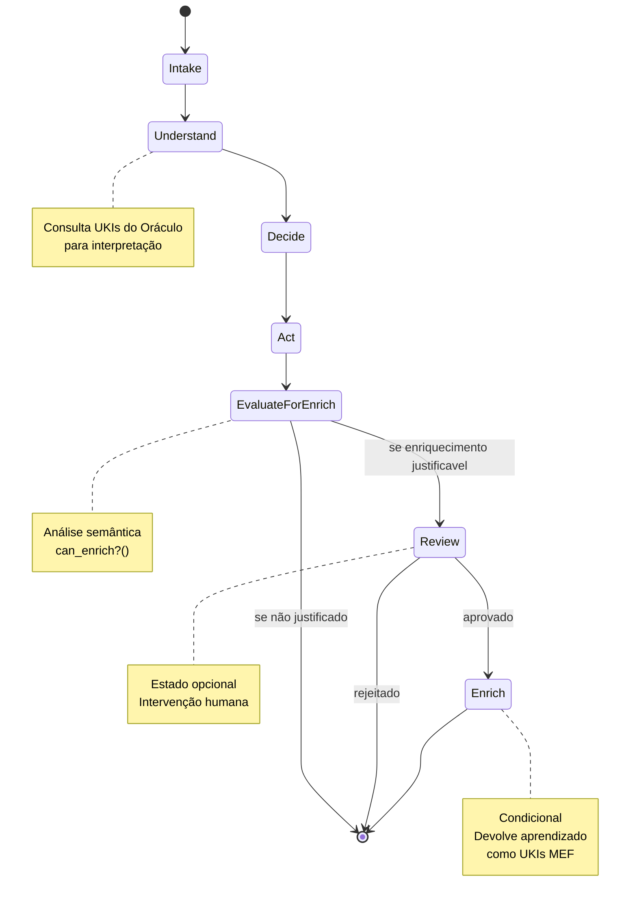

### 📨 **Intake**
- **Propósito:** Receber o evento e organizar o contexto
- **Ações:** Capturar dados do evento, validar formato, preparar contexto
- **Saída:** Contexto estruturado para consulta ao Oráculo

### 🧠 **Understand (via Oráculo)**
- **Propósito:** Consultar UKIs pertinentes para interpretar intenção/risco/contexto
- **Ações:** Busca semântica no Oráculo, análise de UKIs relacionados
- **Saída:** Conhecimento contextual para fundamentar decisões

### ⚖️ **Decide**
- **Propósito:** Escolher caminho baseado nas diretrizes do Oráculo
- **Ações:** Aplicar regras de negócio, avaliar riscos, definir ações
- **Saída:** Plano de ação fundamentado em UKIs

### 🎯 **Act**
- **Propósito:** Executar a ação com pessoas, agentes ou ferramentas
- **Ações:** Implementação prática usando recursos disponíveis da equipe
- **Saída:** Resultado da execução + contexto de aprendizado

### 👁️ **Review (Opcional)**
- **Propósito:** Intervenção humana quando necessário
- **Ações:** Validação humana, aprovação, ajustes
- **Saída:** Confirmação ou redirecionamento

### 🔍 **EvaluateForEnrich**
- **Propósito:** Avaliar se o resultado produz conhecimento estruturável com governança CSH
- **Ações:** Aplicar can_enrich?(act_output, context, user_csh_context, csh_criteria) para decidir próximo estado
- **Saída:** Decisão sobre necessidade de enriquecimento + escopo determinado + explicação de governança
- **Função Semântica:** can_enrich?() avalia:
  - Divergência semântica em relação ao conhecimento existente
  - Possibilidade de estruturação como UKI válida segundo MEF com campos CSH
  - Clareza epistêmica da contribuição
  - **Autoridade CSH:** Valida se usuário tem autoridade para enriquecer no escopo proposto
  - **Critérios organizacionais:** Aplica evaluation_criteria definidos no CSH
  - **Governança transparente:** Gera explicações baseadas em regras CSH específicas

#### **Implementação da Função can_enrich?() com CSH**
```yaml
can_enrich_function:
  input_parameters:
    - act_output: resultado da execução
    - context: contexto do fluxo
    - proposed_uki: UKI candidato
    - user_csh_context: contexto hierárquico do usuário
    - csh_evaluation_criteria: critérios organizacionais configuráveis
  
  validation_checks:
    semantic_novelty:
      - has_semantic_divergence: true
      - adds_new_knowledge: true
    
    structural_validity:
      - mef_compliant: true
      - clear_relationships: true
      - scope_ref_valid: true
      - domain_ref_valid: true
    
    csh_governance:
      - user_authority_sufficient: "resolve via CSH authority rules"
      - domain_access_authorized: "verify against user's domain_access"
      - scope_within_limits: "ensure scope_ref <= user's max_scope"
      - evaluation_criteria_met: "apply CSH evaluation_criteria nodes"
    
    epistemic_clarity:
      - content_meaningful: true
      - user_confirmation: true
      - governance_transparent: "explain CSH-based decisions"
  
  decision_logic: |
    resolved_criteria = resolve_evaluation_criteria(csh_evaluation_criteria, user_csh_context)
    authority_check = validate_user_authority(user_csh_context, proposed_uki.scope_ref)
    
    IF (semantic_novelty AND structural_validity AND authority_check AND meets_criteria(resolved_criteria))
      THEN return {
        decision: ENRICH_APPROVED,
        determined_scope: determine_enrichment_scope(user_csh_context),
        criteria_applied: resolved_criteria,
        governance_explanation: generate_csh_explanation()
      }
    ELSE return {
      decision: ENRICH_REJECTED,
      reason: identify_failure_reason(),
      escalation_path: suggest_escalation_via_csh(),
      alternative_actions: suggest_alternatives()
    }
```

### 🔄 **Enrich Oracle (Condicional)**
- **Propósito:** Devolver aprendizado como UKIs MEF válidos
- **Ações:** Criar/atualizar UKIs referenciais ao que motivou o fluxo
- **Saída:** Conhecimento estruturado adicionado ao Oráculo

---

## 🏛️ GOVERNANÇA HIERÁRQUICA COM CSH

### 🎯 **Integração CSH no ZWF**

O ZWF integra nativamente com o **CSH (Catálogo Semântico de Hierarquias)** organizacional para aplicar governança configurável ao invés de restrições fixas.

#### **Conceitos Universais vs. Configurações Locais**

**Universais no ZWF:**
- Estados canônicos (Intake → Understand → Decide → Act → EvaluateForEnrich → Review → Enrich)
- Checkpoint obrigatório EvaluateForEnrich
- Consulta ao Oráculo no estado Understand
- Enriquecimento condicional baseado em avaliação

**Configuráveis via CSH:**
- Critérios de avaliação para EvaluateForEnrich
- Níveis de autoridade para diferentes escopos de enriquecimento
- Domínios acessíveis por papel/usuário
- Regras de escalação quando autoridade insuficiente

#### **Fluxo de Autoridade**

```yaml
authority_flow_pattern:
  user_context_resolution:
    - resolve_user_from_csh: "Identifica escopo e domínios autorizados"
    - load_evaluation_criteria: "Carrega critérios organizacionais"
    - determine_max_scope: "Define escopo máximo de enriquecimento"
  
  evaluate_for_enrich_execution:
    - apply_csh_criteria: "Usa critérios configuráveis ao invés de fixos"
    - validate_authority: "Verifica se usuário pode enriquecer no escopo proposto"
    - determine_scope: "Define escopo específico para nova UKI"
    - explain_governance: "Gera transparência sobre decisões CSH"
  
  escalation_when_needed:
    - identify_required_authority: "Resolve autoridade necessária via CSH"
    - suggest_approval_workflow: "Propõe caminho de aprovação"
    - provide_alternatives: "Sugere alternativas dentro do escopo autorizado"
```

#### **Cenários de Governança**

**Cenário 1: Desenvolvedor (Escopo Team)**
```yaml
user_context:
  scope_level: "team"
  domain_access: ["technical"]
  authority_level: "developer"

evaluate_for_enrich_result:
  decision: "APPROVED"
  determined_scope: "team"
  explanation: "Conhecimento técnico dentro do escopo autorizado"
  created_uki:
    scope_ref: "team"
    domain_ref: "technical"
```

**Cenário 2: Tentativa de Excesso de Autoridade**
```yaml
user_context:
  scope_level: "team" 
  domain_access: ["technical"]

evaluate_for_enrich_attempt:
  proposed_scope: "organization"
  decision: "REJECTED"
  reason: "Usuário não possui autoridade para escopo organizacional"
  escalation_path: "Solicitar aprovação via team_lead → architect"
  alternative: "Criar UKI com scope_ref='team' como alternativa"
```

---

## 🧠 FUNÇÃO can_enrich?() - FILTRO COGNITIVO

### 💫 **Fundamentação Epistemológica**

A função `can_enrich?()` representa o **ponto de decisão epistemológica** do protocolo ZWF. Ela materializa a compreensão de que nem toda interação ou resultado de execução constitui conhecimento estruturável e reutilizável.

**Princípio Fundamental:** O enriquecimento do Oráculo deve ser uma **ocorrência cognitiva**, não uma **imposição processual**.

### 🔍 **Critérios de Avaliação Conceituais**

#### **1. Divergência Semântica**
```yaml
semantic_divergence:
  purpose: "Avaliar se há conhecimento verdadeiramente novo"
  questions:
    - "O resultado difere significativamente do conhecimento existente?"
    - "Há insights não documentados que emergiram?"
    - "A solução apresenta aspectos novos ou adaptados?"
  threshold: "Contribuição semântica mensurável"
```

#### **2. Estruturabilidade MEF**
```yaml
mef_structurability:
  purpose: "Verificar se o conhecimento é estruturável segundo padrões MEF"
  questions:
    - "O conteúdo pode ser expresso como UKI válido?"
    - "Há relacionamentos claros com conhecimento existente?"
    - "O formato atende aos critérios de qualidade MEF?"
  threshold: "Compatibilidade estrutural com ontologia de suporte"
```

#### **3. Clareza Epistêmica**
```yaml
epistemic_clarity:
  purpose: "Garantir que a contribuição é cognitivamente clara"
  questions:
    - "O conhecimento é articulado de forma compreensível?"
    - "Há contexto suficiente para reutilização?"
    - "A intenção do conhecimento é explícita?"
  threshold: "Clareza conceitual para consumo por outros agentes"
```

#### **4. Validação de Escopo Organizacional**
```yaml
organizational_scope:
  purpose: "Prevenir impactos organizacionais não intencionais"
  questions:
    - "O UKI proposto afeta apenas a equipe executora?"
    - "Não cria regras para domínios restritos?"
    - "Não requer curadoria de stakeholders organizacionais?"
  threshold: "Escopo limitado à autonomia da equipe"
```

### ⚙️ **Implementação Conceitual vs Técnica**

#### **Nível Conceitual (O que decidir)**
```yaml
conceptual_level:
  focus: "Critérios de decisão independentes de tecnologia"
  responsibility: "Definir lógica de avaliação"
  output: "Orientações para implementação técnica"
  
  decision_framework:
    - semantic_novelty: "Há conhecimento novo?"
    - structural_validity: "É estruturável como MEF?"
    - epistemic_clarity: "É cognitivamente claro?"
    - scope_governance: "É apropriado para a equipe criar?"
    - relevance_confirmation: "O usuário confirma relevância?"
```

#### **Nível Técnico (Como implementar)**
```yaml
technical_level:
  focus: "Implementação específica por tecnologia/ferramenta"
  responsibility: "Automatizar critérios conceituais"
  examples:
    - llm_implementation: "Prompts estruturados para avaliação"
    - rule_engine: "Regras booleanas para critérios"
    - workflow_engine: "Condições de transição de estado"
    - human_interface: "Interfaces para confirmação manual"
```

### 🎯 **Exemplos Práticos de Avaliação**

#### **Exemplo 1: APROVA Enriquecimento**
```yaml
scenario: "Implementação de novo padrão de validação"
act_output: "Função de validação com lógica específica para CPF"
context: "Não existia validação de CPF na base de conhecimento"

evaluation:
  semantic_divergence: PASS # "Nova lógica de validação"
  mef_structurability: PASS # "Pode ser UKI tipo 'constraint'"
  epistemic_clarity: PASS # "Função bem documentada"
  scope_governance: PASS # "Domínio 'technical', escopo de equipe"
  user_confirmation: PASS # "Desenvolvedor confirma utilidade"

result: ENRICH_APPROVED
proposed_uki:
  id: "unik:technical:constraint:cpf-validation-function"
  domain: "technical"
  type: "constraint"
```

#### **Exemplo 2: REJEITA Enriquecimento**
```yaml
scenario: "Execução de tarefa rotineira"
act_output: "Deploy realizado com sucesso em staging"
context: "Deploy seguindo procedimento já estabelecido"

evaluation:
  semantic_divergence: FAIL # "Nenhum conhecimento novo"
  mef_structurability: FAIL # "Não há conteúdo estruturável"
  epistemic_clarity: N/A
  scope_governance: N/A
  user_confirmation: N/A

result: ENRICH_REJECTED
reason: "Execução rotineira sem contribuição epistêmica"
```

#### **Exemplo 3: BLOQUEIA por Governança**
```yaml
scenario: "Proposta de política de segurança"
act_output: "Nova política de autenticação para toda organização"
context: "Equipe backend propõe política organizacional"

evaluation:
  semantic_divergence: PASS # "Conhecimento novo"
  mef_structurability: PASS # "Estruturável como policy"
  epistemic_clarity: PASS # "Política bem definida"
  scope_governance: FAIL # "Domínio 'security' requer curadoria"
  user_confirmation: N/A

result: ENRICH_REJECTED
reason: "Domínio 'security' configurado no CSH como restrito para usuários com autoridade 'team_member'"
csh_nodes_cited:
  - node_type: "domain"
    node_id: "security"
    restriction_rule: "requires_authority_level: security_lead"
  - node_type: "authority_level"
    node_id: "team_member"
    restriction_rule: "insufficient_for_security_domain"
escalation_path: "Solicitar aprovação do Security Lead ou elevar autoridade via RH"
alternatives: "Criar UKI em domínio 'technical' com escopo 'team' para implementação local"
```

### 📝 **Requisitos de Explicabilidade para ENRICH_REJECTED**

**Obrigatório**: Toda decisão `ENRICH_REJECTED` deve incluir explicação baseada em nós específicos do CSH:

```yaml
required_explanation_format:
  result: ENRICH_REJECTED
  reason: "[Explicação citando nós CSH específicos]"
  csh_nodes_cited:
    - node_type: "domain" | "scope" | "type" | "authority_level"
      node_id: "[id_do_nó_csh]"
      restriction_rule: "[regra_específica_que_causou_rejeição]"
  escalation_path: "[Como o usuário pode escalar ou obter permissão]"
  alternatives: "[Sugestões de ações alternativas dentro da autoridade do usuário]"
```

**Benefícios da Explicabilidade CSH:**
- **Transparência**: Usuário compreende exatamente por que foi rejeitado
- **Rastreabilidade**: Decisões auditáveis via nós CSH
- **Orientação**: Caminhos claros para resolução ou escalation
- **Consistência**: Explicações padronizadas entre implementações

### 💡 **Valor Conceitual do Filtro**

#### **Para o Oráculo (MEF)**
- **Qualidade**: Garante que apenas conhecimento relevante é armazenado
- **Consistência**: Evita poluição com informações redundantes ou triviais
- **Governança**: Protege contra criação inadequada de regras organizacionais

#### **Para as Equipes**
- **Eficiência**: Evita trabalho desnecessário de documentação
- **Foco**: Direciona atenção para contribuições genuinamente úteis
- **Autonomia**: Permite criação de conhecimento no escopo apropriado

#### **Para o Ecossistema**
- **Escalabilidade**: Permite crescimento sustentável da base de conhecimento
- **Inteligência**: Favorece enriquecimento baseado em mérito epistêmico
- **Sustentabilidade**: Evita overhead de manutenção de conhecimento irrelevante

---

## 🔗 VÍNCULO AO ORÁCULO

### 📋 **Declaração Inicial**
Todo fluxo deve declarar no início quais UKIs do Oráculo o motivam:

```yaml
# Exemplo de declaração de fluxo
flow_id: zion-workflow-jwt-implementation
triggered_by: work.proposed
oracle_context:
  motivating_ukis:
    - unik:technical:concept:jwt-authentication-pattern
    - unik:technical:constraint:security-requirements
    - unik:technical:procedure:code-review-process
```

### ⚖️ **Fundamentação de Decisões**
Durante as transições, o fluxo deve explicitar quais UKIs fundamentam cada decisão:

```yaml
# Exemplo de decisão fundamentada
decision_point: "choose_jwt_library"
reasoning_ukis:
  - unik:technical:constraint:jwt-security-standards
  - unik:technical:procedure:vendor-approval-process
decision_outcome: "use_jsonwebtoken_library"
```

### 🔄 **Enriquecimento Condicional**
Quando aplicável, as saídas devem referenciar UKIs motivadores através do campo `relationships`:

```yaml
# Exemplo de UKI gerada no enriquecimento
schema: "1.0"
ontology_reference: "Ontology_MEF_Support v1.0"
version: "1.0.0"

id: unik:technical:procedure:jwt-implementation-result
title: "Resultado da Implementação JWT - Equipe Backend"
domain: technical
type: procedure
context: implementation
created_date: "2024-01-15"
last_modified: "2024-01-15"

status: active
relationships:
  - type: depends_on
    target: unik:technical:concept:jwt-authentication-pattern
  - type: depends_on
    target: unik:technical:constraint:security-requirements
content: |
  Implementação bem-sucedida do padrão JWT seguindo as diretrizes de segurança.
  Baseado nas orientações dos UKIs relacionados, adaptado para nosso contexto específico.
```

---

## 📤 SAÍDAS CONDICIONAIS

### 🎯 **Tipos de Saída MEF**
Fluxos que justifiquem enriquecimento devem retornar conhecimento ao Oráculo escolhendo entre os tipos MEF:

**📋 Exemplos de Tipos UKI (APENAS PARA REFERÊNCIA):**

> 🚨 **IMPORTANTE**: A tabela abaixo contém **APENAS EXEMPLOS ILUSTRATIVOS**. Estes **NÃO SÃO valores obrigatórios** nem taxonomia fechada. Cada organização define seus próprios tipos no CSH.

| Exemplo de Tipo | Quando Usar (Ilustrativo) | Possível Saída (Escopo de Equipe) |
|----------|-------------|------------------|
| `rule` | Regra operacional da equipe | Regra de validação de input da API |
| `procedure` | Sequência operacional | Template de configuração do microsserviço |
| `concept` | Definição ou modelo técnico | Padrão de implementação de endpoint |
| `metric` | Indicador da equipe | Métrica de performance do serviço |
| `constraint` | Limitação técnica | Função de validação JWT da equipe |
| `glossary` | Termos técnicos da equipe | Definição de endpoint específico |

**🔄 Sua organização pode usar**: tipos completamente diferentes como `template`, `standard`, `guideline`, `decision`, `pattern`, ou qualquer categoria específica de seu contexto.

### 🚫 **Restrições de Escopo Organizacional**

Fluxos ZWF **NÃO PODEM** criar UKIs que impactem múltiplas equipes sem curadoria:

#### **Restrições Configuráveis via CSH**

Cada organização define no **CSH** quais domínios, tipos e escopos são restritos para diferentes níveis de autoridade:

**🚨 Exemplos puramente ilustrativos de configuração organizacional:**
> Estas são **sugestões conceituais**, não implementações obrigatórias:
- **Domínios organizacionais**: Organizações podem configurar que alguns domínios requeiram autoridade elevada
- **Tipos críticos**: Possível restringir certos tipos a papéis específicos no CSH
- **Escopos hierárquicos**: Configurável que criação em escopos superiores exija aprovação
- **Combinações**: CSH permite regras especiais para combinações domínio+tipo

**🏛️ Cada organização define suas próprias regras no CSH** - não há restrições universais.

#### **Validação Dinâmica via CSH**
```yaml
csh_validation:
  can_create_uki: |
    # Consulta dinâmica ao CSH organizacional
    domain_node = csh.get_domain(proposed_uki.domain_ref)
    type_node = csh.get_type(proposed_uki.type_ref)
    scope_node = csh.get_scope(proposed_uki.scope_ref)
    
    # Verifica autoridade do usuário para cada nó 
    IF validate_authority(user_context, domain_node, type_node, scope_node):
      ALLOW creation = true
    ELSE:
      REQUIRE escalation_to_authorized_role = true
```

**Nota**: Os valores anteriormente listados (policy, governance, etc.) eram apenas exemplos. Cada organização configura suas próprias restrições no CSH.

### 🔗 **Relacionamentos Requeridos**
Cada UKI gerada deve incluir:
- `relationships`: UKIs que motivaram/impactaram o fluxo usando tipos válidos (depends_on, overrides, conflicts_with, complements, amends, precedes, equivalent_to)
- Resumo claro da intenção da relação no campo `content`

---

## 📊 EXPLICABILIDADE MÍNIMA

Em cada estado do fluxo, registrar três sinais em linguagem natural:

### 📝 **Template de Registro**
```yaml
flow_step: [nome_do_estado]
signals:
  context: "O que entrou: [descrição da entrada]"
  decision: "Por que transicionou: [justificativa baseada em UKIs do Oráculo]" 
  result: "O que saiu: [descrição da saída]"
oracle_ukis_used:
  - unik:[domain]:[type]:[id-do-uki-consultado]
timestamp: [YYYY-MM-DD HH:MM:SS]
```

### 💡 **Exemplo Prático**
```yaml
flow_step: "decide"
signals:
  context: "Recebida solicitação para implementar autenticação JWT na API"
  decision: "Escolhido padrão bearer token baseado no unik:security:rule:jwt-authentication-pattern que especifica melhores práticas de segurança"
  result: "Definido usar biblioteca jsonwebtoken com configuração de expiração de 15 minutos"
oracle_ukis_used:
  - unik:technical:concept:jwt-authentication-pattern
  - unik:technical:constraint:token-expiration-rules
timestamp: "2024-01-15 14:30:22"
```

---

## 📊 MÉTRICAS CANÔNICAS DE TELEMETRIA

Para observabilidade e monitoramento efetivo de workflows ZWF, estabelecemos métricas padronizadas que podem ser coletadas durante a execução de cada fluxo.

### 🕘 **Métricas de Tempo entre Estados**
```yaml
state_transition_duration:
  intake_to_understand: 
    timestamp_start: "2024-01-15T14:30:22Z"
    timestamp_end: "2024-01-15T14:32:15Z"
    duration_seconds: 113
  understand_to_decide:
    timestamp_start: "2024-01-15T14:32:15Z"
    timestamp_end: "2024-01-15T14:35:48Z"
    duration_seconds: 213
  decide_to_act:
    timestamp_start: "2024-01-15T14:35:48Z"
    timestamp_end: "2024-01-15T14:45:30Z"
    duration_seconds: 582
  act_to_review:
    timestamp_start: "2024-01-15T14:45:30Z"
    timestamp_end: "2024-01-15T14:48:12Z"
    duration_seconds: 162
  review_to_enrich:
    timestamp_start: "2024-01-15T14:48:12Z"
    timestamp_end: "2024-01-15T14:50:05Z"
    duration_seconds: 113
```

### 📈 **Métricas de Qualidade de Transições**
```yaml
transition_quality_score:
  overall_workflow_score: 85  # 0-100
  state_scores:
    intake: 90     # Completude da captura de contexto
    understand: 88 # Qualidade da consulta ao Oráculo
    decide: 82     # Fundamentação das decisões
    act: 85        # Eficácia da execução
    review: 95     # Qualidade da validação
    enrich: 78     # Qualidade do UKI gerado
  quality_factors:
    oracle_coverage: 85      # % de decisões fundamentadas em UKIs
    explainability_depth: 90 # Detalhamento dos sinais
    relationship_clarity: 80 # Clareza dos relationships
```

### 🏥 **Métricas de Health do Workflow**
```yaml
workflow_health_metrics:
  completion_status: "successful"  # successful | failed | partial
  error_count: 0
  warning_count: 2
  retry_count: 1
  state_coverage: 
    total_states: 6
    executed_states: 6
    skipped_states: 0
  oracle_availability: "available"  # available | degraded | unavailable
  enrichment_success: true
```

### 🔮 **Métricas de Eficiência do Enriquecimento**
```yaml
oracle_enrichment_metrics:
  ukis_consulted: 5
  ukis_created: 1
  ukis_updated: 0
  relationship_count: 3
# 🚨 AVISO: EXEMPLOS NÃO SÃO TAXONOMIA OBRIGATÓRIA
# Os valores mostrados abaixo (security, governance, etc.) são APENAS EXEMPLOS ILUSTRATIVOS.
# 🏛️ CSH é a única fonte de taxonomias válidas.
  knowledge_domains_touched:
    - security     # EXEMPLO - cada organização define seus domínios
    - governance   # EXEMPLO - cada organização define seus domínios
  semantic_coherence_score: 87  # 0-100
  reusability_potential: "high"  # low | medium | high
```

### 📋 **Template Completo de Métricas**
```yaml
telemetry:
  workflow_id: "zwf-jwt-implementation-001"
  execution_start: "2024-01-15T14:30:22Z"
  execution_end: "2024-01-15T14:50:05Z"
  total_duration_seconds: 1183
  
  state_transition_duration: [estrutura acima]
  transition_quality_score: [estrutura acima]
  workflow_health_metrics: [estrutura acima]
  oracle_enrichment_metrics: [estrutura acima]
  
  performance_indicators:
    throughput_score: 85        # Velocidade vs. qualidade
    efficiency_ratio: 0.73      # Tempo útil / tempo total
    oracle_hit_rate: 0.89       # UKIs encontrados / UKIs buscados
    decision_confidence: 0.85   # Confiança nas decisões tomadas
  
  observability_tags:
    team: "backend-squad"
    trigger_type: "work.proposed"
    complexity_level: "medium"   # low | medium | high
    ai_assistance_level: "high"  # none | low | medium | high
```

---

## ⚖️ INVARIANTES DE ESTADO (FORMAL)

Para garantir a execução robusta e determinística, cada estado ZWF pode implementar invariantes conceituais que podem ser implementados por engines duráveis:

### 📋 **Invariantes por Estado**

#### 📨 **Intake State**
```yaml
preconditions:
  - trigger_event: defined
  - event_type: valid_canonical_event
postconditions:
  - context_structured: true
  - trigger_validated: true
  - oracle_context_prepared: true
validation:
  required_fields: [flow_id, triggered_by, oracle_context]
  context_format: structured
```

#### 🧠 **Understand State**
```yaml
preconditions:
  - intake_completed: true
  - context_structured: true
postconditions:
  - oracle_consulted: true
  - ukis_identified: min_1
  - strategy_defined: true
validation:
  required_ukis: min_1
  oracle_response: structured
  understanding_documented: true
```

#### ⚖️ **Decide State**
```yaml
preconditions:
  - understanding_completed: true
  - oracle_knowledge_available: true
postconditions:
  - decision_made: true
  - reasoning_documented: true
  - action_plan_defined: true
validation:
  decision_rationale: required
  reasoning_ukis: min_1
  action_plan: structured
```

#### 🎯 **Act State**
```yaml
preconditions:
  - decision_made: true
  - action_plan_defined: true
postconditions:
  - action_executed: true
  - execution_result: documented
  - learning_context_captured: true
validation:
  execution_evidence: required
  result_documentation: structured
  error_handling: documented
```

#### 👁️ **Review State (Optional)**
```yaml
preconditions:
  - action_executed: true
  - review_required: true
postconditions:
  - validation_completed: true
  - approval_status: defined
  - feedback_documented: true
validation:
  review_criteria: defined
  reviewer_input: documented
  outcome_clear: true
```

#### 🔍 **EvaluateForEnrich State**
```yaml
preconditions:
  - action_executed: true
  - execution_result: documented
  - user_csh_context: available
  - csh_evaluation_criteria: loaded
postconditions:
  - enrichment_decision: made
  - can_enrich_evaluated: true
  - scope_determined: true
  - governance_explanation: generated
validation:
  semantic_evaluation: completed
  csh_authority_validated: true
  evaluation_criteria_applied: true
  justification_documented: true
context_required:
  user_authority_level: "from CSH"
  available_evaluation_criteria: "from CSH"
  max_enrichment_scope: "from CSH"
  domain_access_permissions: "from CSH"
```

#### 🔄 **Enrich State (Conditional)**
```yaml
preconditions:
  - enrichment_approved: true
  - learning_captured: true
postconditions:
  - uki_created: true
  - oracle_updated: true
  - relationships_established: true
validation:
  uki_format: mef_compliant
  relationships: motivating_ukis_referenced
  content_meaningful: true
```

### 🔄 **Invariantes de Transição**

#### **Estado para Estado**
```yaml
# Regras gerais de transição
transition_rules:
  intake_to_understand:
    condition: context_structured AND oracle_context_prepared
  understand_to_decide:
    condition: oracle_consulted AND strategy_defined
  decide_to_act:
    condition: decision_made AND action_plan_defined
  act_to_evaluate:
    condition: action_executed
  evaluate_to_review:
    condition: can_enrich_positive AND review_required
  evaluate_to_end:
    condition: can_enrich_negative
  review_to_enrich:
    condition: validation_completed AND enrichment_approved
  review_to_end:
    condition: enrichment_rejected
```

#### **Idempotência**
```yaml
# Garantias de execução segura
idempotency_rules:
  state_reentry: safe_if_postconditions_unmet
  oracle_consultation: cacheable_within_session
  enrichment: atomic_uki_creation
```

### 🚨 **Tratamento de Falhas**

#### **Comportamento em Erro**
```yaml
error_handling:
  oracle_unavailable:
    action: defer_until_available
    fallback: use_cached_ukis_if_recent
  invalid_state_transition:
    action: revert_to_last_valid_state
    log: violation_details
  enrichment_failure:
    action: mandatory_retry
    escalation: human_intervention
```

#### **Recuperação de Estado**
```yaml
recovery_patterns:
  partial_execution:
    action: resume_from_last_valid_checkpoint
  data_corruption:
    action: reconstruct_from_audit_trail
  timeout_exceeded:
    action: graceful_degradation_with_logging
```

### 📊 **Verificação de Consistência**

#### **Validações Automáticas**
```yaml
consistency_checks:
  oracle_binding:
    - motivating_ukis_exist
    - reasoning_ukis_accessible
    - enrichment_ukis_valid
  explainability:
    - signals_complete_per_state
    - decision_rationale_traceable
    - oracle_consultation_documented
  workflow_integrity:
    - all_mandatory_states_executed
    - enrichment_conditional_on_evaluation
    - relationships_bidirectional
```

---

## 🔍 ESQUEMAS DE EXPLICABILIDADE VERIFICÁVEIS

Para garantir a qualidade e consistência dos sinais de explicabilidade, o ZWF define schemas JSON formais para validação automática dos campos `context`, `decision` e `result` em cada estado do workflow.

### 📋 **Schema Base para Sinais**

#### **Schema para Context (O que entrou)**
```json
{
  "$schema": "http://json-schema.org/draft-07/schema#",
  "type": "object",
  "properties": {
    "context": {
      "type": "string",
      "pattern": "^O que entrou: .+",
      "minLength": 20,
      "maxLength": 500,
      "description": "Descrição clara e objetiva do input recebido no estado"
    }
  },
  "required": ["context"],
  "additionalProperties": false
}
```

#### **Schema para Decision (Por que transicionou)**
```json
{
  "$schema": "http://json-schema.org/draft-07/schema#",
  "type": "object", 
  "properties": {
    "decision": {
      "type": "string",
      "pattern": "^Por que transicionou: .+baseado.+(unik-[a-z0-9-]+).+",
      "minLength": 30,
      "maxLength": 800,
      "description": "Justificativa da transição referenciando UKIs do Oráculo"
    }
  },
  "required": ["decision"],
  "additionalProperties": false
}
```

#### **Schema para Result (O que saiu)**
```json
{
  "$schema": "http://json-schema.org/draft-07/schema#",
  "type": "object",
  "properties": {
    "result": {
      "type": "string",
      "pattern": "^O que saiu: .+",
      "minLength": 15,
      "maxLength": 600,
      "description": "Descrição clara do output produzido pelo estado"
    }
  },
  "required": ["result"],
  "additionalProperties": false
}
```

### 🔗 **Schema Completo de Explicabilidade**

#### **Schema Integrado para Validação de Estado**
```json
{
  "$schema": "http://json-schema.org/draft-07/schema#",
  "type": "object",
  "properties": {
    "flow_step": {
      "type": "string",
      "enum": ["intake", "understand", "decide", "act", "evaluateforenrich", "review", "enrich"]
    },
    "signals": {
      "type": "object",
      "properties": {
        "context": {
          "type": "string",
          "pattern": "^O que entrou: .+",
          "minLength": 20,
          "maxLength": 500
        },
        "decision": {
          "type": "string", 
          "pattern": "^Por que transicionou: .+baseado.+(unik:[a-z]+:[a-z]+:[a-z0-9-]+).+",
          "minLength": 30,
          "maxLength": 800
        },
        "result": {
          "type": "string",
          "pattern": "^O que saiu: .+",
          "minLength": 15,
          "maxLength": 600
        }
      },
      "required": ["context", "decision", "result"],
      "additionalProperties": false
    },
    "oracle_ukis_used": {
      "type": "array",
      "items": {
        "type": "string",
        "pattern": "^unik:[a-z]+:[a-z]+:[a-z0-9-]+$"
      },
      "minItems": 1,
      "uniqueItems": true
    },
    "timestamp": {
      "type": "string",
      "pattern": "^[0-9]{4}-[0-9]{2}-[0-9]{2} [0-9]{2}:[0-9]{2}:[0-9]{2}$"
    }
  },
  "required": ["flow_step", "signals", "oracle_ukis_used", "timestamp"],
  "additionalProperties": false
}
```

### ✅ **Exemplos de Validação Bem-Sucedida**

#### **Exemplo Válido - Estado Decide**
```yaml
# Input que PASSA na validação
flow_step: "decide"
signals:
  context: "O que entrou: solicitação para implementar autenticação JWT na API principal"
  decision: "Por que transicionou: escolhido padrão bearer token baseado no unik:security:rule:jwt-authentication-pattern que especifica melhores práticas de segurança"
  result: "O que saiu: definido usar biblioteca jsonwebtoken com configuração de expiração de 15 minutos"
oracle_ukis_used:
  - unik:technical:concept:jwt-authentication-pattern
  - unik:technical:constraint:token-expiration-rules
timestamp: "2024-01-15 14:30:22"
```

#### **Exemplo Válido - Estado Act**
```yaml
# Input que PASSA na validação
flow_step: "act"
signals:
  context: "O que entrou: plano de implementação de JWT com biblioteca jsonwebtoken aprovado"
  decision: "Por que transicionou: executada implementação baseado no unik:security:constraint:code-standards que define estrutura de middleware"
  result: "O que saiu: middleware de autenticação implementado e testado com 100% de cobertura"
oracle_ukis_used:
  - unik:technical:constraint:code-standards
  - unik:technical:procedure:testing-requirements
timestamp: "2024-01-15 15:45:10"
```

### ❌ **Exemplos de Validação com Falha**

#### **Falha 1: Context muito curto**
```yaml
# Input que FALHA na validação
flow_step: "decide"
signals:
  context: "O que entrou: JWT"  # ERRO: menos de 20 caracteres
  decision: "Por que transicionou: baseado no unik:security:rule:jwt padrão de segurança"
  result: "O que saiu: biblioteca definida"
# ERRO DE VALIDAÇÃO: context deve ter mínimo 20 caracteres
```

#### **Falha 2: Decision sem referência a UKI**
```yaml
# Input que FALHA na validação
flow_step: "understand"
signals:
  context: "O que entrou: documentação de requisitos de autenticação para análise"
  decision: "Por que transicionou: analisados os requisitos e decidido prosseguir"  # ERRO: não referencia UKI
  result: "O que saiu: compreensão dos requisitos de segurança necessários"
# ERRO DE VALIDAÇÃO: decision deve conter referência a UKI (padrão "baseado.+unik:")
```

#### **Falha 3: UKI malformado**
```yaml
# Input que FALHA na validação
flow_step: "enrich"
signals:
  context: "O que entrou: implementação JWT completa para documentação"
  decision: "Por que transicionou: criado UKI baseado no unik:security:concept:implementation-pattern"
  result: "O que saiu: novo UKI documentando padrão de implementação JWT"
oracle_ukis_used:
  - invalid-uki-format  # ERRO: deve seguir padrão unik:[domain]:[type]:[id]
  - unik:security:concept:valid
# ERRO DE VALIDAÇÃO: UKI deve seguir formato unik:[domain]:[type]:[identifier]
```

### 🛡️ **Uso para Auditoria e Compliance**

#### **Validação Automática em Pipelines**
```bash
# Exemplo de validação em CI/CD
jsonschema -i workflow_step.yaml zwf_explainability_schema.json
if [ $? -eq 0 ]; then
  echo "✅ Sinais de explicabilidade válidos"
else
  echo "❌ Falha na validação - workflow não conforme"
  exit 1
fi
```

#### **Métricas de Qualidade**
- **Taxa de Conformidade**: % de sinais que passam na validação
- **Rastreabilidade**: 100% das decisões devem referenciar UKIs
- **Completude**: todos os campos obrigatórios preenchidos
- **Qualidade Descritiva**: comprimentos mínimos respeitados

---

## 🎪 PADRÕES DE FLUXO (COBERTURA MÍNIMA)

### 📥 **Ingest (knowledge.added)**
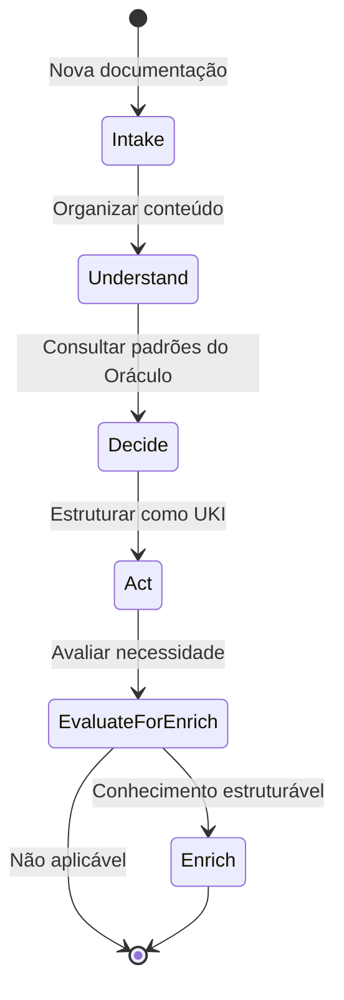

### 🎫 **Request (work.proposed)**
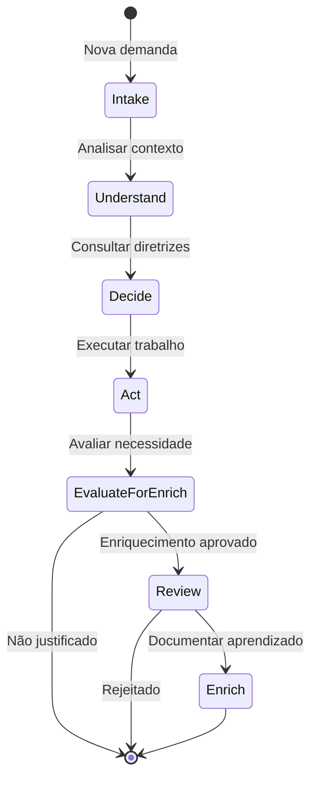

### 🎯 **Strategy (decisão estratégica)**
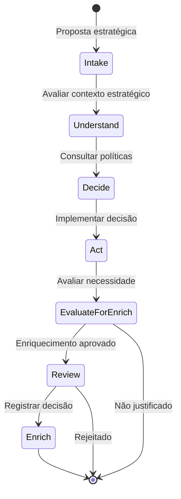

### 🔧 **Refinement (work.refine.requested)**
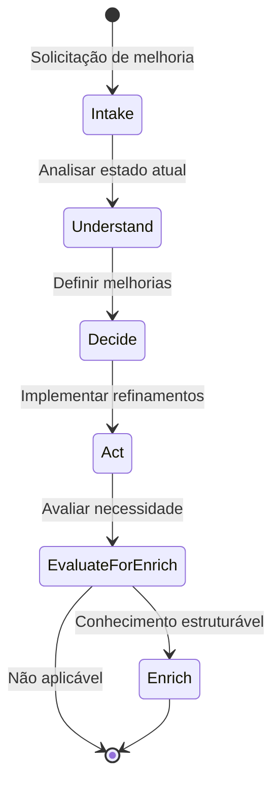

### 🤝 **Assistance (assistance.requested)**
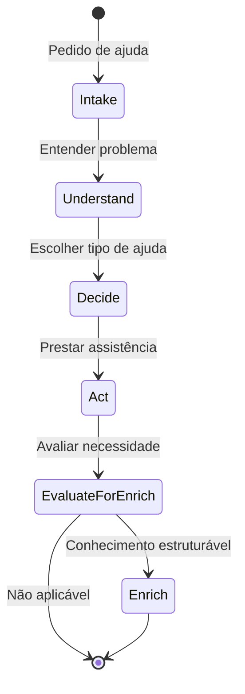

### 📝 **Feedback (feedback.submitted)**
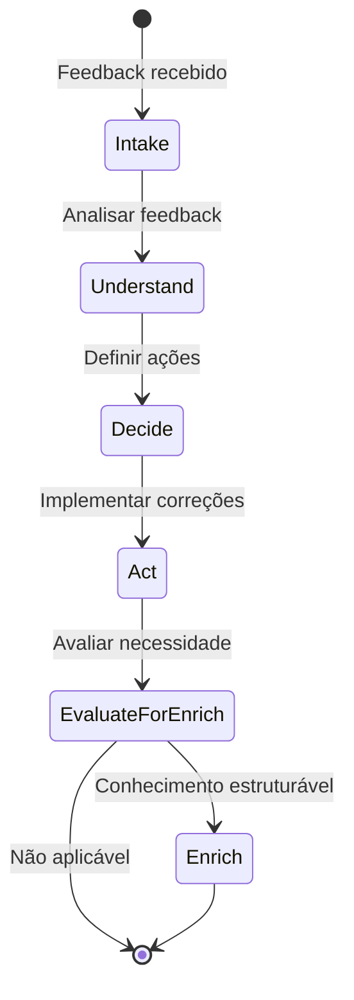

---

## 🚫 LIMITES DE ZION

### ❌ **O que ZWF NÃO especifica:**
- Ferramentas específicas de implementação
- Motores de orquestração ou workflow engines
- Prompts ou interfaces de agentes
- Custos, SLAs ou métricas numéricas
- Formatos técnicos de execução
- Tecnologias de implementação

### 🚫 **Restrições de Governança:**
- **NÃO PERMITE** criação de UKIs organizacionais (policy, governance, security, finance, strategy, ethics)
- **REQUER** curadoria humana para UKIs que impactem múltiplas equipes
- **LIMITA** escopo de enriquecimento à equipe executora

### ❌ **O que ZWF NÃO adiciona ao MEF:**
- Novos campos na estrutura UKI
- Modificações no formato YAML
- Tipos de UKI adicionais
- Apenas usa `relationships` para relacionamentos

### ✅ **O que ZWF especifica:**
- Padrão conceitual de estados de fluxo
- Tipos de eventos que iniciam workflows
- Relacionamento obrigatório com o Oráculo
- Formato de explicabilidade e rastreamento
- Estrutura de enriquecimento do conhecimento

---

## 🎯 RESULTADO ESPERADO

Com o ZWF, qualquer equipe pode:

1. **Desenhar fluxos conceituais** seguindo os estados canônicos
2. **Consultar o Oráculo** para fundamentar decisões
3. **Executar ações** usando suas próprias ferramentas
4. **Enriquecer condicionalmente o Oráculo** com aprendizado em formato MEF quando estruturável
5. **Manter rastreabilidade** através dos sinais de explicabilidade
6. **Operar orientada a IA** do discovery à entrega

**Ciclo inteligente:** Consultar Oráculo → Agir → Avaliar → Enriquecer Condicionalmente

---

## 🔄 INTEGRAÇÃO COM AS CAMADAS MATRIX

### 🔮 **Relação com Oracle (MEF)**
- **Entrada:** ZWF consulta UKIs do Oráculo para fundamentar decisões
- **Saída:** ZWF produz novos UKIs MEF para enriquecer o Oráculo
- **Formato:** Todos os relacionamentos usam `relationships` do MEF

### ⚙️ **Relação com Operator**
- **ZWF → Operator:** Fornece o desenho conceitual do fluxo
- **Operator:** Implementa usando tecnologias específicas da equipe
- **ZWF:** Não prescreve como implementar, apenas o que desenhar

---

<a name="english"></a>
# English 🇺🇸

> 🚨 **IMPORTANT WARNING**: This document contains ILLUSTRATIVE EXAMPLES (such as `strategy`, `operations`, etc.) that are NOT mandatory taxonomies. The **CSH (Semantic Hierarchy Catalog)** is the only definitive source for organizational taxonomies. Examples serve only as conceptual reference.

> Zion Workflow Framework

**Version:** 1.0
**Status:** Active
**Ontology Reference:** Ontology_MEF_Support v1.0
**Purpose:** To specify in a conceptual and standardized way the workflow framework for AI-oriented teams, defining how to describe, execute and govern workflows as technology-independent state machines.

---

## 📟️ OVERVIEW

The Matrix ZWF Protocol defines a **conceptual model for AI-oriented workflows** that allows multidisciplinary teams to describe workflows as technology-independent state machines. All flows follow the pattern: **Event → Query Oracle → Decision → Action → Evaluation → Conditional Oracle Enrichment**.

ZWF does not prescribe tools, orchestration engines, or technical implementations - it only directs **how to think and record the path** in a conceptual and traceable way.

**CSH Integration:** ZWF integrates with the Semantic Hierarchy Catalog (CSH) to enable governance-aware workflows that respect organizational hierarchies and authority levels during both Oracle consultation and knowledge enrichment phases.

### 🏛️ **CSH - Single Source of Governance**

ZWF uses the **Semantic Hierarchy Catalog (CSH)** for:
- **Enrichment Criteria**: The `EvaluateForEnrich` checkpoint consults configurable rules in CSH
- **Authority Validation**: Verifies if user has authority to create UKIs in specific scopes
- **Knowledge Filtering**: Oracle returns only UKIs compatible with user's hierarchical context
- **Organization Flexible**: Each implementation can define its hierarchies and rules

**Reference Document**: `CSH_CATALOGO_SEMANTICO_HIERARQUIAS.md`

---

## 🎭 ACTORS AND ROLES

### 🔮 **Oracle**
- **Function:** Strategic/semantic repository that maintains UKIs (MEF)
- **Input:** Queries for guidelines, rules, decisions, patterns and examples
- **Output:** Contextual knowledge to support flow decisions filtered by CSH permissions
- **Enrichment:** Receives new/updated UKIs at the end of flows within governance scope
- **CSH Context:** Respects organizational hierarchies and visibility rules defined in CSH

### 👥 **Teams**
- **Function:** Describe flows in ZWF conceptual language
- **Responsibility:** Implement flows using their own tools and technologies
- **Roles:** Dev/Eng/Tech/PM/UX/Analysts
- **Authority Levels:** Each team member has CSH authority context that affects Oracle access and enrichment permissions

### ⚙️ **Operator**
- **Function:** Executes in practice (CI/CD, IDE, orchestrators, etc.)
- **Limitation:** ZWF does not prescribe how to implement - only what to design

---

## 📡 CANONICAL EVENTS (TRIGGERS)

ZWF recognizes six types of events that initiate flows:

| Event | Description | Typical Context |
|--------|-------------|-----------------|
| `knowledge.added` | New content available | Documentation, specifications, decisions |
| `work.proposed` | New work proposal | Story, epic, feature, strategy |
| `work.refine.requested` | Refinement request | Improvements, adjustments, optimizations |
| `assistance.requested` | Help/collaboration request | Pair programming, consulting, support |
| `test.authored` | Test scenarios created | Unit tests, integration, acceptance |
| `feedback.submitted` | Correction/learning | Bug reports, improvements, lessons learned |

---

## 🔄 CANONICAL STATES (STATE MACHINE)

Every ZWF flow follows this conceptual sequence:

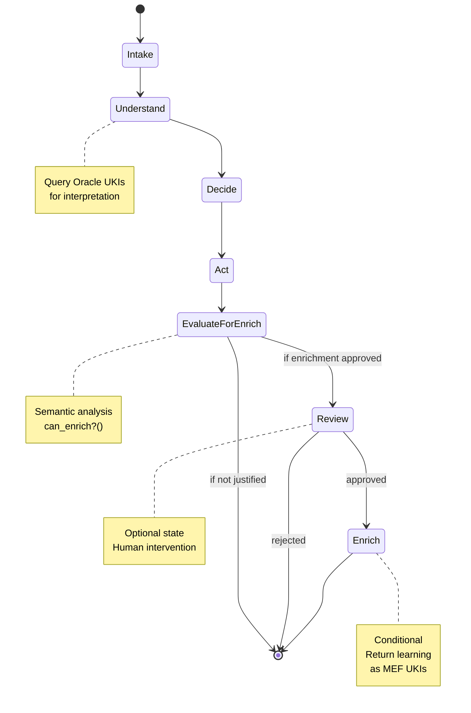

### 📨 **Intake**
- **Purpose:** Receive the event and organize the context
- **Actions:** Capture event data, validate format, prepare context
- **Output:** Structured context for Oracle consultation

### 🧠 **Understand (via Oracle)**
- **Purpose:** Query relevant UKIs to interpret intention/risk/context
- **Actions:** Semantic search in Oracle, analysis of related UKIs
- **Output:** Contextual knowledge to support decisions

### ⚖️ **Decide**
- **Purpose:** Choose path based on Oracle guidelines
- **Actions:** Apply business rules, assess risks, define actions
- **Output:** Action plan based on UKIs

### 🎯 **Act**
- **Purpose:** Execute action with people, agents or tools
- **Actions:** Practical implementation using team's available resources
- **Output:** Execution result + learning context

### 👁️ **Review (Optional)**
- **Purpose:** Human intervention when necessary
- **Actions:** Human validation, approval, adjustments
- **Output:** Confirmation or redirection

### 🔍 **EvaluateForEnrich**
- **Purpose:** Assess whether the result produces structurable knowledge
- **Actions:** Apply can_enrich?(act_output, context, user_csh_context, csh_criteria) to decide next state
- **Output:** Decision about enrichment necessity
- **CSH Authority Context:** Validates user authority for each CSH hierarchy (scope, domain, type, maturity)
- **Semantic Function:** can_enrich?() evaluates:
  - Semantic divergence from existing knowledge
  - UKI structuring possibility according to MEF
  - Epistemic clarity of contribution
  - **CSH Governance:** Authority validation for all hierarchical references
  - **Organizational Compliance:** Respects configured visibility and authority rules

#### **can_enrich?() Function Implementation**
```yaml
can_enrich_function:
  input_parameters:
    - act_output: execution result
    - context: flow context
    - proposed_uki: candidate UKI
    - user_csh_context: user hierarchical context
    - csh_evaluation_criteria: organizational configurable criteria
  
  validation_checks:
    semantic_novelty:
      - has_semantic_divergence: true
      - adds_new_knowledge: true
    
    structural_validity:
      - mef_compliant: true
      - clear_relationships: true
    
    csh_governance:
      - scope_authority_valid: validate_scope_authority(user_csh_context, proposed_uki.scope_ref)
      - domain_authority_valid: validate_domain_authority(user_csh_context, proposed_uki.domain_ref)
      - type_authority_valid: validate_type_authority(user_csh_context, proposed_uki.type_ref)
      - maturity_authority_valid: validate_maturity_authority(user_csh_context, proposed_uki.maturity_ref)
      - visibility_compliance: validate_visibility_rules(proposed_uki, csh_evaluation_criteria)
    
    epistemic_clarity:
      - content_meaningful: true
      - user_confirmation: true
  
  decision_logic: |
    IF (semantic_novelty AND structural_validity AND csh_governance AND epistemic_clarity)
      THEN return ENRICH_APPROVED
    ELSE return ENRICH_REJECTED
```

### 🔄 **Enrich Oracle (Conditional)**
- **Purpose:** Return learning as valid MEF UKIs
- **Actions:** Create/update UKIs referential to what motivated the flow
- **Output:** Structured knowledge added to Oracle

---

## 🧠 can_enrich?() FUNCTION - COGNITIVE FILTER

### 💫 **Epistemological Foundation**

The `can_enrich?()` function represents the **epistemological decision point** of the ZWF protocol. It materializes the understanding that not every interaction or execution result constitutes structurable and reusable knowledge.

**Fundamental Principle:** Oracle enrichment should be a **cognitive occurrence**, not a **procedural imposition**.

### 🔍 **Conceptual Evaluation Criteria**

#### **1. Semantic Divergence**
```yaml
semantic_divergence:
  purpose: "Assess if there is genuinely new knowledge"
  questions:
    - "Does the result differ significantly from existing knowledge?"
    - "Are there undocumented insights that emerged?"
    - "Does the solution present new or adapted aspects?"
  threshold: "Measurable semantic contribution"
```

#### **2. MEF Structurability**
```yaml
mef_structurability:
  purpose: "Verify if knowledge is structurable according to MEF standards"
  questions:
    - "Can the content be expressed as a valid UKI?"
    - "Are there clear relationships with existing knowledge?"
    - "Does the format meet MEF quality criteria?"
  threshold: "Structural compatibility with support ontology"
```

#### **3. Epistemic Clarity**
```yaml
epistemic_clarity:
  purpose: "Ensure the contribution is cognitively clear"
  questions:
    - "Is the knowledge articulated comprehensibly?"
    - "Is there sufficient context for reuse?"
    - "Is the knowledge intention explicit?"
  threshold: "Conceptual clarity for consumption by other agents"
```

#### **4. Organizational Scope Validation**
```yaml
organizational_scope:
  purpose: "Prevent unintentional organizational impacts"
  questions:
    - "Does the proposed UKI affect only the executing team?"
    - "Does it respect CSH-configured domain restrictions for this user's authority level?"
    - "Does it not require organizational stakeholder curation?"
  threshold: "Scope limited to team autonomy"
```

### ⚙️ **Conceptual vs Technical Implementation**

#### **Conceptual Level (What to decide)**
```yaml
conceptual_level:
  focus: "Technology-independent decision criteria"
  responsibility: "Define evaluation logic"
  output: "Guidelines for technical implementation"
  
  decision_framework:
    - semantic_novelty: "Is there new knowledge?"
    - structural_validity: "Is it structurable as MEF?"
    - epistemic_clarity: "Is it cognitively clear?"
    - scope_governance: "Is it appropriate for the team to create?"
    - relevance_confirmation: "Does the user confirm relevance?"
```

#### **Technical Level (How to implement)**
```yaml
technical_level:
  focus: "Technology/tool-specific implementation"
  responsibility: "Automate conceptual criteria"
  examples:
    - llm_implementation: "Structured prompts for evaluation"
    - rule_engine: "Boolean rules for criteria"
    - workflow_engine: "State transition conditions"
    - human_interface: "Interfaces for manual confirmation"
```

### 🎯 **Practical Evaluation Examples**

#### **Example 1: APPROVES Enrichment**
```yaml
scenario: "Implementation of new validation pattern"
act_output: "Validation function with specific logic for CPF"
context: "No CPF validation existed in knowledge base"

evaluation:
  semantic_divergence: PASS # "New validation logic"
  mef_structurability: PASS # "Can be UKI type 'constraint'"
  epistemic_clarity: PASS # "Well-documented function"
  scope_governance: PASS # "Domain 'technical', team scope"
  user_confirmation: PASS # "Developer confirms utility"

result: ENRICH_APPROVED
proposed_uki:
  id: "unik:technical:constraint:cpf-validation-function"
  domain: "technical"
  type: "constraint"
```

#### **Example 2: REJECTS Enrichment**
```yaml
scenario: "Routine task execution"
act_output: "Deploy successfully completed to staging"
context: "Deploy following already established procedure"

evaluation:
  semantic_divergence: FAIL # "No new knowledge"
  mef_structurability: FAIL # "No structurable content"
  epistemic_clarity: N/A
  scope_governance: N/A
  user_confirmation: N/A

result: ENRICH_REJECTED
reason: "Routine execution without epistemic contribution"
```

#### **Example 3: BLOCKS by Governance**
```yaml
scenario: "Security policy proposal"
act_output: "New authentication policy for entire organization"
context: "Backend team proposes organizational policy"

evaluation:
  semantic_divergence: PASS # "New knowledge"
  mef_structurability: PASS # "Structurable as policy"
  epistemic_clarity: PASS # "Well-defined policy"
  scope_governance: FAIL # "Domain 'security' requires curation"
  user_confirmation: N/A

result: ENRICH_REJECTED
reason: "Domain 'security' configured in CSH as restricted for users with authority 'team_member'"
csh_nodes_cited:
  - node_type: "domain"
    node_id: "security"
    restriction_rule: "requires_authority_level: security_lead"
  - node_type: "authority_level"
    node_id: "team_member"
    restriction_rule: "insufficient_for_security_domain"
escalation_path: "Request approval from Security Lead or elevate authority via HR"
alternatives: "Create UKI in 'technical' domain with 'team' scope for local implementation"
```

### 📝 **Explainability Requirements for ENRICH_REJECTED**

**Mandatory**: Every `ENRICH_REJECTED` decision must include explanation based on specific CSH nodes:

```yaml
required_explanation_format:
  result: ENRICH_REJECTED
  reason: "[Explanation citing specific CSH nodes]"
  csh_nodes_cited:
    - node_type: "domain" | "scope" | "type" | "authority_level"
      node_id: "[csh_node_id]"
      restriction_rule: "[specific_rule_that_caused_rejection]"
  escalation_path: "[How user can escalate or obtain permission]"
  alternatives: "[Suggested alternative actions within user's authority]"
```

**Benefits of CSH Explainability:**
- **Transparency**: User understands exactly why rejection occurred
- **Traceability**: Auditable decisions via CSH nodes
- **Guidance**: Clear paths for resolution or escalation
- **Consistency**: Standardized explanations across implementations

### 💡 **Conceptual Value of the Filter**

#### **For the Oracle (MEF)**
- **Quality**: Ensures only relevant knowledge is stored
- **Consistency**: Avoids pollution with redundant or trivial information
- **Governance**: Protects against inappropriate creation of organizational rules

#### **For Teams**
- **Efficiency**: Avoids unnecessary documentation work
- **Focus**: Directs attention to genuinely useful contributions
- **Autonomy**: Enables knowledge creation within appropriate scope

#### **For the Ecosystem**
- **Scalability**: Enables sustainable growth of knowledge base
- **Intelligence**: Favors enrichment based on epistemic merit
- **Sustainability**: Avoids overhead of maintaining irrelevant knowledge

---

## 🔗 ORACLE BINDING

### 📋 **Initial Declaration**
Flows can declare at the beginning which Oracle UKIs motivate them:

```yaml
# Example of flow declaration
flow_id: zion-workflow-jwt-implementation
triggered_by: work.proposed
oracle_context:
  motivating_ukis:
    - unik:technical:concept:jwt-authentication-pattern
    - unik:technical:constraint:security-requirements
    - unik:technical:procedure:code-review-process
```

### ⚖️ **Decision Foundation**
During transitions, the flow must explicitly state which UKIs support each decision:

```yaml
# Example of founded decision
decision_point: "choose_jwt_library"
reasoning_ukis:
  - unik:technical:constraint:jwt-security-standards
  - unik:technical:procedure:vendor-approval-process
decision_outcome: "use_jsonwebtoken_library"
```

### 🔄 **Conditional Enrichment**
When applicable, outputs must reference motivating UKIs through the `relationships` field:

```yaml
# Example of UKI generated in enrichment
schema: "1.0"
ontology_reference: "Ontology_MEF_Support v1.0"
version: "1.0.0"

id: unik:technical:procedure:jwt-implementation-result
title: "JWT Implementation Result - Backend Team"
domain: technical
type: procedure
context: implementation
created_date: "2024-01-15"
last_modified: "2024-01-15"

status: active
relationships:
  - type: depends_on
    target: unik:technical:concept:jwt-authentication-pattern
  - type: depends_on
    target: unik:technical:constraint:security-requirements
content: |
  Successful JWT pattern implementation following security guidelines.
  Based on related UKIs guidance, adapted to our specific context.
```

---

## 📤 CONDITIONAL OUTPUTS

### 🎯 **MEF Output Types**
Flows that justify enrichment must return knowledge to Oracle choosing among MEF types:

| UKI Type | When to Use | Example Output (Team Scope) |
|----------|-------------|----------------|
| `rule` | Team operational rule | API input validation rule |
| `procedure` | Operational sequence | Microservice configuration template |
| `concept` | Technical definition or model | Endpoint implementation pattern |
| `metric` | Team indicator | Service performance metric |
| `constraint` | Technical limitation | Team-specific JWT validation function |
| `glossary` | Team technical terms | Specific endpoint definition |

### 🏛️ **HIERARCHICAL GOVERNANCE WITH CSH**

#### **Authority Flow Model**

ZWF integrates with CSH (Semantic Hierarchy Catalog) to enable governance-aware workflows that respect organizational hierarchies and authority levels:

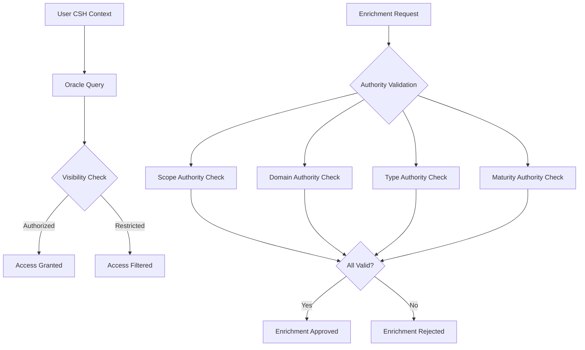

#### **CSH Governance Functions**

##### **Authority Validation**
```yaml
validate_scope_authority:
  input:
    - user_csh_context: hierarchical context of requesting user
    - target_scope_ref: reference to scope node in CSH
  logic: |
    scope_node = csh.get_node(target_scope_ref)
    required_authority = scope_node.governance.authority_required
    user_authorities = user_csh_context.authorities
    
    IF required_authority IN user_authorities:
      RETURN authority_valid: true
    ELSE:
      RETURN authority_valid: false, required: required_authority

validate_domain_authority:
  input:
    - user_csh_context: hierarchical context of requesting user
    - target_domain_ref: reference to domain node in CSH
  logic: |
    domain_node = csh.get_node(target_domain_ref)
    IF domain_node.governance.restricted_creation:
      required_authority = domain_node.governance.authority_required
      IF required_authority IN user_csh_context.authorities:
        RETURN authority_valid: true
      ELSE:
        RETURN authority_valid: false
    ELSE:
      RETURN authority_valid: true
```

##### **Visibility Control**
```yaml
pertinence_resolution:
  input:
    - query_context: user search context
    - user_csh_context: user hierarchical permissions
    - available_ukis: candidate knowledge units
  process: |
    filtered_ukis = []
    FOR uki IN available_ukis:
      uki_scope = csh.get_node(uki.scope_ref)
      visibility_rules = uki_scope.governance.visibility
      
      IF user_csh_context.authorities INTERSECTS visibility_rules:
        filtered_ukis.append(uki)
      ELIF uki.scope_mode == "propagated":
        # Check if user has access through hierarchy propagation
        IF check_propagated_access(user_csh_context, uki_scope):
          filtered_ukis.append(uki)
    
    RETURN filtered_ukis
```

#### **Practical Governance Scenarios**

##### **Scenario 1: Team Member Creating Technical UKI**
```yaml
user_context:
  name: "João Silva"
  authorities: ["team_member", "developer"]
  scope_access: ["team_backend"]

proposed_uki:
  scope_ref: "team_backend"
  domain_ref: "technical"
  type_ref: "pattern"
  maturity_ref: "experimental"

validation_result:
  scope_authority: ✅ VALID (team_member can create in team_backend)
  domain_authority: ✅ VALID (technical domain allows team creation)
  type_authority: ✅ VALID (pattern type allowed for developers)
  maturity_authority: ✅ VALID (experimental maturity allowed)
  final_decision: ENRICHMENT_APPROVED
```

##### **Scenario 2: Team Member Attempting Organizational Policy**
```yaml
user_context:
  name: "Maria Santos"
  authorities: ["team_member", "analyst"]
  scope_access: ["team_product"]

proposed_uki:
  scope_ref: "organization"
  domain_ref: "governance"
  type_ref: "policy"
  maturity_ref: "stable"

validation_result:
  scope_authority: ❌ INVALID (requires "organization_lead" authority)
  domain_authority: ❌ INVALID (governance domain restricted)
  type_authority: ❌ INVALID (policy type requires "policy_creator")
  final_decision: ENRICHMENT_REJECTED
  suggestion: "Forward to organizational governance process"
```

##### **Scenario 3: Tech Lead Creating Cross-Team Standard**
```yaml
user_context:
  name: "Carlos Pereira"
  authorities: ["tech_lead", "architect"]
  scope_access: ["team_backend", "team_frontend", "squad_payments"]

proposed_uki:
  scope_ref: "squad_payments"
  domain_ref: "technical"
  type_ref: "standard"
  maturity_ref: "validated"

validation_result:
  scope_authority: ✅ VALID (tech_lead can create in squad_payments)
  domain_authority: ✅ VALID (technical domain accessible)
  type_authority: ✅ VALID (standard type allowed for architects)
  maturity_authority: ✅ VALID (validated maturity authorized)
  final_decision: ENRICHMENT_APPROVED
```

#### **CSH Integration Benefits**

##### **For Organizations**
- **Configurable Governance**: Define hierarchies and authority levels per organizational structure
- **Controlled Knowledge Evolution**: Prevent unauthorized creation of critical organizational knowledge
- **Scalable Permissions**: Authority and visibility rules that scale with organizational growth

##### **For Teams**
- **Clear Boundaries**: Understanding of what knowledge they can create and access
- **Progressive Authority**: Team members can gain authority as they grow in the organization
- **Contextual Access**: Access to knowledge relevant to their role and scope

##### **For AI Systems**
- **Governance-Aware Assistance**: AI systems respect organizational hierarchies during assistance
- **Context-Sensitive Recommendations**: Knowledge recommendations filtered by user permissions
- **Authority-Based Enrichment**: Enrichment suggestions respect user creation authorities

### 🔗 **Required Relationships**
Each generated UKI must include:
- `related_to`: UKIs that motivated/impacted the flow using valid types (implements, depends_on, extends, replaces, complies_with, conflicts_with, derives_from, relates_to)
- Clear summary of relationship intention in `description` field within each relationship
- CSH compliance: Referenced UKIs should be accessible within user's authority context as defined by organizational CSH

---

## 📊 MINIMAL EXPLAINABILITY

In each flow state, record three signals in natural language:

### 📝 **Recording Template**
```yaml
flow_step: [state_name]
signals:
  context: "What came in: [input description]"
  decision: "Why it transitioned: [justification based on Oracle UKIs]"
  result: "What came out: [output description]"
oracle_ukis_used:
  - unik:[domain]:[type]:[consulted-uki-id]
timestamp: [YYYY-MM-DD HH:MM:SS]
```

### 💡 **Practical Example**
```yaml
flow_step: "decide"
signals:
  context: "Received request to implement JWT authentication in API"
  decision: "Chosen bearer token pattern based on unik:security:rule:jwt-authentication-pattern specifying security best practices"
  result: "Defined to use jsonwebtoken library with 15-minute expiration configuration"
oracle_ukis_used:
  - unik:technical:concept:jwt-authentication-pattern
  - unik:technical:constraint:token-expiration-rules
timestamp: "2024-01-15 14:30:22"
```

---

## 📊 CANONICAL TELEMETRY METRICS

For effective observability and monitoring of ZWF workflows, we establish standardized metrics that should be collected during the execution of each flow.

### 🕘 **State Transition Duration Metrics**
```yaml
state_transition_duration:
  intake_to_understand: 
    timestamp_start: "2024-01-15T14:30:22Z"
    timestamp_end: "2024-01-15T14:32:15Z"
    duration_seconds: 113
  understand_to_decide:
    timestamp_start: "2024-01-15T14:32:15Z"
    timestamp_end: "2024-01-15T14:35:48Z"
    duration_seconds: 213
  decide_to_act:
    timestamp_start: "2024-01-15T14:35:48Z"
    timestamp_end: "2024-01-15T14:45:30Z"
    duration_seconds: 582
  act_to_review:
    timestamp_start: "2024-01-15T14:45:30Z"
    timestamp_end: "2024-01-15T14:48:12Z"
    duration_seconds: 162
  review_to_enrich:
    timestamp_start: "2024-01-15T14:48:12Z"
    timestamp_end: "2024-01-15T14:50:05Z"
    duration_seconds: 113
```

### 📈 **Transition Quality Metrics**
```yaml
transition_quality_score:
  overall_workflow_score: 85  # 0-100
  state_scores:
    intake: 90     # Context capture completeness
    understand: 88 # Oracle consultation quality
    decide: 82     # Decision foundation strength
    act: 85        # Execution effectiveness
    review: 95     # Validation quality
    enrich: 78     # Generated UKI quality
  quality_factors:
    oracle_coverage: 85      # % of decisions founded on UKIs
    explainability_depth: 90 # Signal detail level
    relationship_clarity: 80 # relationships clarity
```

### 🏥 **Workflow Health Metrics**
```yaml
workflow_health_metrics:
  completion_status: "successful"  # successful | failed | partial
  error_count: 0
  warning_count: 2
  retry_count: 1
  state_coverage: 
    total_states: 6
    executed_states: 6
    skipped_states: 0
  oracle_availability: "available"  # available | degraded | unavailable
  enrichment_success: true
```

### 🔮 **Oracle Enrichment Efficiency Metrics**
```yaml
oracle_enrichment_metrics:
  ukis_consulted: 5
  ukis_created: 1
  ukis_updated: 0
  relationship_count: 3
  knowledge_domains_touched:
    - security
    - governance
  semantic_coherence_score: 87  # 0-100
  reusability_potential: "high"  # low | medium | high
```

### 📋 **Complete Metrics Template**
```yaml
telemetry:
  workflow_id: "zwf-jwt-implementation-001"
  execution_start: "2024-01-15T14:30:22Z"
  execution_end: "2024-01-15T14:50:05Z"
  total_duration_seconds: 1183
  
  state_transition_duration: [structure above]
  transition_quality_score: [structure above]
  workflow_health_metrics: [structure above]
  oracle_enrichment_metrics: [structure above]
  
  performance_indicators:
    throughput_score: 85        # Speed vs. quality balance
    efficiency_ratio: 0.73      # Useful time / total time
    oracle_hit_rate: 0.89       # UKIs found / UKIs searched
    decision_confidence: 0.85   # Confidence in decisions made
  
  observability_tags:
    team: "backend-squad"
    trigger_type: "work.proposed"
    complexity_level: "medium"   # low | medium | high
    ai_assistance_level: "high"  # none | low | medium | high
```

---

## ⚖️ STATE INVARIANTS (FORMAL)

To ensure robust and deterministic execution, each ZWF state can implement conceptual invariants that can be implemented by durable engines:

### 📋 **Invariants per State**

#### 📨 **Intake State**
```yaml
preconditions:
  - trigger_event: defined
  - event_type: valid_canonical_event
postconditions:
  - context_structured: true
  - trigger_validated: true
  - oracle_context_prepared: true
validation:
  required_fields: [flow_id, triggered_by, oracle_context]
  context_format: structured
```

#### 🧠 **Understand State**
```yaml
preconditions:
  - intake_completed: true
  - context_structured: true
postconditions:
  - oracle_consulted: true
  - ukis_identified: min_1
  - strategy_defined: true
validation:
  required_ukis: min_1
  oracle_response: structured
  understanding_documented: true
```

#### ⚖️ **Decide State**
```yaml
preconditions:
  - understanding_completed: true
  - oracle_knowledge_available: true
postconditions:
  - decision_made: true
  - reasoning_documented: true
  - action_plan_defined: true
validation:
  decision_rationale: required
  reasoning_ukis: min_1
  action_plan: structured
```

#### 🎯 **Act State**
```yaml
preconditions:
  - decision_made: true
  - action_plan_defined: true
postconditions:
  - action_executed: true
  - execution_result: documented
  - learning_context_captured: true
validation:
  execution_evidence: required
  result_documentation: structured
  error_handling: documented
```

#### 👁️ **Review State (Optional)**
```yaml
preconditions:
  - action_executed: true
  - review_required: true
postconditions:
  - validation_completed: true
  - approval_status: defined
  - feedback_documented: true
validation:
  review_criteria: defined
  reviewer_input: documented
  outcome_clear: true
```

#### 🔍 **EvaluateForEnrich State**
```yaml
preconditions:
  - action_executed: true
  - execution_result: documented
  - user_csh_context: available
  - csh_evaluation_criteria: loaded
postconditions:
  - enrichment_decision: made
  - can_enrich_evaluated: true
  - scope_determined: true
  - governance_explanation: generated
validation:
  semantic_evaluation: completed
  csh_authority_validated: true
  evaluation_criteria_applied: true
  justification_documented: true
context_required:
  user_authority_level: "from CSH"
  available_evaluation_criteria: "from CSH"
  max_enrichment_scope: "from CSH"
  domain_access_permissions: "from CSH"
```

#### 🔄 **Enrich State (Conditional)**
```yaml
preconditions:
  - enrichment_approved: true
  - learning_captured: true
postconditions:
  - uki_created: true
  - oracle_updated: true
  - relationships_established: true
validation:
  uki_format: mef_compliant
  relationships: motivating_ukis_referenced
  content_meaningful: true
```

### 🔄 **Transition Invariants**

#### **State to State**
```yaml
# General transition rules
transition_rules:
  intake_to_understand:
    condition: context_structured AND oracle_context_prepared
  understand_to_decide:
    condition: oracle_consulted AND strategy_defined
  decide_to_act:
    condition: decision_made AND action_plan_defined
  act_to_evaluate:
    condition: action_executed
  evaluate_to_review:
    condition: can_enrich_positive AND review_required
  evaluate_to_end:
    condition: can_enrich_negative
  review_to_enrich:
    condition: validation_completed AND enrichment_approved
  review_to_end:
    condition: enrichment_rejected
```

#### **Idempotency**
```yaml
# Safe execution guarantees
idempotency_rules:
  state_reentry: safe_if_postconditions_unmet
  oracle_consultation: cacheable_within_session
  enrichment: atomic_uki_creation
```

### 🚨 **Failure Handling**

#### **Error Behavior**
```yaml
error_handling:
  oracle_unavailable:
    action: defer_until_available
    fallback: use_cached_ukis_if_recent
  invalid_state_transition:
    action: revert_to_last_valid_state
    log: violation_details
  enrichment_failure:
    action: mandatory_retry
    escalation: human_intervention
```

#### **State Recovery**
```yaml
recovery_patterns:
  partial_execution:
    action: resume_from_last_valid_checkpoint
  data_corruption:
    action: reconstruct_from_audit_trail
  timeout_exceeded:
    action: graceful_degradation_with_logging
```

### 📊 **Consistency Verification**

#### **Automatic Validations**
```yaml
consistency_checks:
  oracle_binding:
    - motivating_ukis_exist
    - reasoning_ukis_accessible
    - enrichment_ukis_valid
  explainability:
    - signals_complete_per_state
    - decision_rationale_traceable
    - oracle_consultation_documented
  workflow_integrity:
    - all_mandatory_states_executed
    - enrichment_conditional_on_evaluation
    - relationships_bidirectional
```

---

## 🔍 VERIFIABLE EXPLAINABILITY SCHEMAS

To ensure quality and consistency of explainability signals, ZWF defines formal JSON schemas for automatic validation of `context`, `decision` and `result` fields in each workflow state.

### 📋 **Base Schemas for Signals**

#### **Schema for Context (What came in)**
```json
{
  "$schema": "http://json-schema.org/draft-07/schema#",
  "type": "object",
  "properties": {
    "context": {
      "type": "string",
      "pattern": "^What came in: .+",
      "minLength": 20,
      "maxLength": 500,
      "description": "Clear and objective description of the input received in the state"
    }
  },
  "required": ["context"],
  "additionalProperties": false
}
```

#### **Schema for Decision (Why it transitioned)**
```json
{
  "$schema": "http://json-schema.org/draft-07/schema#",
  "type": "object", 
  "properties": {
    "decision": {
      "type": "string",
      "pattern": "^Why it transitioned: .+based.+(unik-[a-z0-9-]+).+",
      "minLength": 30,
      "maxLength": 800,
      "description": "Transition justification referencing Oracle UKIs"
    }
  },
  "required": ["decision"],
  "additionalProperties": false
}
```

#### **Schema for Result (What came out)**
```json
{
  "$schema": "http://json-schema.org/draft-07/schema#",
  "type": "object",
  "properties": {
    "result": {
      "type": "string",
      "pattern": "^What came out: .+",
      "minLength": 15,
      "maxLength": 600,
      "description": "Clear description of the output produced by the state"
    }
  },
  "required": ["result"],
  "additionalProperties": false
}
```

### 🔗 **Complete Explainability Schema**

#### **Integrated Schema for State Validation**
```json
{
  "$schema": "http://json-schema.org/draft-07/schema#",
  "type": "object",
  "properties": {
    "flow_step": {
      "type": "string",
      "enum": ["intake", "understand", "decide", "act", "evaluateforenrich", "review", "enrich"]
    },
    "signals": {
      "type": "object",
      "properties": {
        "context": {
          "type": "string",
          "pattern": "^What came in: .+",
          "minLength": 20,
          "maxLength": 500
        },
        "decision": {
          "type": "string", 
          "pattern": "^Why it transitioned: .+based.+(unik:[a-z]+:[a-z]+:[a-z0-9-]+).+",
          "minLength": 30,
          "maxLength": 800
        },
        "result": {
          "type": "string",
          "pattern": "^What came out: .+",
          "minLength": 15,
          "maxLength": 600
        }
      },
      "required": ["context", "decision", "result"],
      "additionalProperties": false
    },
    "oracle_ukis_used": {
      "type": "array",
      "items": {
        "type": "string",
        "pattern": "^unik:[a-z]+:[a-z]+:[a-z0-9-]+$"
      },
      "minItems": 1,
      "uniqueItems": true
    },
    "timestamp": {
      "type": "string",
      "pattern": "^[0-9]{4}-[0-9]{2}-[0-9]{2} [0-9]{2}:[0-9]{2}:[0-9]{2}$"
    }
  },
  "required": ["flow_step", "signals", "oracle_ukis_used", "timestamp"],
  "additionalProperties": false
}
```

### ✅ **Successful Validation Examples**

#### **Valid Example - Decide State**
```yaml
# Input that PASSES validation
flow_step: "decide"
signals:
  context: "What came in: request to implement JWT authentication in the main API"
  decision: "Why it transitioned: chosen bearer token pattern based on unik:security:rule:jwt-authentication-pattern specifying security best practices"
  result: "What came out: defined to use jsonwebtoken library with 15-minute expiration configuration"
oracle_ukis_used:
  - unik:technical:concept:jwt-authentication-pattern
  - unik:technical:constraint:token-expiration-rules
timestamp: "2024-01-15 14:30:22"
```

#### **Valid Example - Act State**
```yaml
# Input that PASSES validation
flow_step: "act"
signals:
  context: "What came in: JWT implementation plan with jsonwebtoken library approved"
  decision: "Why it transitioned: executed implementation based on unik:security:constraint:code-standards defining middleware structure"
  result: "What came out: authentication middleware implemented and tested with 100% coverage"
oracle_ukis_used:
  - unik:technical:constraint:code-standards
  - unik:technical:procedure:testing-requirements
timestamp: "2024-01-15 15:45:10"
```

### ❌ **Validation Failure Examples**

#### **Failure 1: Context too short**
```yaml
# Input that FAILS validation
flow_step: "decide"
signals:
  context: "What came in: JWT"  # ERROR: less than 20 characters
  decision: "Why it transitioned: based on unik:security:rule:jwt security pattern"
  result: "What came out: library defined"
# VALIDATION ERROR: context must have minimum 20 characters
```

#### **Failure 2: Decision without UKI reference**
```yaml
# Input that FAILS validation
flow_step: "understand"
signals:
  context: "What came in: authentication requirements documentation for analysis"
  decision: "Why it transitioned: analyzed requirements and decided to proceed"  # ERROR: no UKI reference
  result: "What came out: understanding of necessary security requirements"
# VALIDATION ERROR: decision must contain UKI reference (pattern "based.+unik:")
```

#### **Failure 3: Malformed UKI**
```yaml
# Input that FAILS validation
flow_step: "enrich"
signals:
  context: "What came in: complete JWT implementation for documentation"
  decision: "Why it transitioned: created UKI based on unik:security:concept:implementation-pattern"
  result: "What came out: new UKI documenting JWT implementation pattern"
oracle_ukis_used:
  - invalid-uki-format  # ERROR: must follow unik:[domain]:[type]:[id] pattern
  - unik:security:concept:valid
# VALIDATION ERROR: UKI must follow unik:[domain]:[type]:[identifier] format
```

### 🛡️ **Usage for Audit and Compliance**

#### **Automatic Validation in Pipelines**
```bash
# Example validation in CI/CD
jsonschema -i workflow_step.yaml zwf_explainability_schema.json
if [ $? -eq 0 ]; then
  echo "✅ Valid explainability signals"
else
  echo "❌ Validation failed - non-compliant workflow"
  exit 1
fi
```

#### **Quality Metrics**
- **Compliance Rate**: % of signals that pass validation
- **Traceability**: 100% of decisions must reference UKIs
- **Completeness**: all required fields filled
- **Descriptive Quality**: minimum lengths respected

---

## 🎪 FLOW PATTERNS (MINIMAL COVERAGE)

### 📥 **Ingest (knowledge.added)**
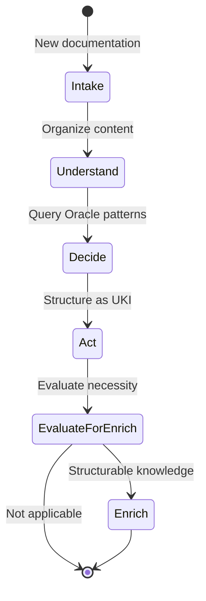

### 🎫 **Request (work.proposed)**
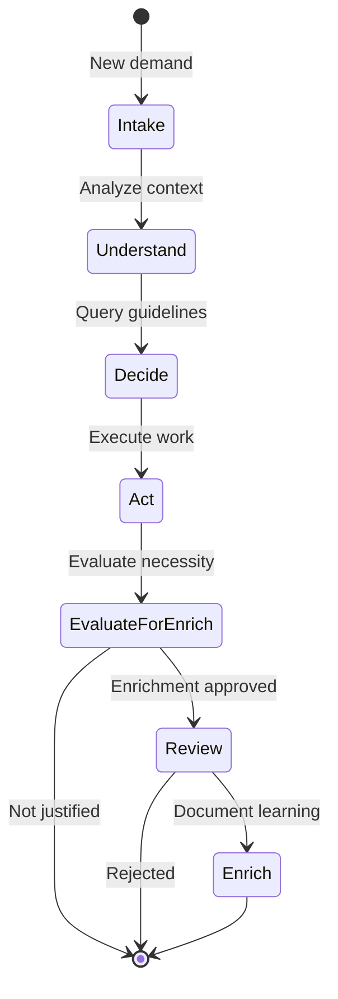

### 🎯 **Strategy (strategic decision)**
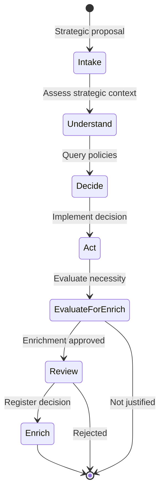

### 🔧 **Refinement (work.refine.requested)**
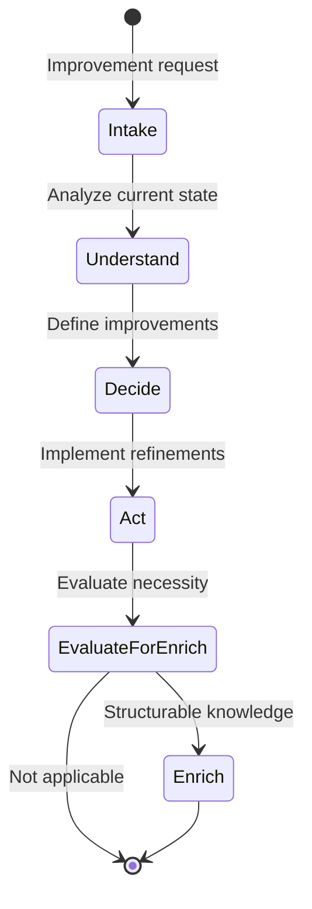

### 🤝 **Assistance (assistance.requested)**
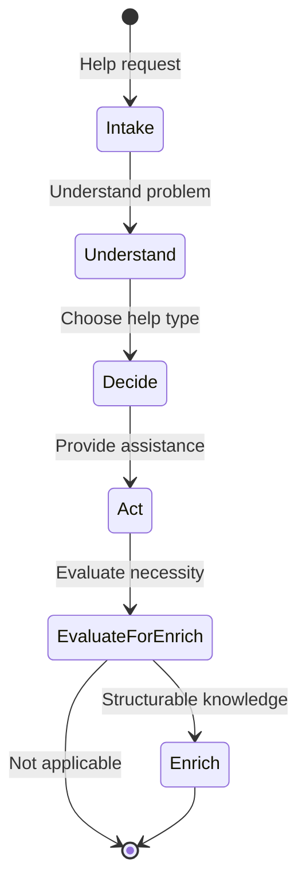

### 📝 **Feedback (feedback.submitted)**
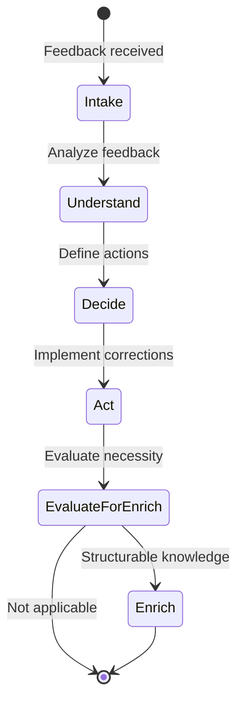

---

## 🚫 ZION BOUNDARIES

### ❌ **What ZWF does NOT specify:**
- Specific implementation tools
- Orchestration engines or workflow engines
- Agent prompts or interfaces
- Costs, SLAs or numerical metrics
- Technical execution formats
- Implementation technologies

### 🚫 **Governance Restrictions:**
- **DOES NOT ALLOW** creation of organizational UKIs (policy, governance, security, finance, strategy, ethics)
- **REQUIRES** human curation for UKIs that impact multiple teams
- **LIMITS** enrichment scope to executing team

### ❌ **What ZWF does NOT add to MEF:**
- New fields in UKI structure
- YAML format modifications
- Additional UKI types
- Only uses `relationships` for relationships

### ✅ **What ZWF specifies:**
- Conceptual pattern of flow states
- Types of events that initiate workflows
- Mandatory relationship with Oracle
- Explainability and tracking format
- Knowledge enrichment structure

---

## 🎯 EXPECTED RESULT

With ZWF, any team can:

1. **Design conceptual flows** following canonical states
2. **Query Oracle** to support decisions
3. **Execute actions** using their own tools
4. **Conditionally enrich Oracle** with learning in MEF format when structurable
5. **Maintain traceability** through explainability signals
6. **Operate AI-oriented** from discovery to delivery

**Intelligent loop:** Query Oracle → Act → Evaluate → Conditionally Enrich

---

## 🔄 INTEGRATION WITH MATRIX LAYERS

### 🔮 **Relationship with Oracle (MEF)**
- **Input:** ZWF queries Oracle UKIs to support decisions
- **Output:** ZWF produces new MEF UKIs to enrich Oracle
- **Format:** All relationships use MEF's `relationships`

### ⚙️ **Relationship with Operator**
- **ZWF → Operator:** Provides conceptual flow design
- **Operator:** Implements using team-specific technologies
- **ZWF:** Does not prescribe how to implement, only what to design